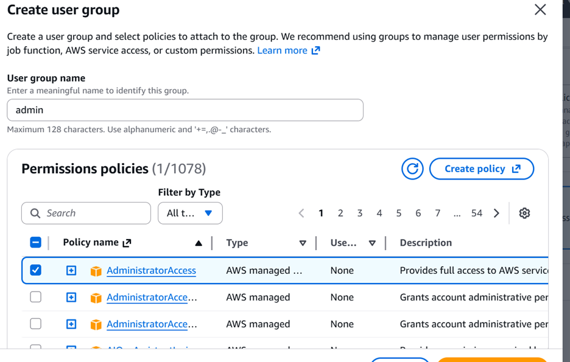
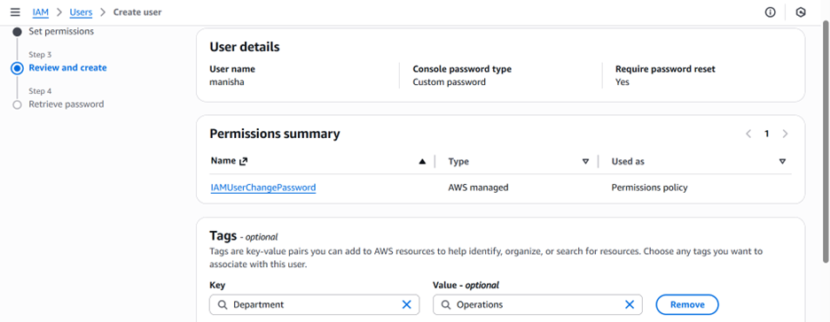
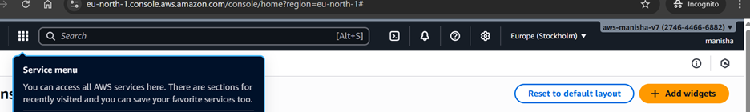
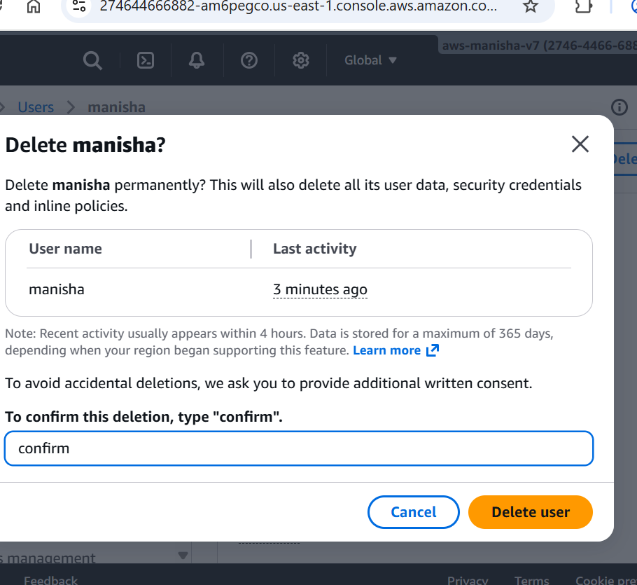
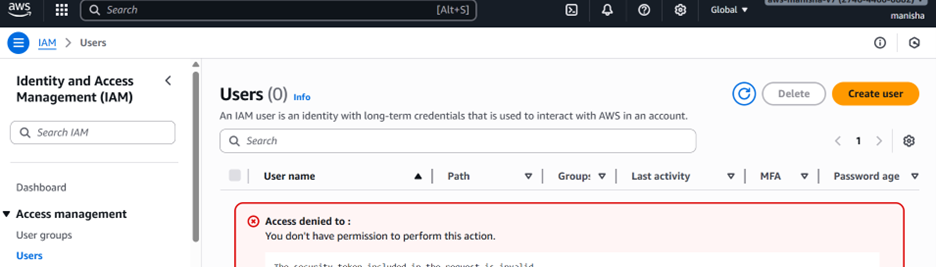
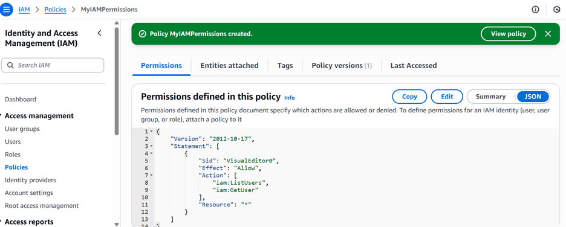
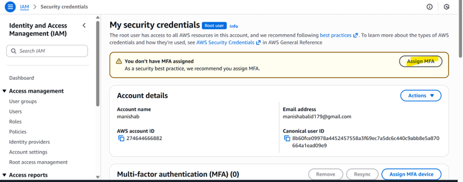
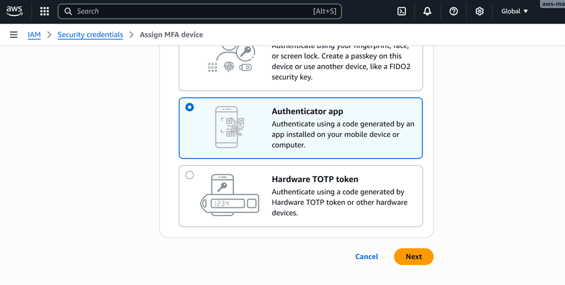
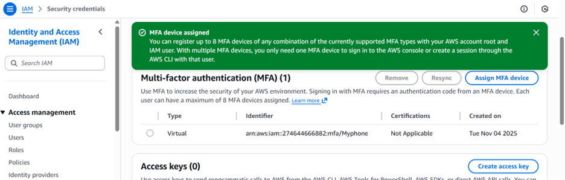
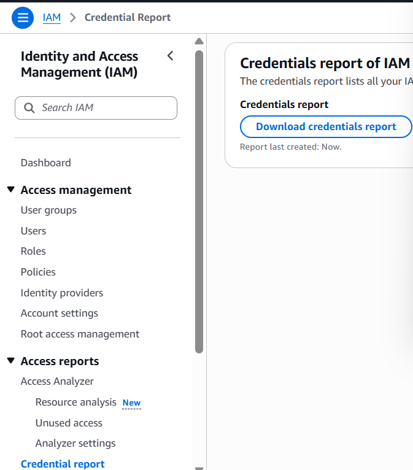

IAM
IAM = Identity and Access Management, Global service
- Root account created by default, shouldn’t be used or shared
- Users are people within your organization, and can be grouped
- Groups only contain users, not other groups
- Users don’t have to belong to a group, and user can belong to multiple groups

IAM user
- A user represents a single person or application that interacts with AWS.
- Each user has: A name
Credentials (password, access keys)
Permissions (granted via policies)

IAM group 
- A group is a collection of IAM users.
- You attach policies (permissions) to the group and all users in that group inherit those permissions.
- Example: A group named Developers has permission to manage EC2 instances. Every user added to Developers can automatically start/stop EC2.

IAM roles
- A role is an identity with permissions, but no permanent user credentials (no password or access key).
- example -
- An EC2 instance needs to upload logs to an S3 bucket — you assign an IAM role to the EC2 instance:
Role Name: EC2-S3-Access
Policy: Allow s3:PutObject on your bucket
Result: EC2 instance can upload logs securely without storing credentials.

IAM User

Login to IAM user

IAM policy

Add usergroup

IAM MFA 

IAM roles for services
- Some AWS service will need to perform actions on your behalf
- To do so, we will assign permissions to AWS services with IAM Roles
- Common roles: 
1.EC2 Instance Roles 
2.Lambda Function Roles 
3.Roles for CloudFormation

IAM roles hands on

IAM security tools
- IAM Credentials Report (account-level) 
- a report that lists all your account's users and the status of their various credential

- IAM Access Advisor (user-level) 
-  Access advisor shows the service permissions granted to a user and when those services     were last accessed. 
- You can use this information to revise your policies

Security tools handson
- IAM Credentials Report (account-level) 

Credential reports
Security tools handson
• IAM Credentials Report (account-level) 

Credential reports

IAM Access Advisor (user-level)   
- use for user access permissions

IAM details
- Users: mapped to a physical user, has a password for AWS Console 
- Groups: contains users only
- Policies: JSON document that outlines permissions for users or groups 
- Roles: for EC2 instances or AWS services 
- Security: MFA + Password Policy 
- AWS CLI: manage your AWS services using the command-line 
- AWS SDK: manage your AWS services using a programming language
- Access Keys: access AWS using the CLI or SDK 
- Audit: IAM Credential Reports & IAM Access Advisor

