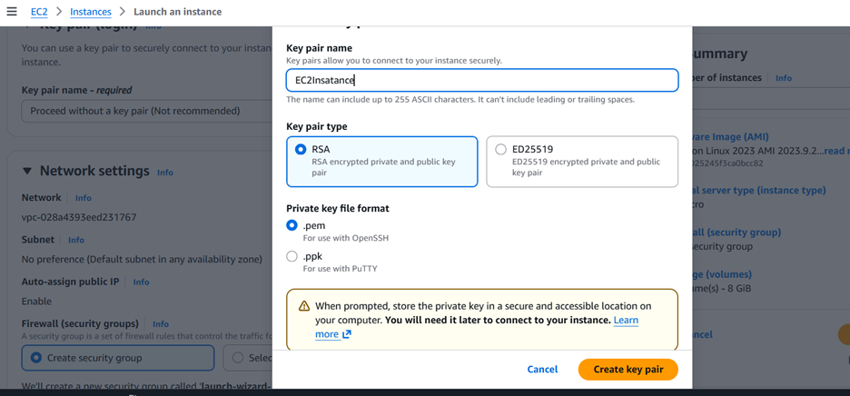
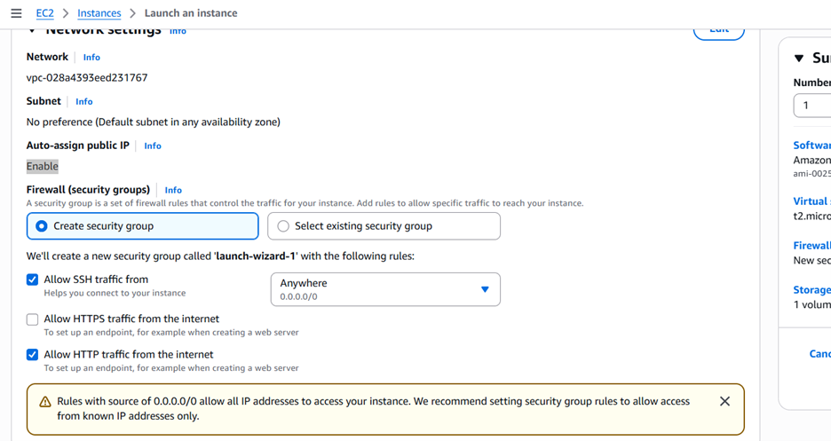
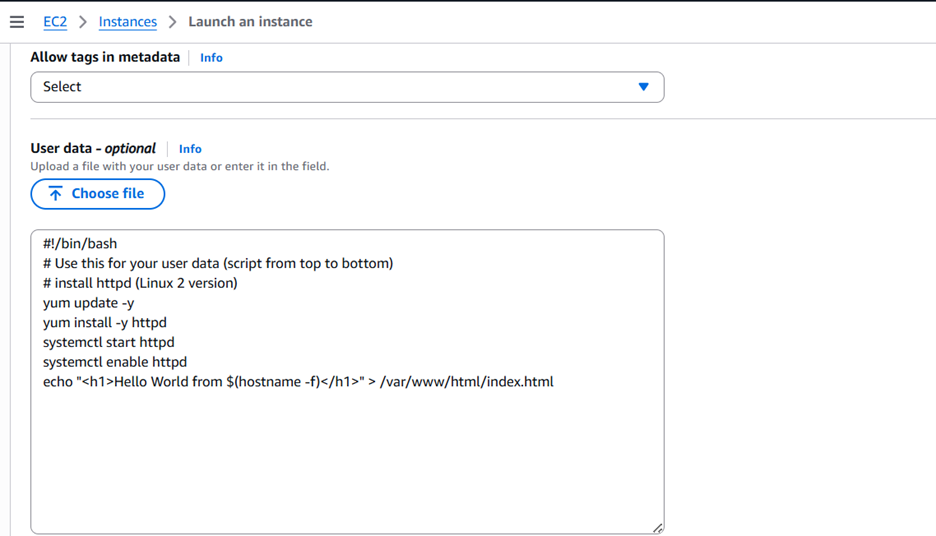
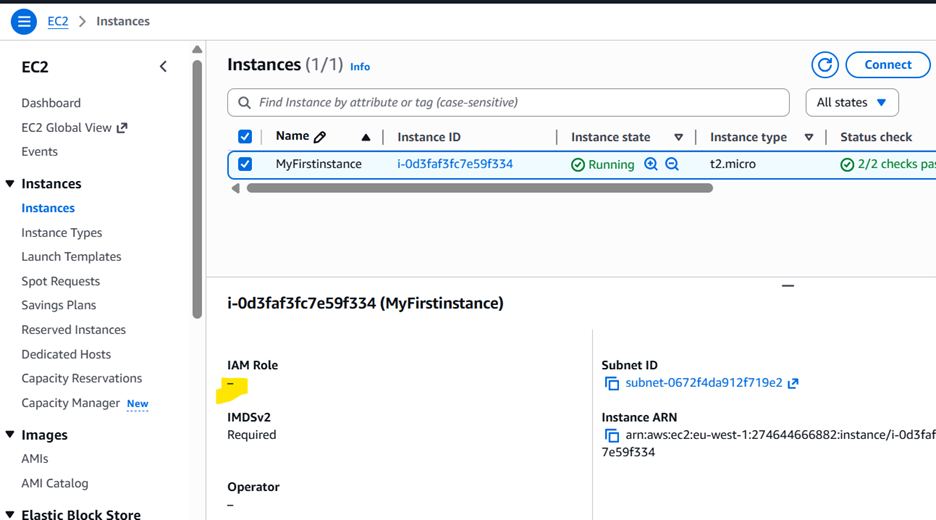
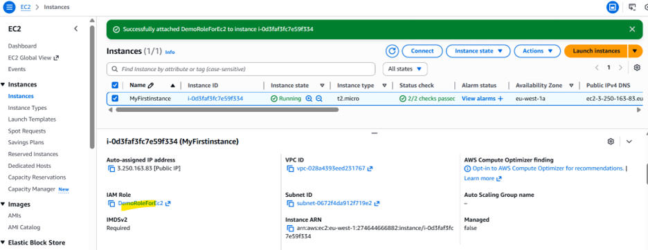
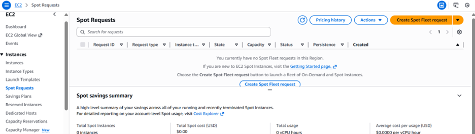
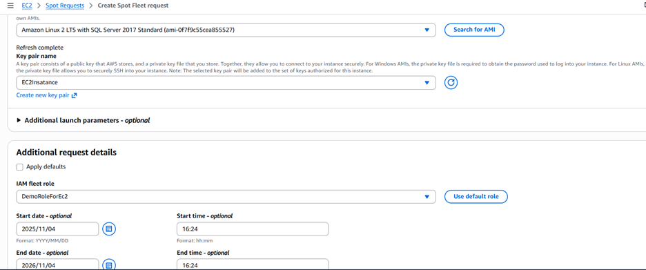
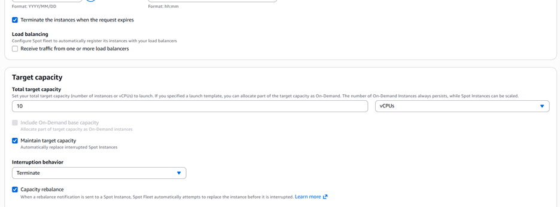
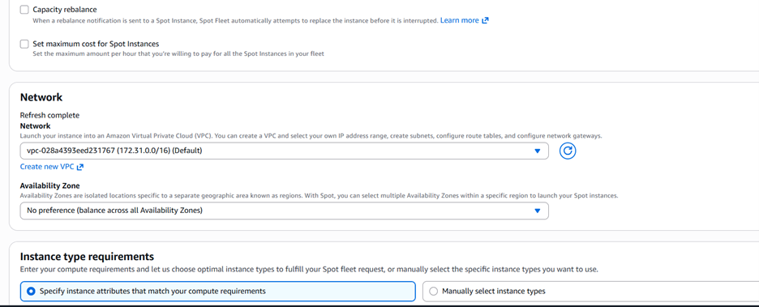
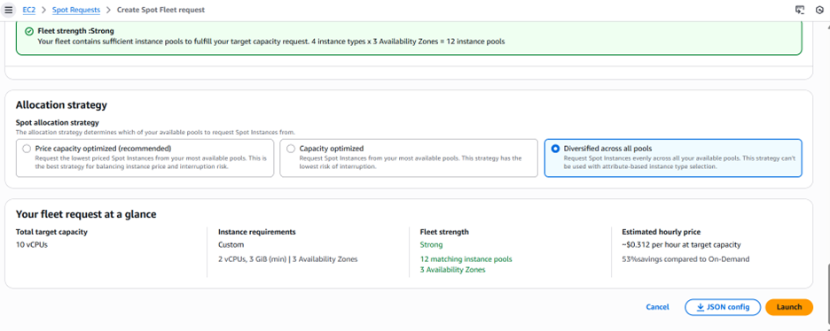

Amazon EC2 –
- EC2 is one of the most popular of AWS’ offering
- EC2 = Elastic Compute Cloud = Infrastructure as a Service
- It mainly consists in the capability of : 
1. Renting virtual machines (EC2) 
2. Storing data on virtual drives (EBS) 
3. Distributing load across machines (ELB) 
4. Scaling the services using an auto-scaling group (ASG)

EC2 sizing & configuration options 
- Operating System (OS): Linux, Windows or Mac OS 
- How much compute power & cores (CPU)
- How much random-access memory (RAM) 
- How much storage space:  
1. Network-attached (EBS & EFS) 
2. hardware (EC2 Instance Store)
- Network card: speed of the card, Public IP address 
- Firewall rules: security group 
- Bootstrap script (configure at first launch): EC2 User Data

EC2 User Data 
- It is possible to bootstrap our instances using an EC2 User data script. 
- bootstrapping means launching commands when a machine starts 
- That script is only run once at the instance first start 
- EC2 user data is used to automate boot tasks such as: 
- Installing updates 
- Installing software
 1. Downloading common files from the internet
 	- Anything you can think of 
- The EC2 User Data Script runs with the root use

Launching an EC2 Instance running Linux
Create keypair

Add userdata

Introduction to Security Groups
- Security Groups are the fundamental of network security in AWS
- They control how traffic is allowed into or out of our EC2 Instance
- Security groups only contain rules • Security groups rules can reference by IP or by security group

-Security groups are acting as a “firewall” on EC2 instance
- They regulate: 
1. Access to Ports 
2. Authorised IP ranges – IPv4 and IPv6 
3. Control of inbound network (from other to the instance) 
4. Control of outbound network (from the instance to other)

Classic Ports to know 
- 22 = SSH (Secure Shell) - log into a Linux instance
- 21 = FTP (File Transfer Protocol) – upload files into a file share 
- 22 = SFTP (Secure File Transfer Protocol) – upload files using SSH
- 80 = HTTP – access unsecured websites 
- 443 = HTTPS – access secured websites
- 3389 = RDP (Remote Desktop Protocol) – log into a Windows instance

EC2 connect –

EC2 Instance roles –
IAM role missing

Add IAM role

EC2 Instances Purchasing Options 
- On-Demand Instances – short workload, predictable pricing, pay by second 
- Reserved (1 & 3 years) 
1. Reserved Instances – long workloads 
2. Convertible Reserved Instances – long workloads with flexible instances
- Savings Plans (1 & 3 years) –commitment to an amount of usage, long workload
- Spot Instances – short workloads, cheap, can lose instances (less reliable)
- Dedicated Hosts – book an entire physical server, control instance placement 
- Dedicated Instances – no other customers will share your hardware 
- Capacity Reservations – reserve capacity in a specific AZ for any duration

EC2 On Demand 
- Pay for what you use: 
- Linux or Windows - billing per second, after the first minute 
- All other operating systems - billing per hour

EC2 Reserved Instance
- Up to 72% discount compared to On-demand 
- You reserve a specific instance attribute (Instance Type, Region, Tenancy, OS) 
- Reservation Period – 1 year (+discount) or 3 years (+++discount)

EC2 Savings Plan
- Get a discount based on long-term usage (up to 72% - same as RIs)

EC2 Spot Instances
- Can get a discount of up to 90% compared to On-demand
- Instances that you can “lose” at any point of time if your max price is less than the current spot price

EC2 Dedicated Host
- A physical server with EC2 instance capacity fully dedicated to your use
- Purchasing Options: 
1. On-demand – pay per second for active Dedicated Host 
2. Reserved - 1 or 3 years (No Upfront, Partial Upfront, All Upfront)

EC2 Dedicated Instances-
- Instances run on hardware that’s dedicated to you

EC2 Capacity Reservation
- Reserve On-Demand instances capacity in a specific AZ for any duration
 1. You always have access to EC2 capacity when you need it 
- No time commitment (create/cancel anytime), no billing discount

