Private vs Public IP (IPv4)
- Networking has two sorts of IPs. IPv4 and IPv6:
- IPv4: 1.160.10.240
- IPv6: 3ffe:1900:4545:3:200:f8ff:fe21:67cf
- IPv4 allows for 3.7 billion different addresses in the public space
- IPv4: [0-255].[0-255].[0-255].[0-255]

Private vs Public IP (IPv4) Difference
- Public IP:
    - Public IP means the machine can be identified on the internet (WWW)
    - Must be unique across the whole web (not two machines can have the same public IP). 
    - Can be geo-located easil

- Private IP:
- Private IP means the machine can only be identified on a private network only
- The IP must be unique across the private network
- BUT two different private networks (two companies) can have the same IPs. 
- Machines connect to WWW using a NAT + internet gateway (a proxy)
- Only a specified range of IPs can be used as private IP

Elastic IPs
- When you stop and then start an EC2 instance, it can change its public IP. 
- If you need to have a fixed public IP for your instance, you need an Elastic IP
- An Elastic IP is a public IPv4 IP you own as long as you don’t delete it
- You can attach it to one instance at a time

Public IP
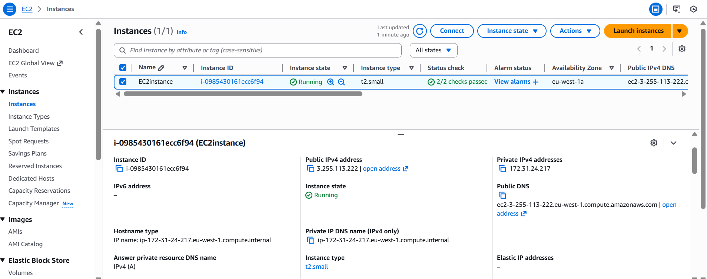

allocate ip address
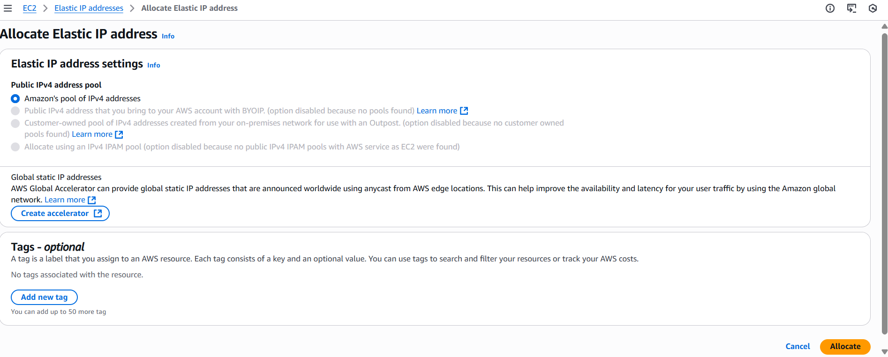

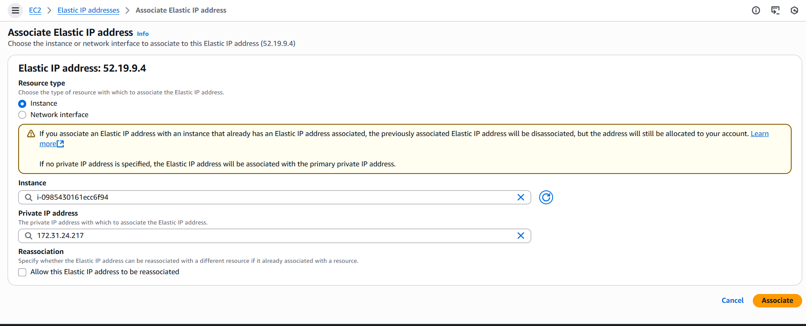

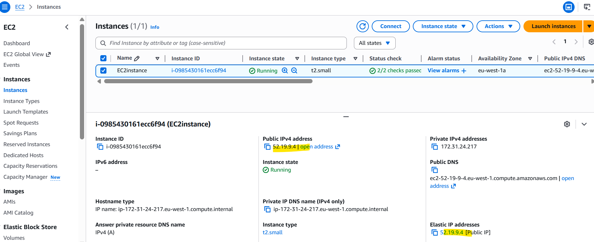

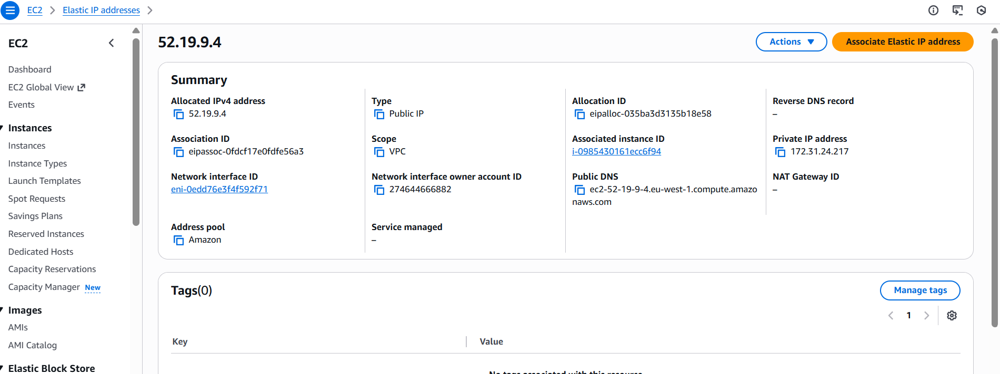

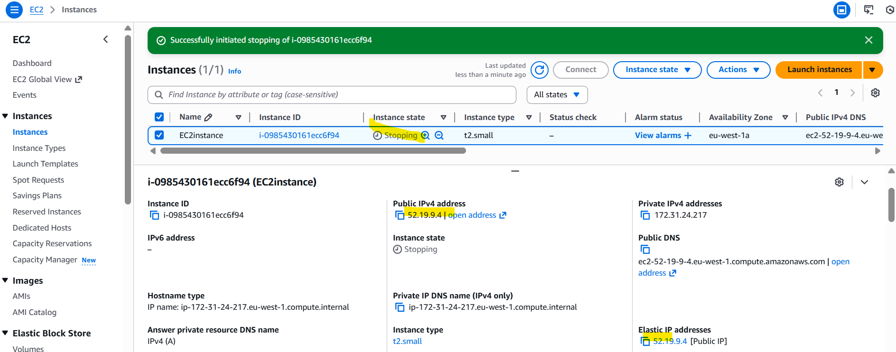

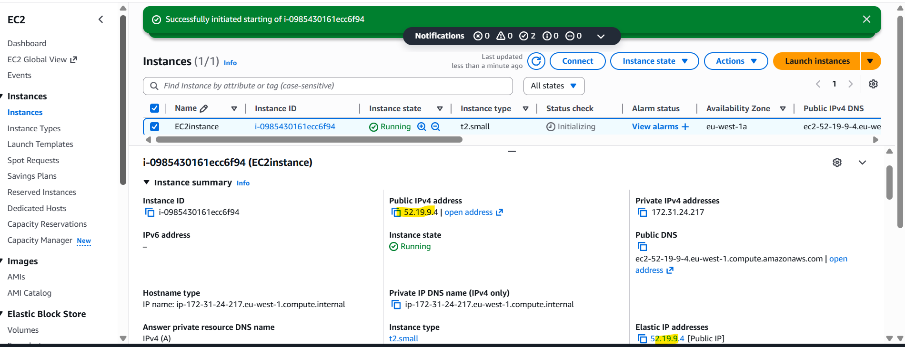

Placement Groups
- Sometimes you want control over the EC2 Instance placement strategy
- That strategy can be defined using placement groups
- When you create a placement group, you specify one of the following strategies for the group:
    - Cluster—clusters instances into a low-latency group in a single Availability Zone
    - Spread—spreads instances across underlying hardware (max 7 instances per group per AZ)
    - Partition—spreads instances across many different partitions (which rely on different sets of racks) within an AZ. Scales to 100s of EC2 instances per group (Hadoop, Cassandra, Kafka)

Placement Groups Cluster
- Pros: Great network (10 Gbps bandwidth between instances with Enhanced Networking enabled - recommended)
- Cons: If the AZ fails, all instances fails at the same time
- Use case: 
    - Big Data job that needs to complete fast
    - Application that needs extremely low latency and high network throughput

Placement Groups Spread
- Pros: 
    - Can span across Availability Zones (AZ)
    - Reduced risk is simultaneous failure
    - EC2 Instances are on different physical hardware
- Cons: 
    - Limited to 7 instances per AZ per placement group
- Use case: 
    - Application that needs to maximize high availability
    - Critical Applications where each instance must be isolated from failure from each other

Placements Groups Partition -
- Up to 7 partitions per AZ
- Can span across multiple AZs in the same region
- Up to 100s of EC2 instances The instances in a partition do not share racks with the instances in the other partitions
- A partition failure can affect many EC2 but won’t affect other partitions
- EC2 instances get access to the partition information as metadata
- Use cases: HDFS, HBase, Cassandra, Kafka

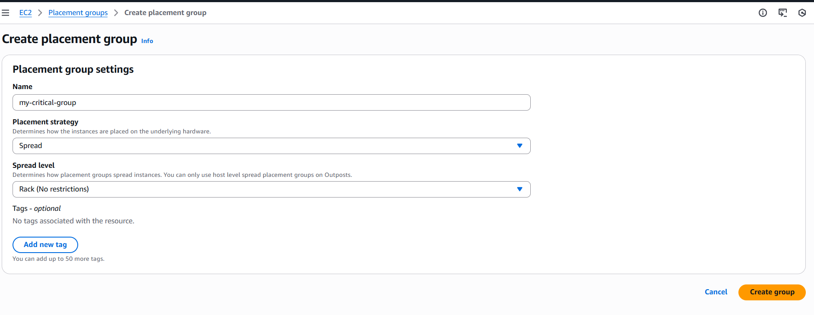

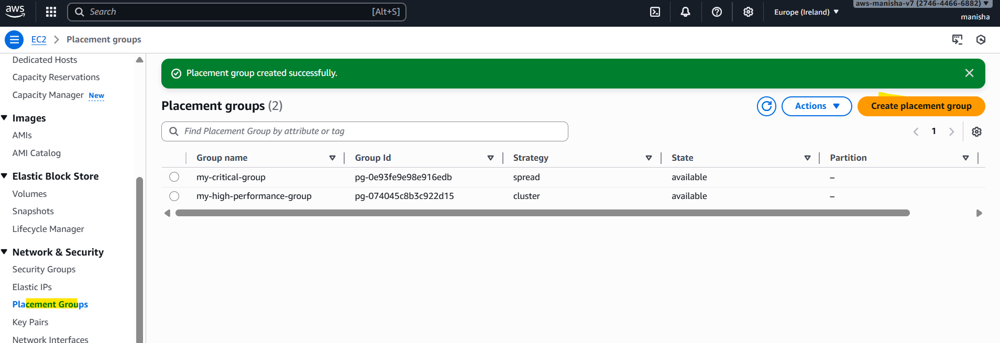

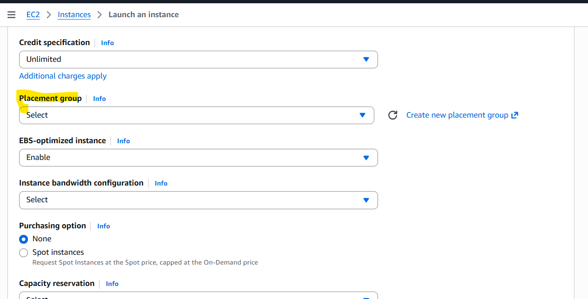

Elastic Network Interfaces (ENI)
- Logical component in a VPC that represents a virtual network card
- The ENI can have the following attributes
    - Primary private IPv4, one or more secondary IPv4
    - One Elastic IP (IPv4) per private IPv4
    - One Public IPv4
    - One or more security group
- You can create ENI independently and attach them on the fly (move them) on EC2 instances for failover

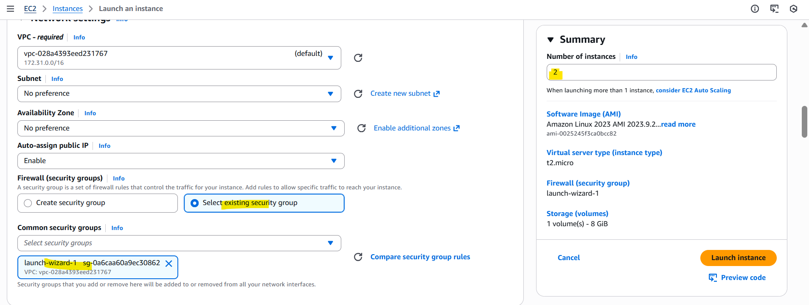

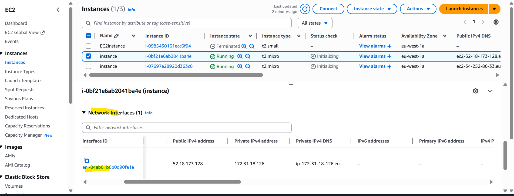

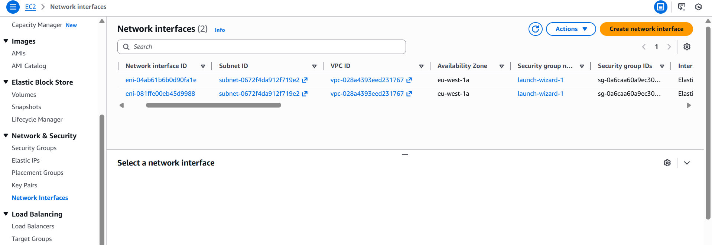

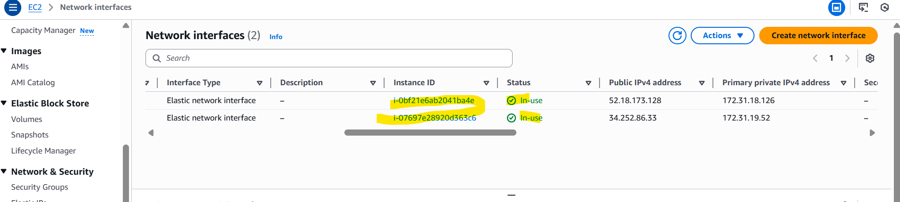

create network interface
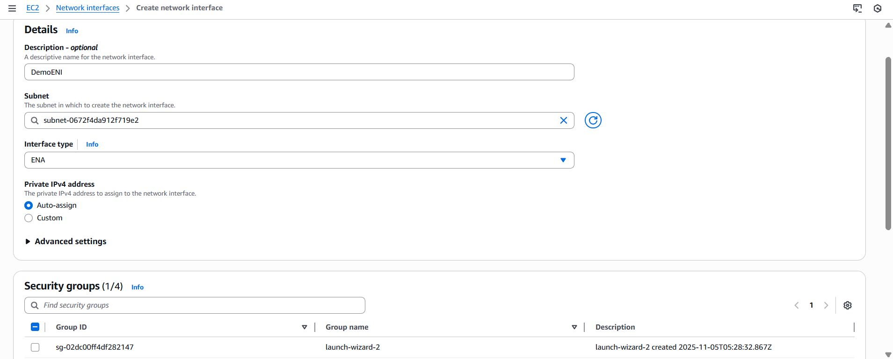

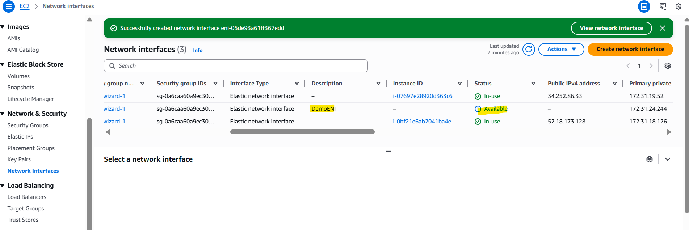

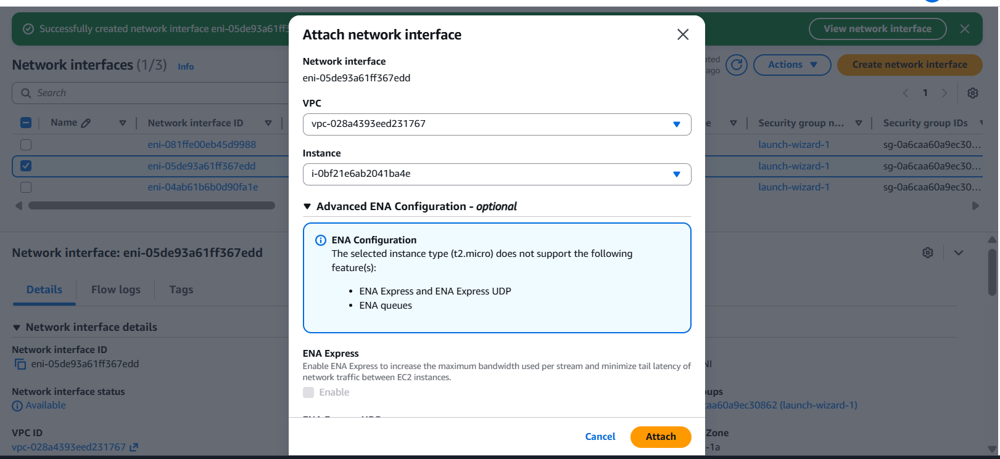

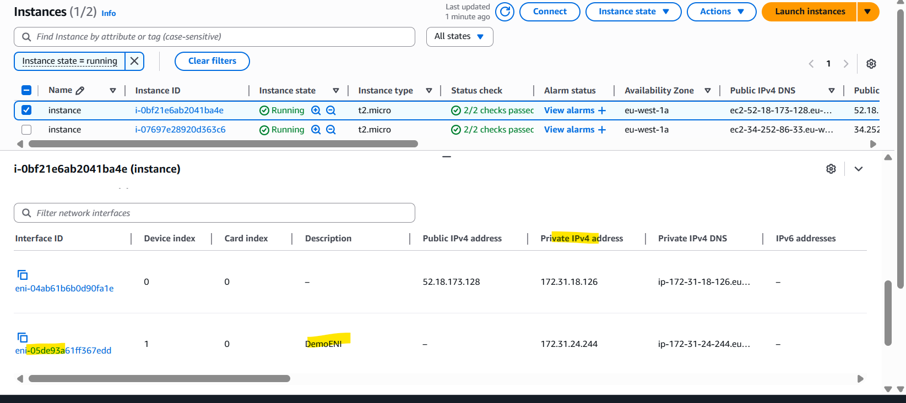

EC2 Hibernate
We know we can stop, terminate instances
- Stop – the data on disk (EBS) is kept intact in the next start
- Terminate – any EBS volumes (root) also set-up to be destroyed is lost

Introducing EC2 Hibernate: 
- The in-memory (RAM) state is preserved
- The instance boot is much faster! (the OS is not stopped / restarted)
- Under the hood: the RAM state is written to a file in the root EBS volume
- The root EBS volume must be encrypted

Use cases:
- Long-running processing
- Saving the RAM state
- Services that take time to initialize

