What’s an EBS Volume?
- An EBS (Elastic Block Store) Volume is a network drive you can attach to your instances while they run
- It allows your instances to persist data, even after their termination
- They can only be mounted to one instance at a time (at the CCP level)
- They are bound to a specific availability zone

EBS Volume
- It’s a network drive (i.e. not a physical drive)
    - It uses the network to communicate the instance, which means there might be a bit of latency
    - It can be detached from an EC2 instance and attached to another one quickly

- It’s locked to an Availability Zone (AZ)
    - An EBS Volume in us-east-1a cannot be attached to us-east-1b
- To move a volume across, you first need to snapshot it

- Have a provisioned capacity (size in GBs, and IOPS)
    - You get billed for all the provisioned capacity
    - You can increase the capacity of the drive over time

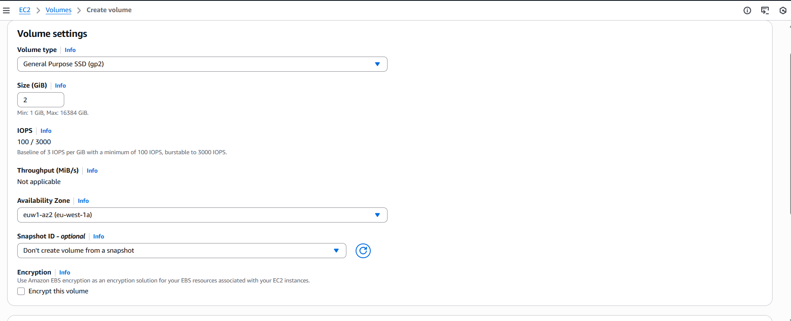

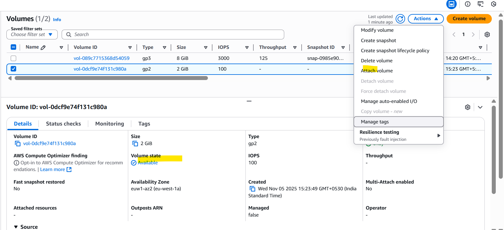

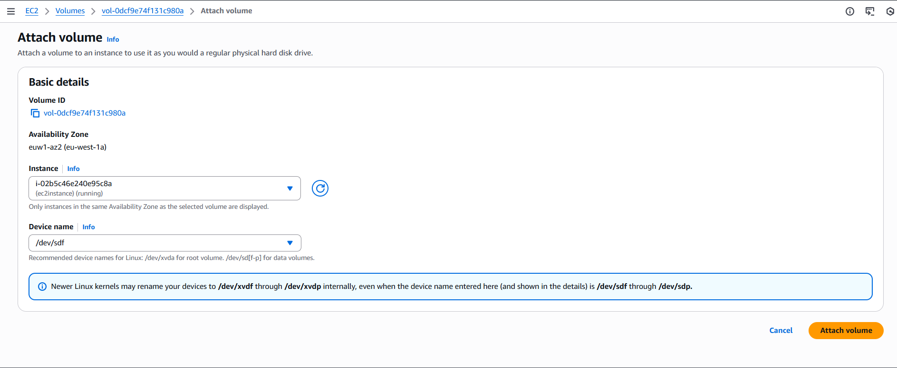

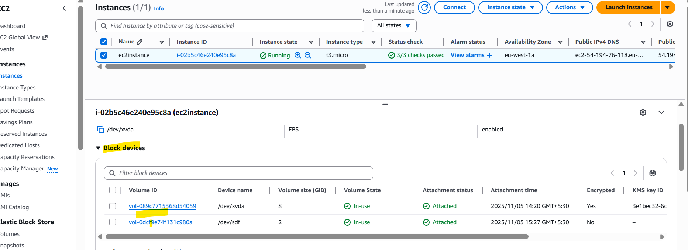

EBS Snapshots
- Make a backup (snapshot) of your EBS volume at a point in time
- Not necessary to detach volume to do snapshot, but recommended
- Can copy snapshots across AZ or Region

EBS Snapshots Features
- EBS Snapshot Archive
    - Move a Snapshot to an ”archive tier” that is 75% cheaper
    - Takes within 24 to 72 hours for restoring the archive
- Recycle Bin for EBS Snapshots
    - Setup rules to retain deleted snapshots so you can recover them after an accidental deletion
    - Specify retention (from 1 day to 1 year)
- Fast Snapshot Restore (FSR)
    - Force full initialization of snapshot to have no latency on the first use ($$$

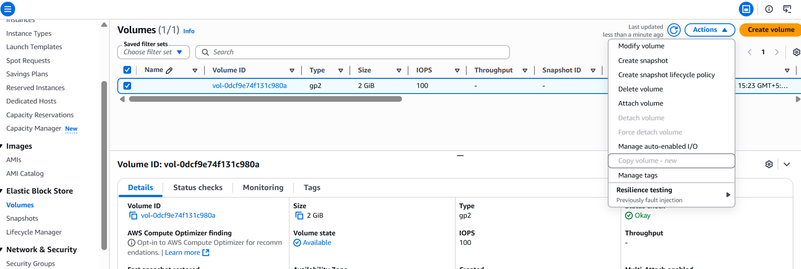

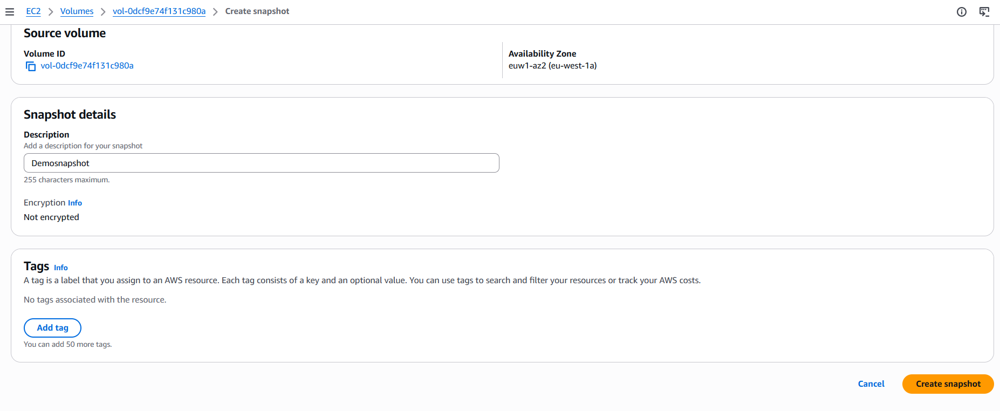

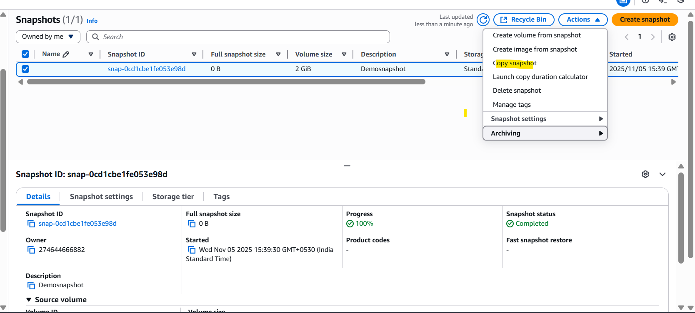

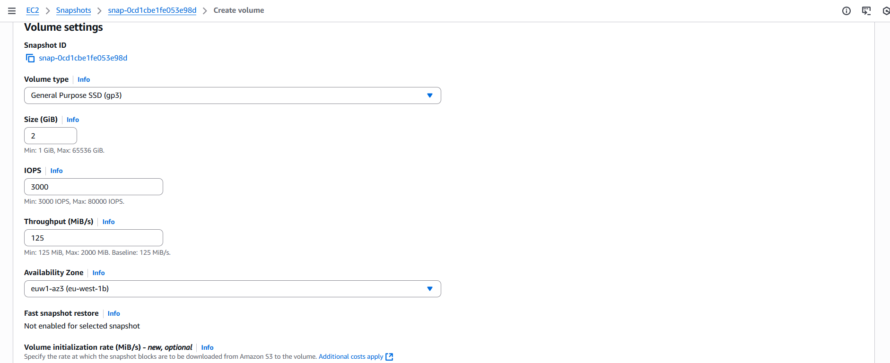

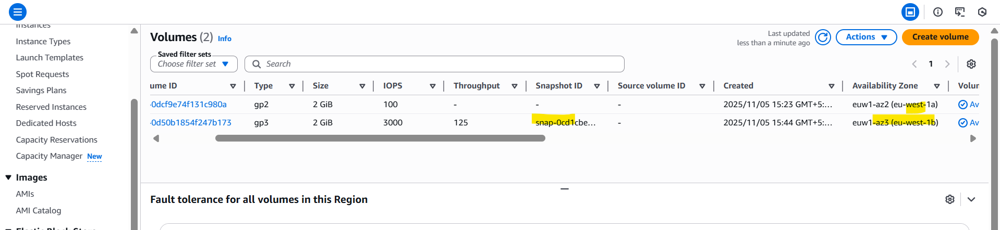

Snapshot delete
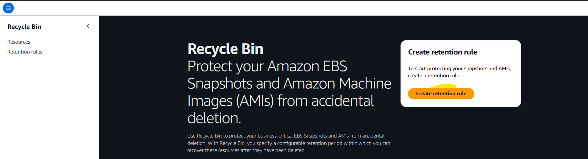

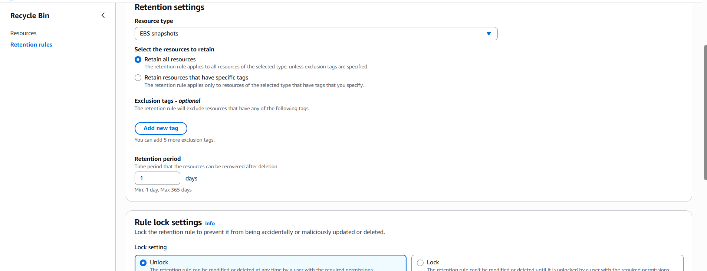

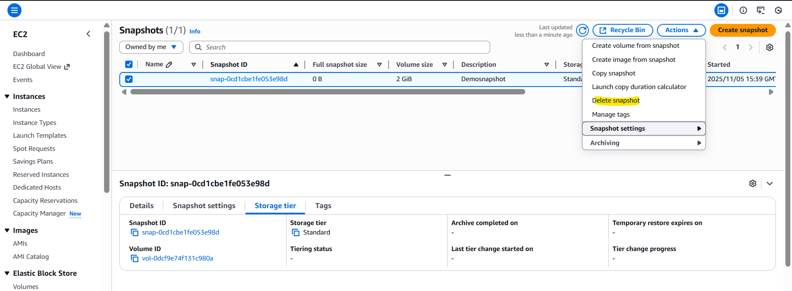

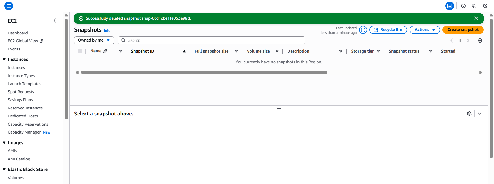

recover snapshot
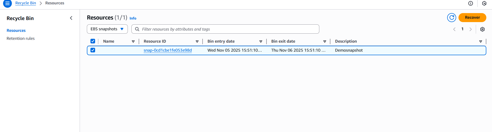

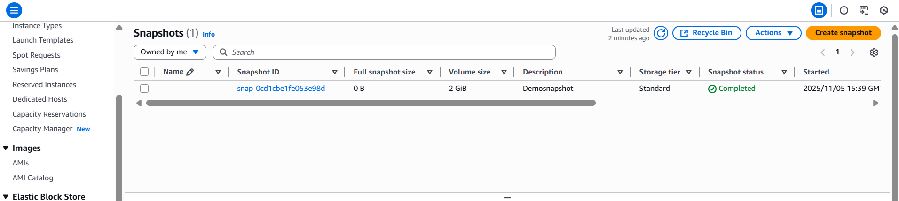

AMI Overview
- AMI = Amazon Machine Image
- AMI are a customization of an EC2 instance
    - You add your own software, configuration, operating system, monitoring…
    - Faster boot / configuration time because all your software is pre-packaged
- AMI are built for a specific region (and can be copied across regions
- You can launch EC2 instances from:
    - A Public AMI: AWS provided
    - Your own AMI: you make and maintain them yourself
    - An AWS Marketplace AMI: an AMI someone else made (and potentially sells)

AMI Process (from an EC2 instance)
- Start an EC2 instance and customize it
- Stop the instance (for data integrity)
- Build an AMI – this will also create EBS snapshots
-  Launch instances from other AMIs

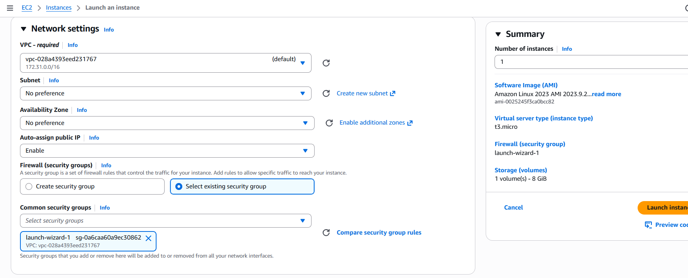

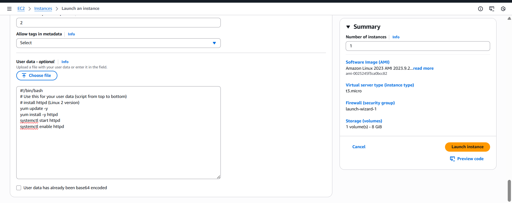

