Amazon RDS Overview 
- RDS stands for Relational Database Service
- It’s a managed DB service for DB use SQL as a query language. 
- It allows you to create databases in the cloud that are managed by AWS
    - Postgres
    - MySQL
    - MariaDB
    - Oracle
    - Microsoft SQL Server
    - IBM DB2
    - Aurora (AWS Proprietary database

Advantage over using RDS versus deploying DB on EC2
- RDS is a managed service:
    - Automated provisioning, OS patching
    - Continuous backups and restore to specific timestamp (Point in Time Restore)!
    - Monitoring dashboards
    - Read replicas for improved read performance
    - Multi AZ setup for DR (Disaster Recovery)
    - Maintenance windows for upgrades
    - Scaling capability (vertical and horizontal)
    - Storage backed by EBS 
- BUT you can’t SSH into your instances

RDS – Storage Auto Scaling
- Helps you increase storage on your RDS DB instance dynamically
- When RDS detects you are running out of free database storage, it scales automatically
- Avoid manually scaling your database storage
- You have to set Maximum Storage Threshold (maximum limit for DB storage)
- Automatically modify storage if:
    - Free storage is less than 10% of allocated storage 
    - Low-storage lasts at least 5 minutes 
    - 6 hours have passed since last modification
- Useful for applications with unpredictable workloads
- Supports all RDS database engines

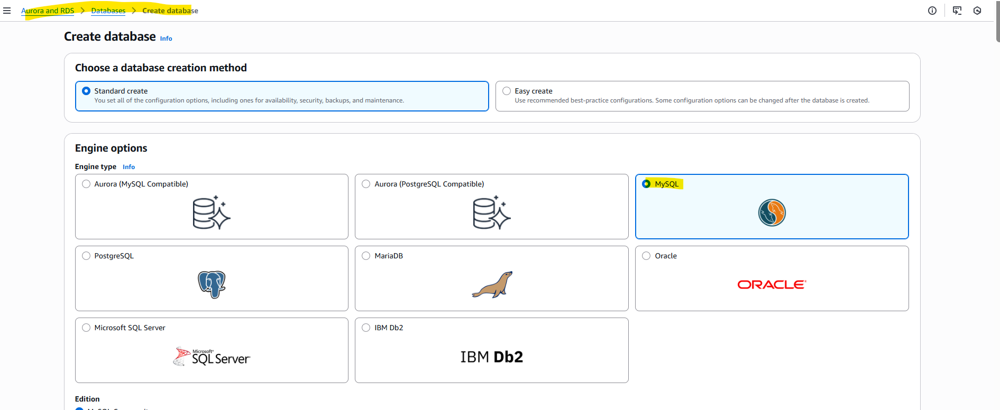

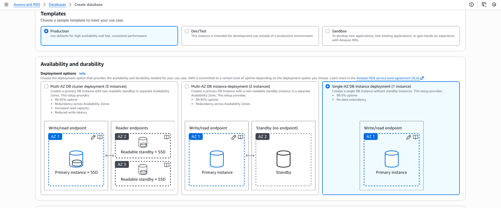

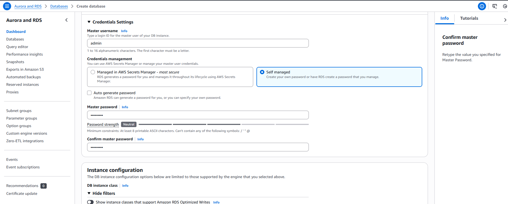

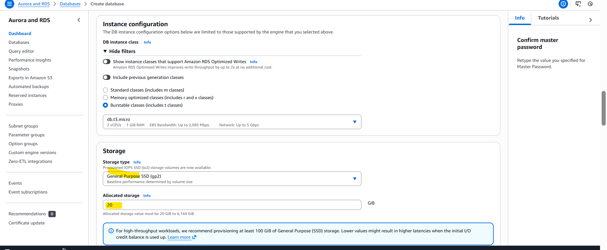

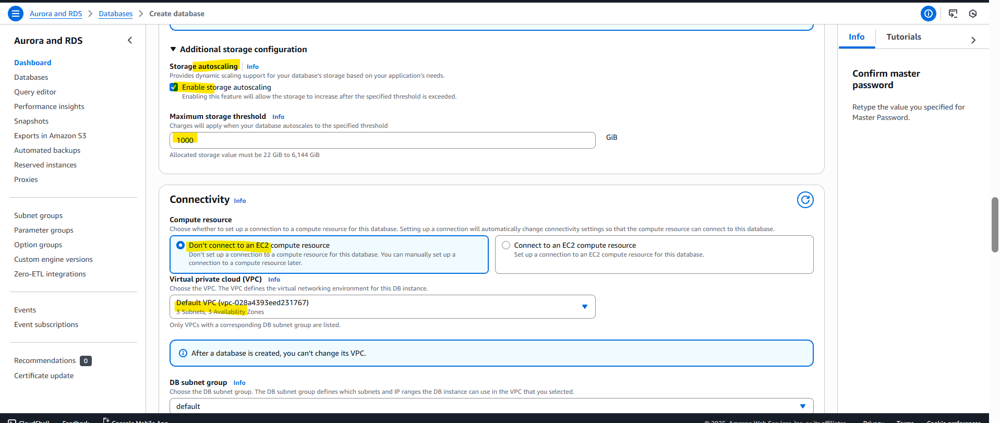

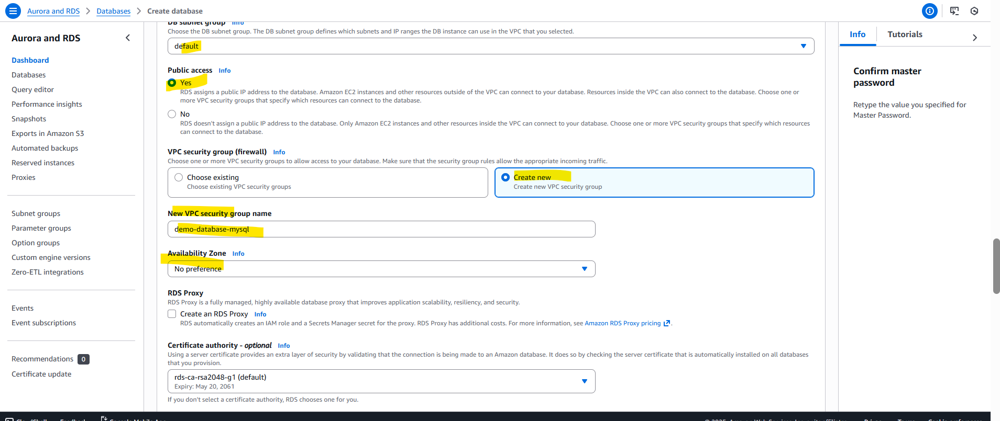

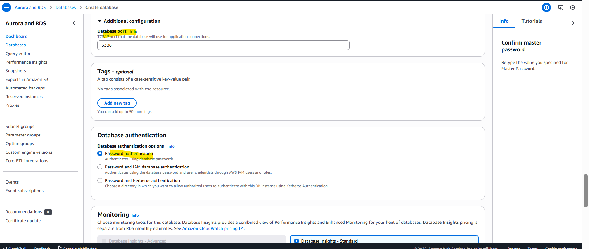

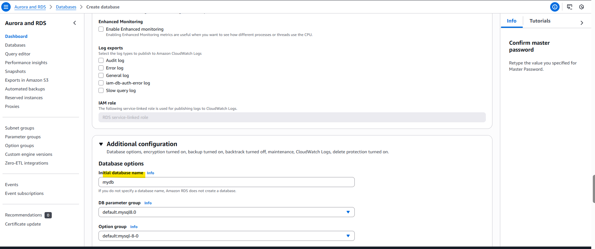

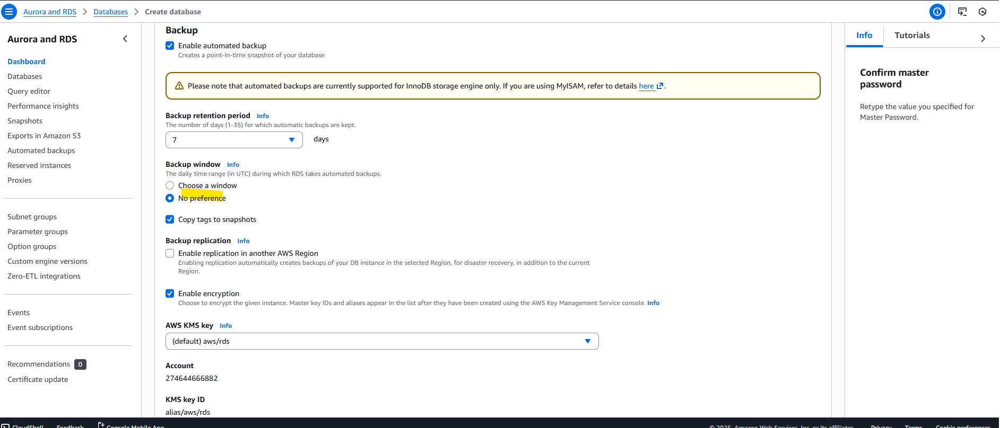

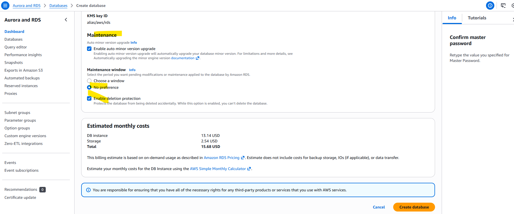

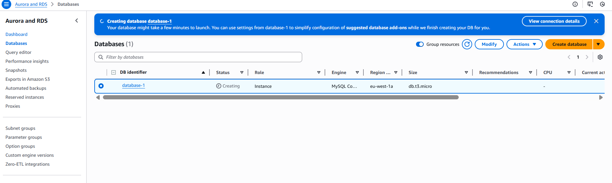

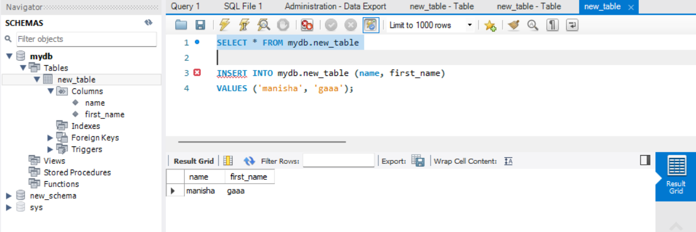

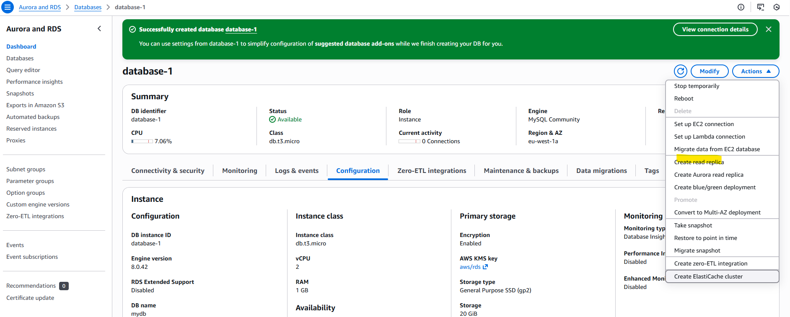

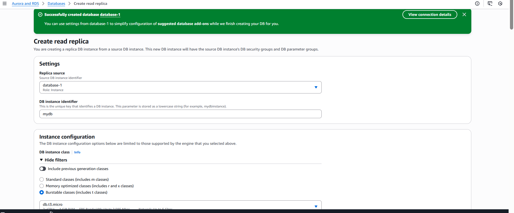

RDS Custom
- Managed Oracle and Microsoft SQL Server Database with OS and database customization
- RDS: Automates setup, operation, and scaling of database in AWS
- Custom: access to the underlying database and OS so you can
    - Configure settings
    - Install patches
    - Enable native features
    - Access the underlying EC2 Instance using SSH or SSM Session Manager

