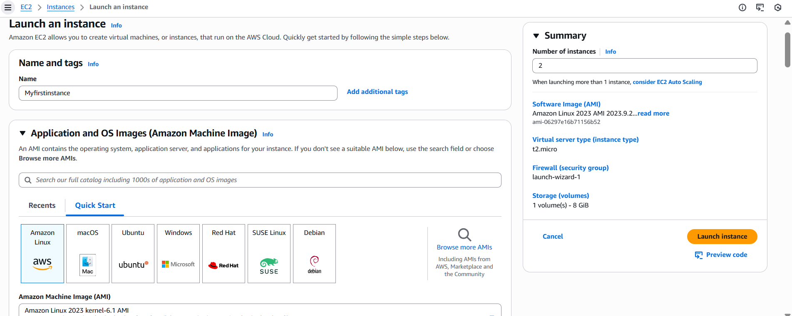
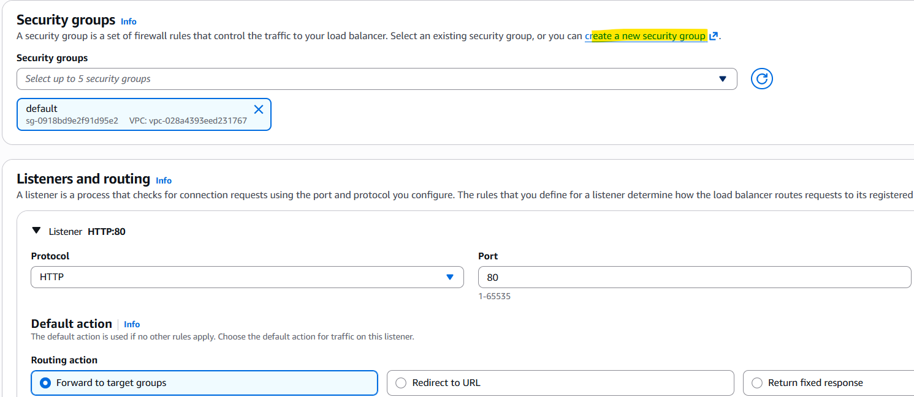
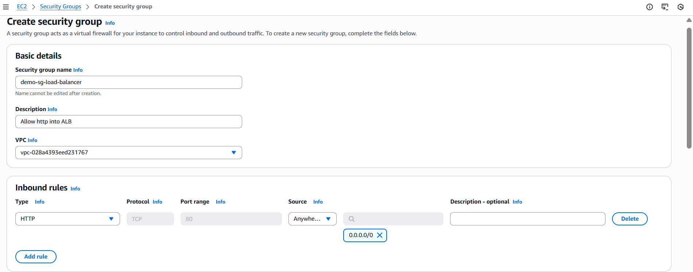
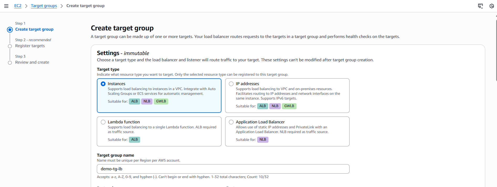
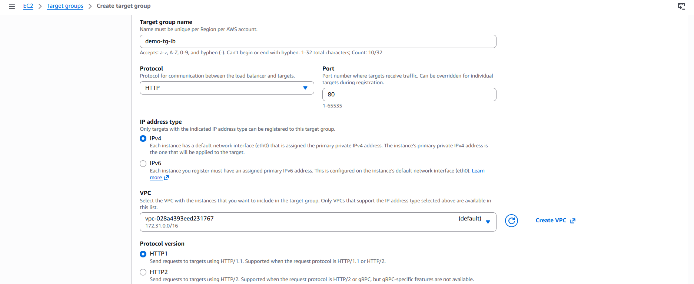
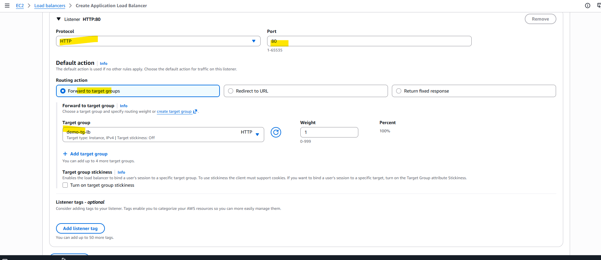
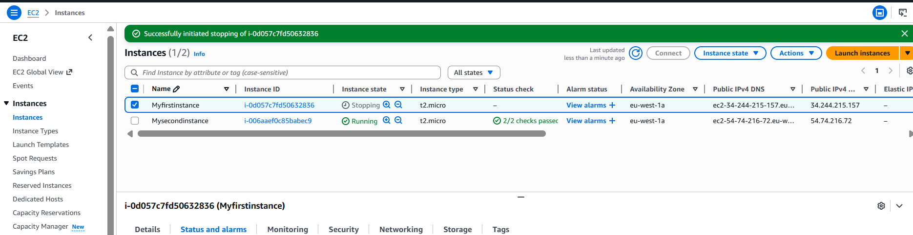
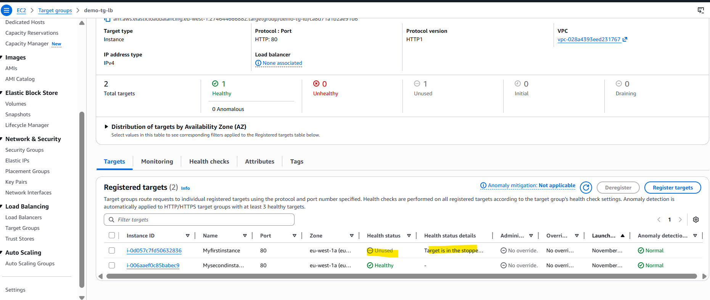
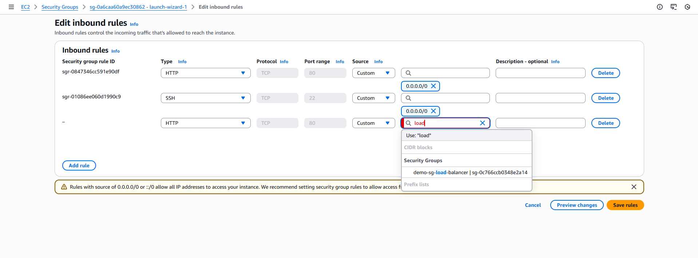

EC2 Instance Store
- EBS volumes are network drives with good but “limited” performance
- If you need a high-performance hardware disk, use EC2 Instance Store
- Better I/O performance
- Good for buffer / cache / scratch data / temporary content 
- Risk of data loss if hardware fails

EBS Volume Types
- EBS Volumes come in 6 types
    - gp2 / gp3 (SSD): General purpose SSD volume that balances price and performance for a wide variety of workloads
    - io1 / io2 Block Express (SSD): Highest-performance SSD volume for mission-critical low-latency or high-throughput workloads
    - st1 (HDD): Low cost HDD volume designed for frequently accessed, throughput- intensive workloads
    - sc1 (HDD): Lowest cost HDD volume designed for less frequently accessed workloads

EBS Volume Types Use cases
General Purpose SSD-
- Cost effective storage, low-latency
- System boot volumes, Virtual desktops, Development and test environments
- 1 GiB - 16 TiB
- gp3:
    - Baseline of 3,000 IOPS and throughput of 125 MiB/s
    - Can increase IOPS up to 16,000 and throughput up to 1000 MiB/s independently
- gp2:
    - Small gp2 volumes can burst IOPS to 3,000
    - Size of the volume and IOPS are linked, max IOPS is 16,000
    - 3 IOPS per GB, means at 5,334 GB we are at the max IOPS

Amazon EFS – Elastic File System 
-  Managed NFS (network file system) that can be mounted on many EC2
-  EFS works with EC2 instances in multi-AZ
-  Highly available, scalable, expensive (3x gp2), pay per use

- Use cases: content management, web serving, data sharing, Wordpress
- Uses NFSv4.1 protocol
- Uses security group to control access to EFS
- Compatible with Linux based AMI (not Windows)
- Encryption at rest using KMS

EFS – Performance & Storage Classes
- EFS Scale
    - 1000s of concurrent NFS clients, 10 GB+ /s throughput
    - Grow to Petabyte-scale network file system, automatically
- Performance Mode (set at EFS creation time)
    - General Purpose (default) – latency-sensitive use cases (web server, CMS, etc…)
    - Max I/O – higher latency, throughput, highly parallel (big data, media processing)
- Throughput Mode
    - Bursting – 1 TB = 50MiB/s + burst of up to 100MiB/s
    - Provisioned – set your throughput regardless of storage size, ex: 1 GiB/s for 1 TB storage
    - Elastic – automatically scales throughput up or down based on your workloads
        - Up to 3GiB/s for reads and 1GiB/s for writes
        - Used for unpredictable workloads

EFS – Storage Classes
-Storage Tiers (lifecycle management feature – move file after N days)
    - Standard: for frequently accessed files
    - Infrequent access (EFS-IA): cost to retrieve files, lower price to store. 
- Archive: rarely accessed data (few times each year), 50% cheaper
- Implement lifecycle policies to move files between storage tiers

- Availability and durability
    - Standard: Multi-AZ, great for prod
    - One Zone: One AZ, great for dev, backup enabled by default, compatible with IA (EFS One Zone-IA)

EBS vs EFS – Elastic Block Storage
- EBS volumes…
    - one instance (except multi-attach io1/io2) are locked at the Availability Zone (AZ) level
    - gp2: IO increases if the disk size increases
    - gp3 & io1: can increase IO independently
- To migrate an EBS volume across AZ
    - Take a snapshot 
    - Restore the snapshot to another AZ
    - EBS backups use IO and you shouldn’t run them while your application is handling a lot of traffic    
- Root EBS Volumes of instances get terminated by default if the EC2 instance gets terminated. (you can disable that)    

High Availability & Scalability
Scalability & High Availability
- Scalability means that an application / system can handle greater loads by adapting. 
- There are two kinds of scalability:
- Vertical Scalability
- Horizontal Scalability (= elasticity)
- Scalability is linked but different to High Availability

Vertical Scalability-
- Vertically scalability means increasing the size of the instance
- For example, your application runs on a t2.micro
- Scaling that application vertically means running it on a t2.large
- Vertical scalability is very common for non distributed systems, such as a database. 
- RDS, ElastiCache are services that can scale vertically.
- There’s usually a limit to how much you can vertically scale (hardware limit)

Horizontal Scalability -
- Horizontal Scalability means increasing the number of instances / systems for your application
- Horizontal scaling implies distributed systems
- This is very common for web applications / modern applications

High Availability
- High Availability usually goes hand in hand with horizontal scaling
- High availability means running your application / system in at least 2 data centers (== Availability Zones)
- The goal of high availability is to survive a data center loss
- The high availability can be passive (for RDS Multi AZ for example)
- The high availability can be active (for horizontal scaling)

High Availability & Scalability For EC2
- Vertical Scaling: Increase instance size (= scale up / down)
    - From: t2.nano - 0.5G of RAM, 1 vCPU
    - To: u-12tb1.metal – 12.3 TB of RAM, 448 vCPUs
- Horizontal Scaling: Increase number of instances (= scale out / in)
    - Auto Scaling Group
    - Load Balancer
- High Availability: Run instances for the same application across multi AZ
    - Auto Scaling Group multi AZ
    - Load Balancer multi AZ

What is load balancing?
- Load Balances are servers that forward traffic to multiple servers (e.g., EC2 instances) downstream

Why use a load balancer?
- Spread load across multiple downstream instances 
- Expose a single point of access (DNS) to your application
- Seamlessly handle failures of downstream instances 
- Do regular health checks to your instances 
- Provide SSL termination (HTTPS) for your websites 
- Enforce stickiness with cookies 
- High availability across zones 
- Separate public traffic from private traffic

Why use an Elastic Load Balancer?
- An Elastic Load Balancer is a managed load balancer
    - AWS guarantees that it will be working
    - AWS takes care of upgrades, maintenance, high availability
    - AWS provides only a few configuration knobs
- It costs less to setup your own load balancer but it will be a lot more effort on your end
- It is integrated with many AWS offerings / services
    - EC2, EC2 Auto Scaling Groups, Amazon ECS
    - AWS Certificate Manager (ACM), CloudWatch
    - Route 53, AWS WAF, AWS Global Accelerator

Health Checks
- Health Checks are crucial for Load Balancers
- They enable the load balancer to know if instances it forwards traffic to are available to reply to requests
- The health check is done on a port and a route (/health is common)
- If the response is not 200 (OK), then the instance is unhealthy

Types of load balancer on AWS
- AWS has 4 kinds of managed Load Balancers
- Classic Load Balancer (v1 - old generation) – 2009 – CLB
    - HTTP, HTTPS, TCP, SSL (secure TCP)
- Application Load Balancer (v2 - new generation) – 2016 – ALB 
    - HTTP, HTTPS, WebSocket
- Network Load Balancer (v2 - new generation) – 2017 – NLB 
    - TCP, TLS (secure TCP), UDP
- Gateway Load Balancer – 2020 – GWLB 
    - Operates at layer 3 (Network layer) – IP Protocol
- Some load balancers can be setup as internal (private) or external (public) ELBs

Application Load Balancer (v2)
- Application load balancers is Layer 7 (HTTP)
- Load balancing to multiple HTTP applications across machines (target groups)
- Load balancing to multiple applications on the same machine (ex: containers)
- Support for HTTP/2 and WebSocket
- Support redirects (from HTTP to HTTPS for example)

Application Load Balancer (v2)
- Routing tables to different target groups:
- Routing based on path in URL (example.com/users & example.com/posts)
- Routing based on hostname in URL (one.example.com & other.example.com)
- Routing based on Query String, Headers (example.com/users?id=123&order=false)
- ALB are a great fit for micro services & container-based application (example: Docker & Amazon ECS)
- Has a port mapping feature to redirect to a dynamic port in ECS
- In comparison, we’d need multiple Classic Load Balancer per application

Applicat LB -
launch EC2

create application loabbalancer

create targetgroup

stop ec2first instance targetgroup shows unused

add inboundrule - security group

