What is DNS?
- Domain Name System which translates the human friendly hostnames into the machine IP addresses
- www.google.com => 172.217.18.36
- DNS is the backbone of the Internet
- DNS uses hierarchical naming structure
.com
.example.com
www.example.com

DNS Terminologies
- Domain Registrar: Amazon Route 53, GoDaddy, …
- DNS Records: A, AAAA, CNAME, NS, …
- Zone File: contains DNS records
- Name Server: resolves DNS queries (Authoritative or Non-Authoritative)
- Top Level Domain (TLD): .com, .us, .in, .gov, .org,
- Second Level Domain (SLD): amazon.com, google.com

Amazon Route 53
- A highly available, scalable, fully managed and Authoritative DNS
- Authoritative = the customer (you) can update the DNS records 
- Route 53 is also a Domain Registrar
- Ability to check the health of your resources
- The only AWS service which provides 100% availability SLA

Route 53 – Record Types
- A – maps a hostname to IPv4
- AAAA – maps a hostname to IPv6
- CNAME – maps a hostname to another hostname
- The target is a domain name which must have an A or AAAA record
- Can’t create a CNAME record for the top node of a DNS namespace (Zone Apex)
- Example: you can’t create for example.com, but you can create for www.example.com
- NS – Name Servers for the Hosted Zone
    - Control how traffic is routed for a domain

Route 53 – Hosted Zones
- Public Hosted Zones – contains records that specify how to route traffic on the Internet (public domain names)
    -application1.mypublicdomain.com
- Private Hosted Zones – contain records that specify how you route traffic within one or more VPCs (private domain names)
    -application1.company.internal

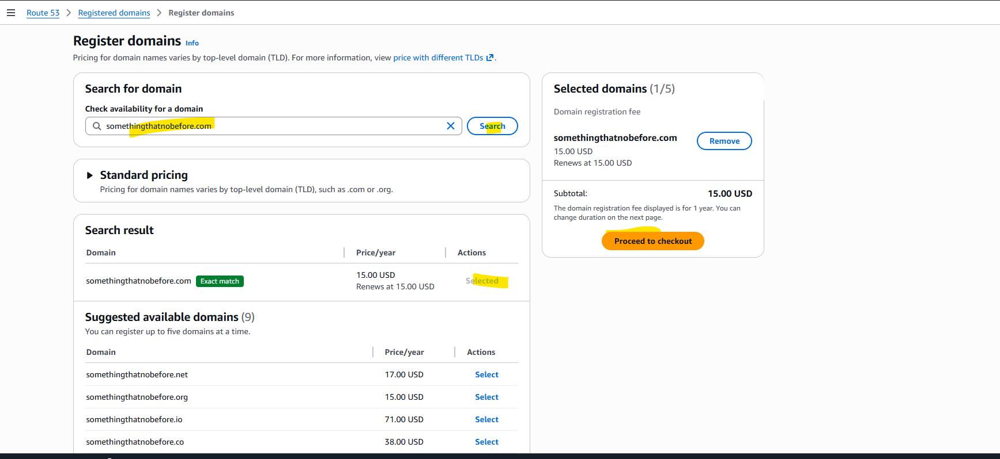

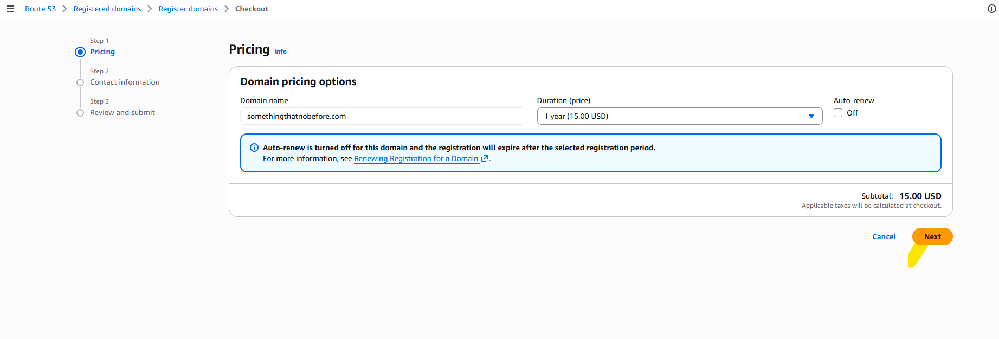

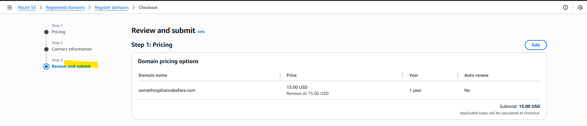

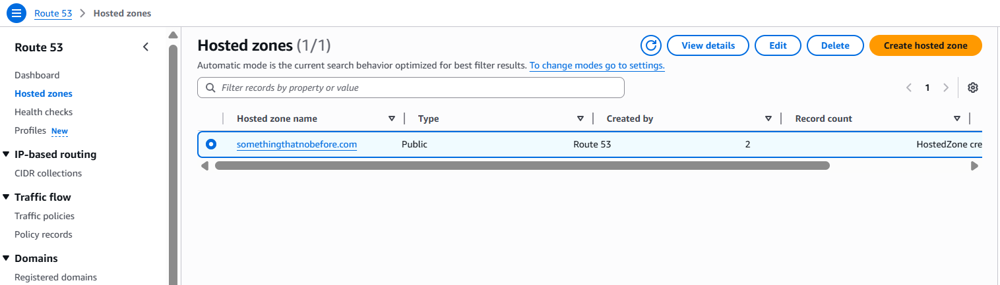

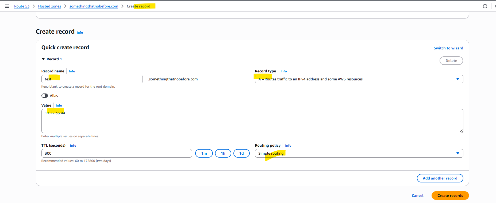

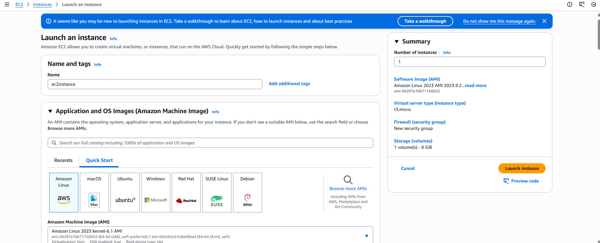

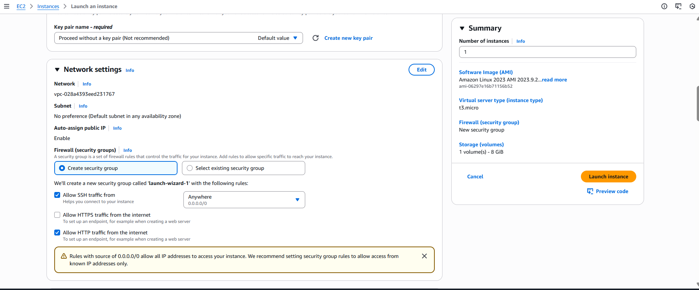

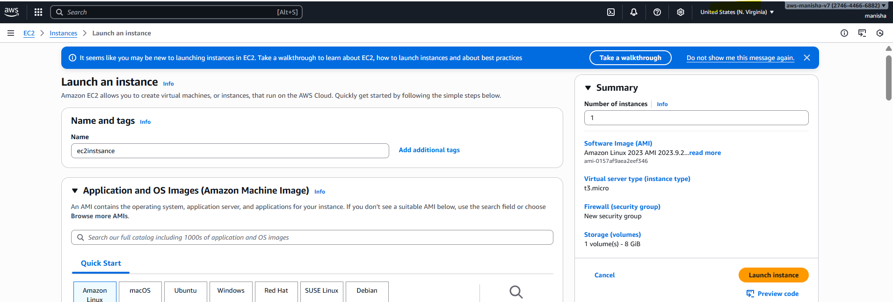

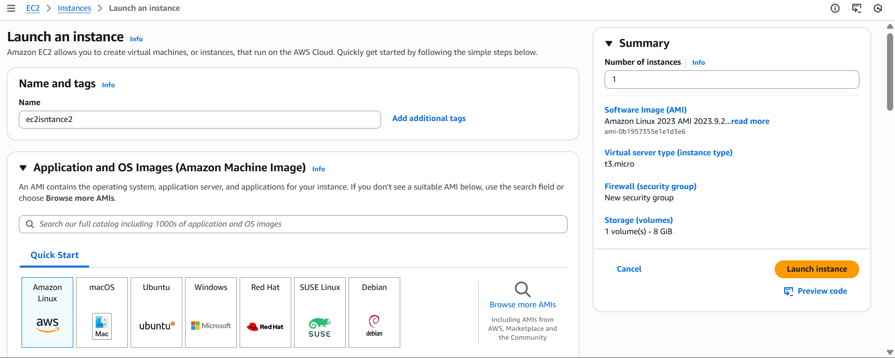

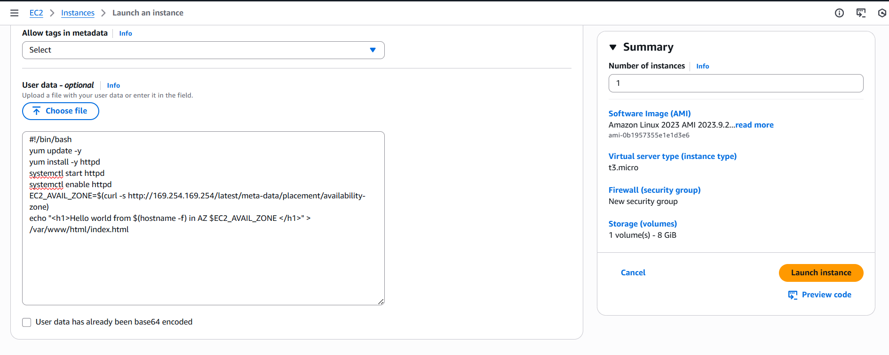

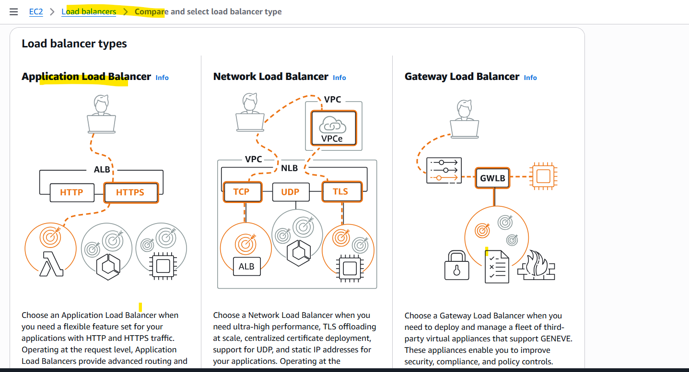

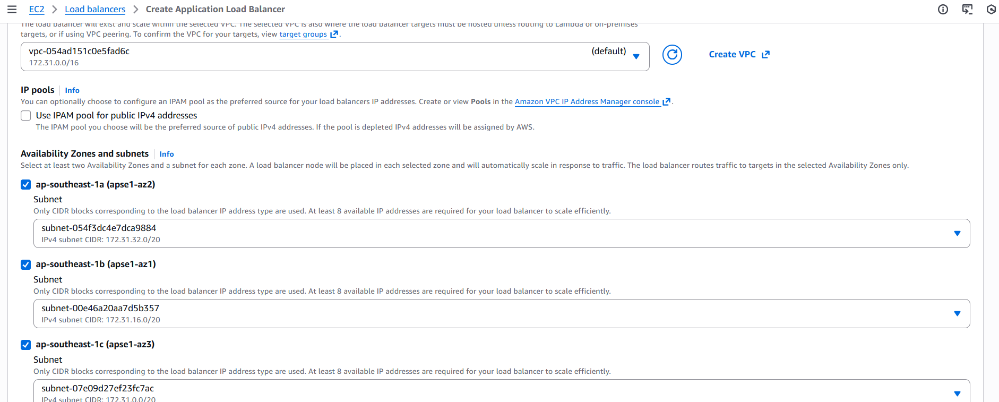

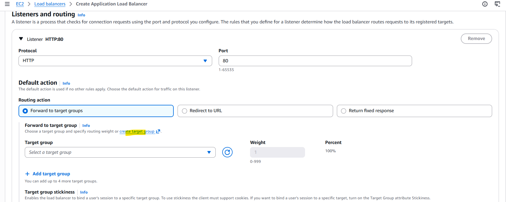

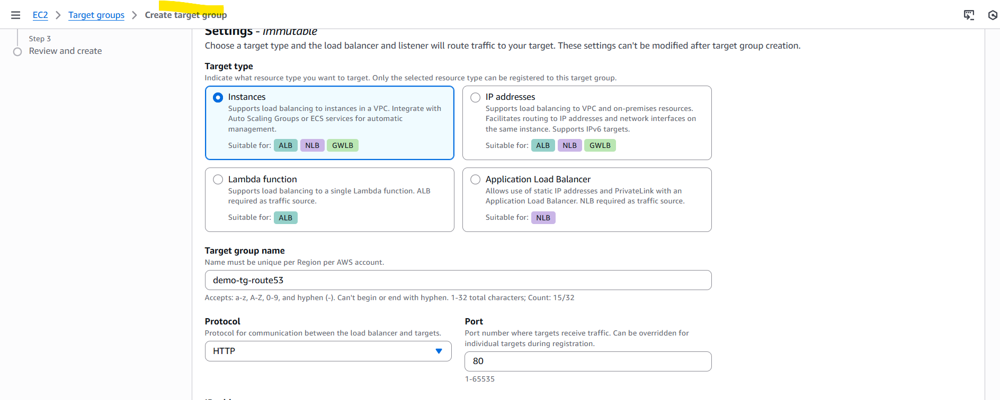

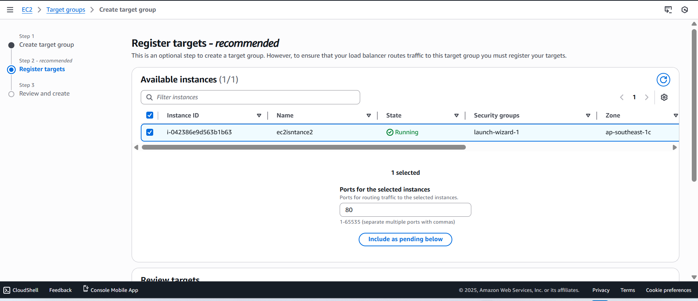

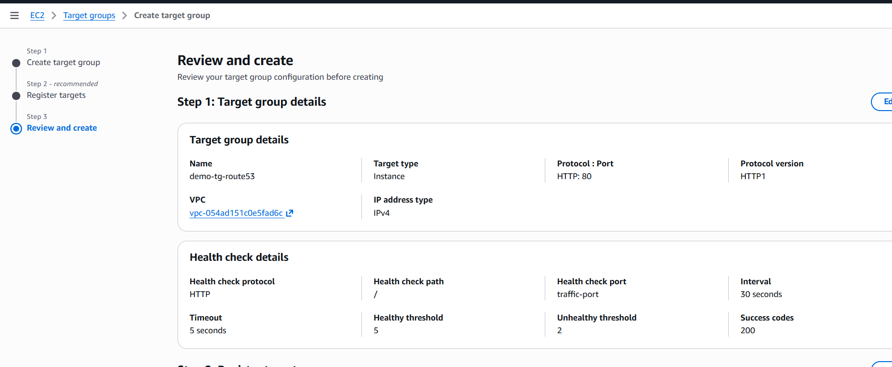

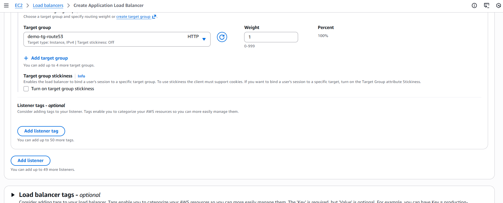

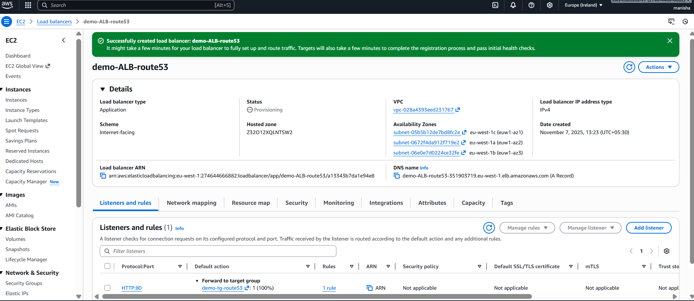

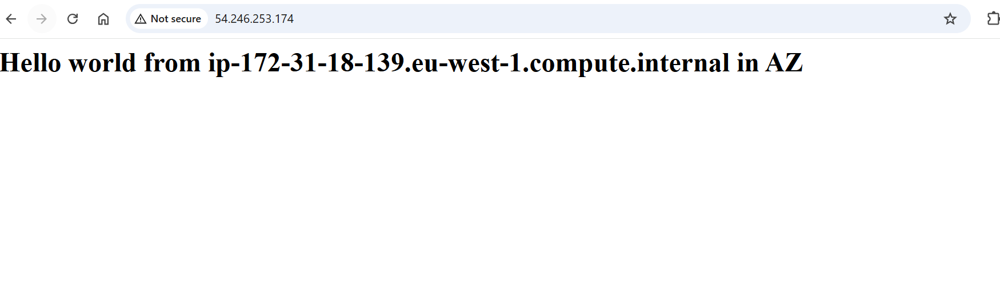

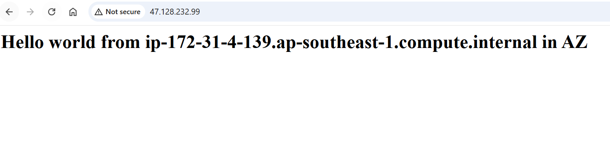

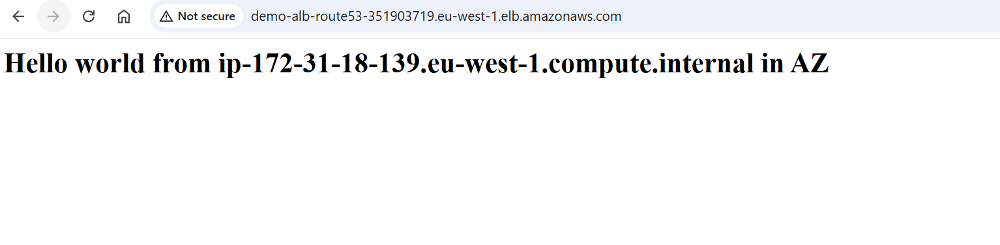

