Amazone S3
- Amazon S3 is one of the main building blocks of AWS
- It’s advertised as ”infinitely scaling” storage 
- Many websites use Amazon S3 as a backbone
- Many AWS services use Amazon S3 as an integration as well

Amazon S3 Use cases 
- Backup and storage 
- Disaster Recovery 
- Archive 
- Hybrid Cloud storage 
- Application hosting

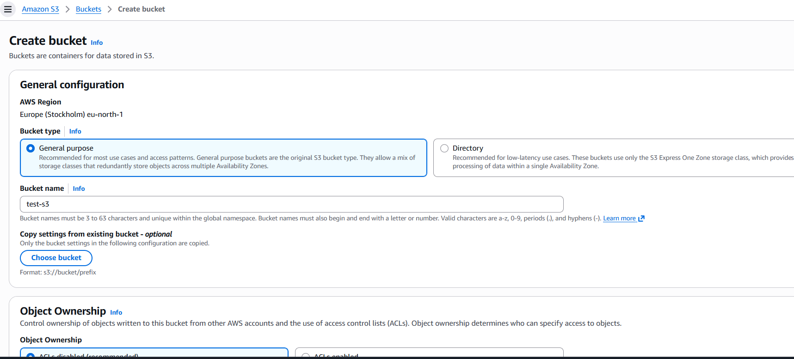

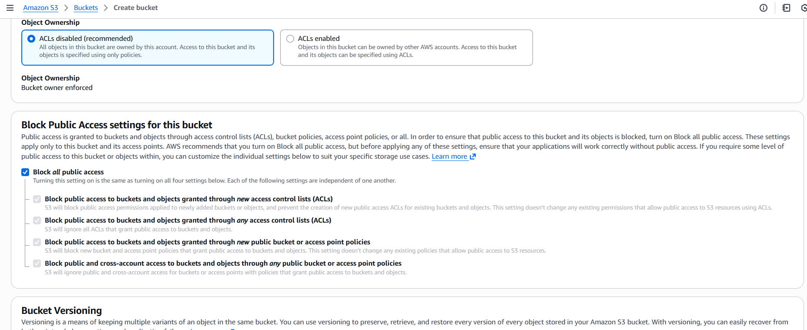

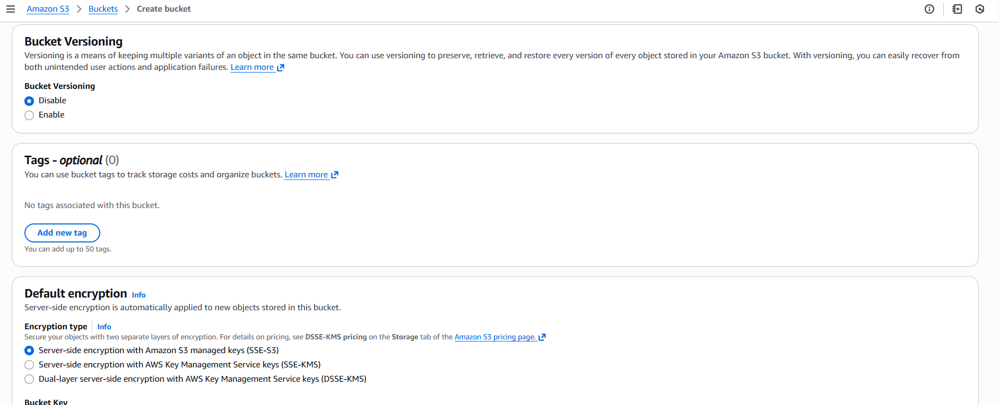

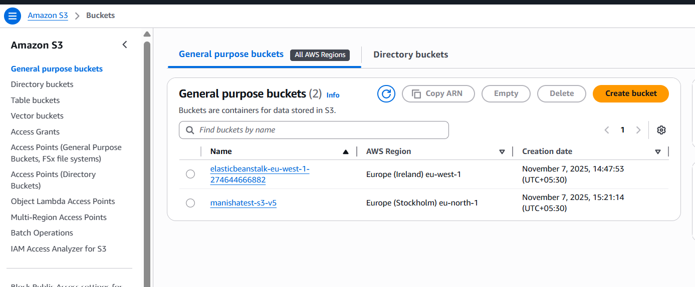

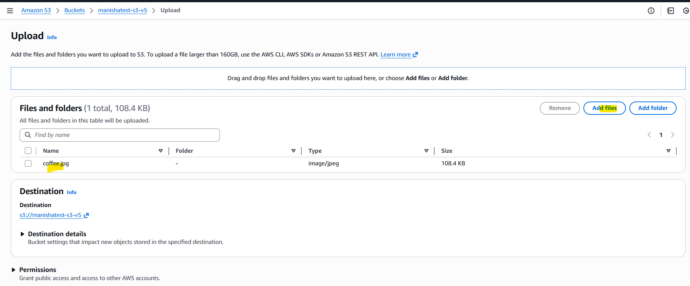

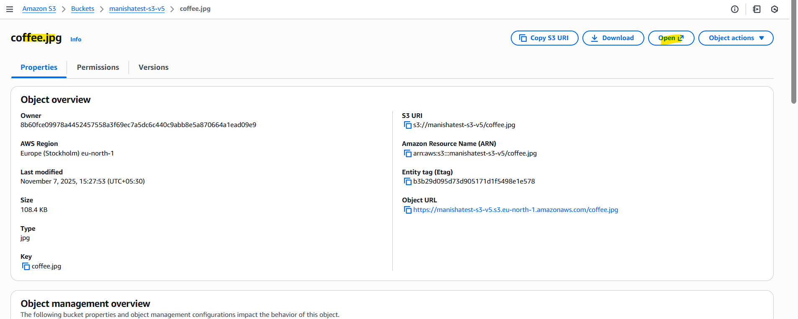

Amazon S3 – Security
-User-Based
    - IAM Policies – which API calls should be allowed for a specific user from IAM
- Resource-Based
    - Bucket Policies – bucket wide rules from the S3 console - allows cross account
    - Object Access Control List (ACL) – finer grain (can be disabled)
    - Bucket Access Control List (ACL) – less common (can be disabled)
- Note: an IAM principal can access an S3 object if
    - The user IAM permissions ALLOW it OR the resource policy ALLOWS it
    - AND there’s no explicit DENY

S3 Bucket Policies 
- JSON based policies 
• Resources: buckets and objects 
• Effect: Allow / Deny 
• Actions: Set of API to Allow or Deny 
• Principal: The account or user to apply the policy to
- Use S3 bucket for policy to: 
• Grant public access to the bucket • Force objects to be encrypted at upload 
• Grant access to another account (Cross Account)

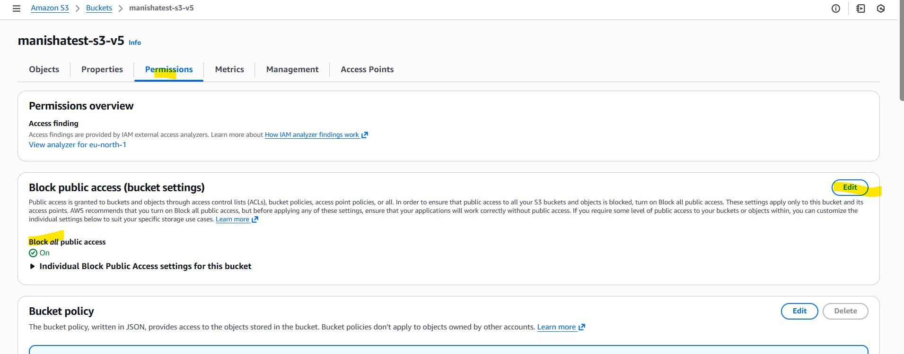

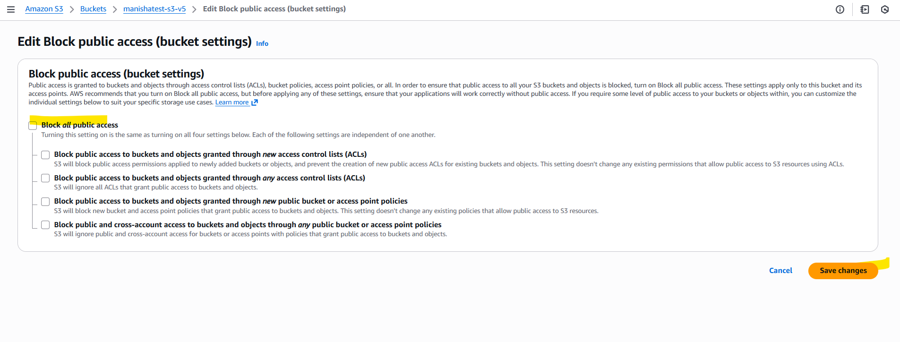

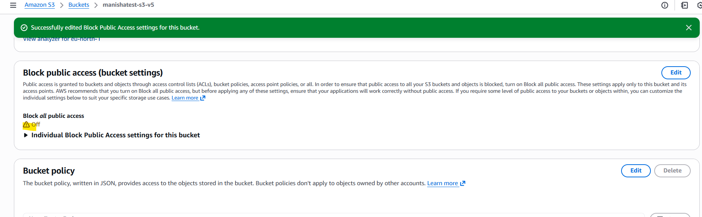

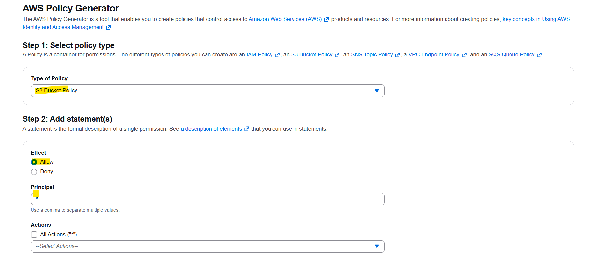

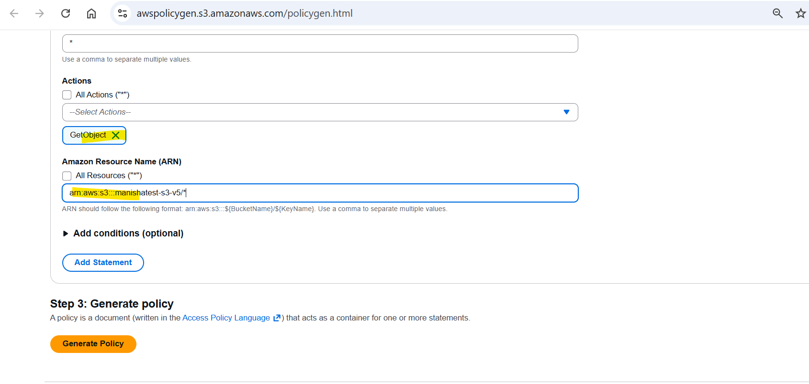

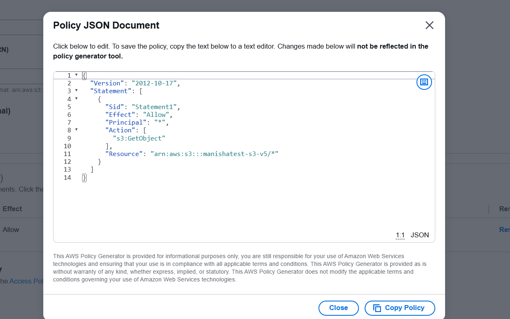

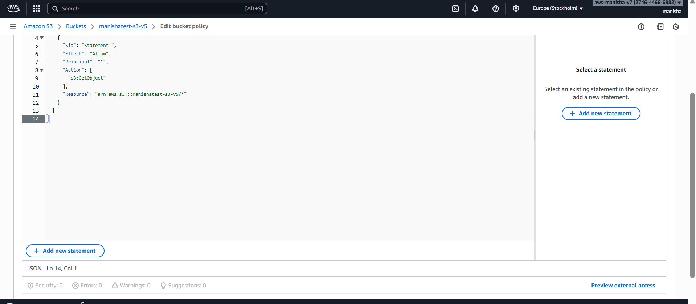

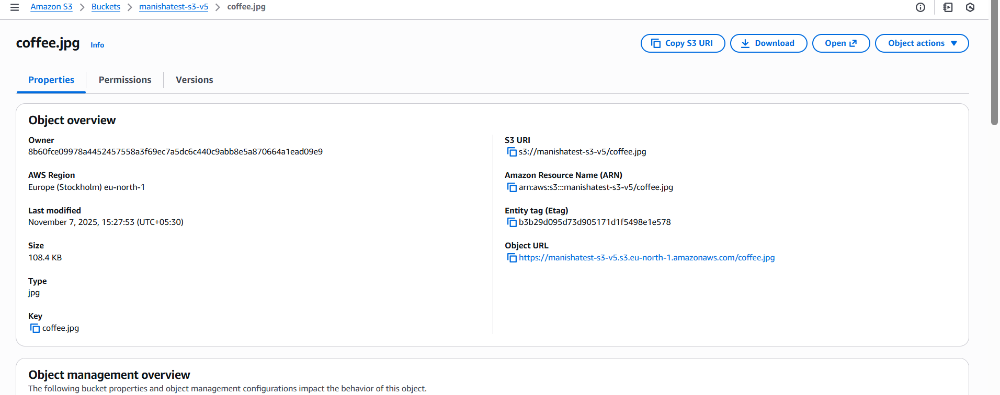

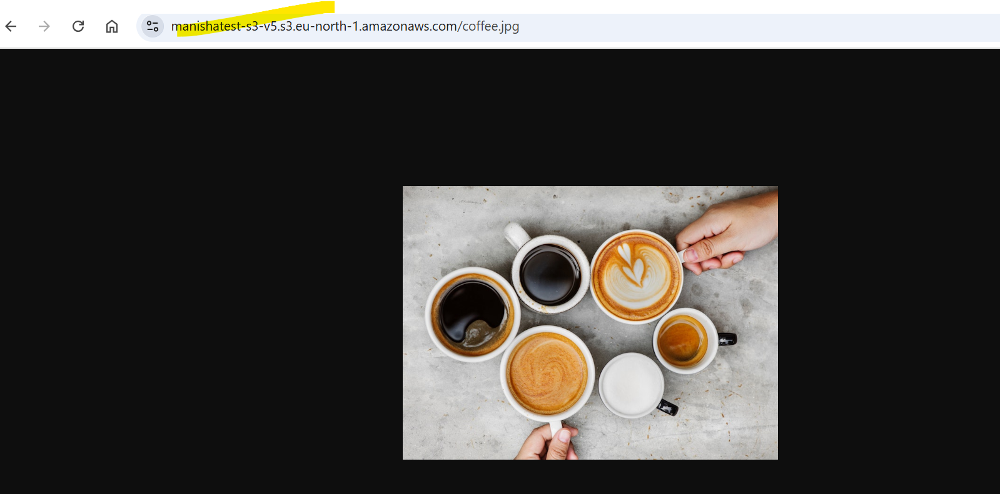

website -
