Amazone S3
- Amazon S3 is one of the main building blocks of AWS
- It’s advertised as ”infinitely scaling” storage 
- Many websites use Amazon S3 as a backbone
- Many AWS services use Amazon S3 as an integration as well

Amazon S3 Use cases 
- Backup and storage 
- Disaster Recovery 
- Archive 
- Hybrid Cloud storage 
- Application hosting

Amazon S3 – Security
-User-Based
    - IAM Policies – which API calls should be allowed for a specific user from IAM
- Resource-Based
    - Bucket Policies – bucket wide rules from the S3 console - allows cross account
    - Object Access Control List (ACL) – finer grain (can be disabled)
    - Bucket Access Control List (ACL) – less common (can be disabled)
- Note: an IAM principal can access an S3 object if
    - The user IAM permissions ALLOW it OR the resource policy ALLOWS it
    - AND there’s no explicit DENY

S3 Bucket Policies 
- JSON based policies 
• Resources: buckets and objects 
• Effect: Allow / Deny 
• Actions: Set of API to Allow or Deny 
• Principal: The account or user to apply the policy to
- Use S3 bucket for policy to: 
• Grant public access to the bucket • Force objects to be encrypted at upload 
• Grant access to another account (Cross Account)

website -
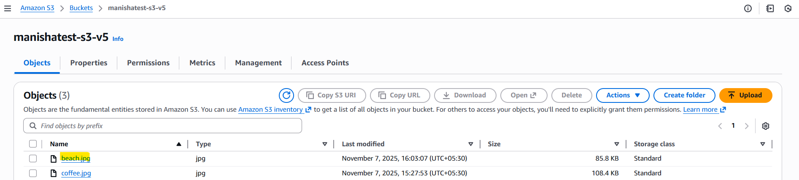

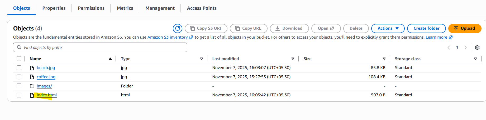

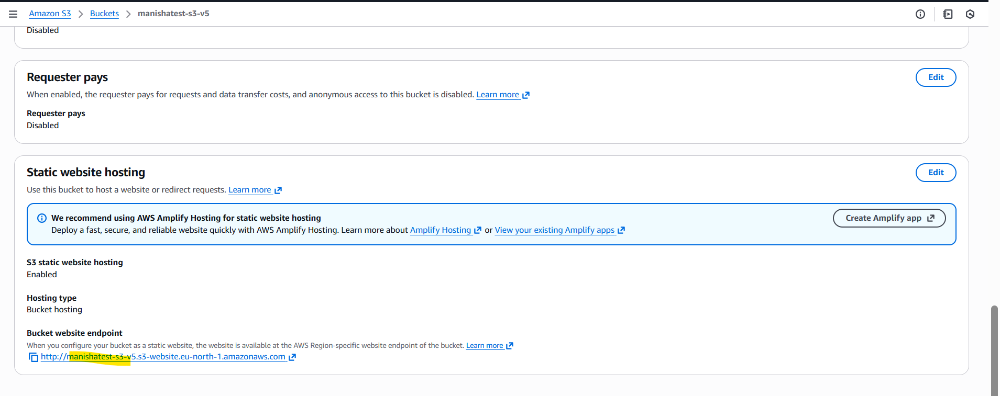

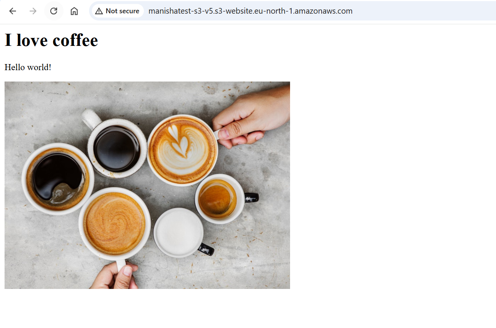

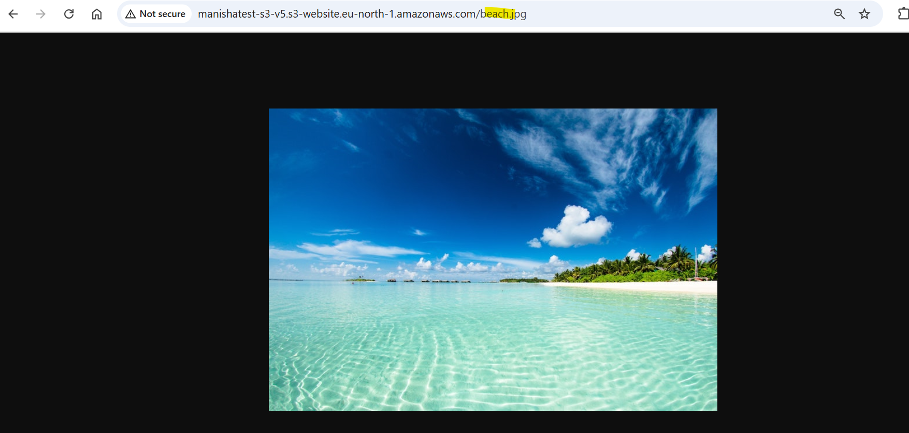

versioning
- You can version your files in Amazon S3
- It is enabled at the bucket level
- Same key overwrite will change the “version”: 1, 2, 3
Notes:
- Any file that is not versioned prior to enabling versioning will have version “null”
- Suspending versioning does not delete the previous versions

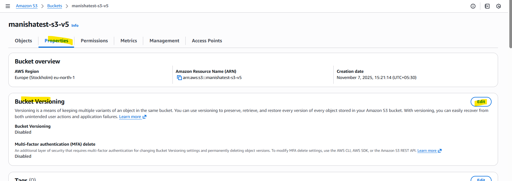

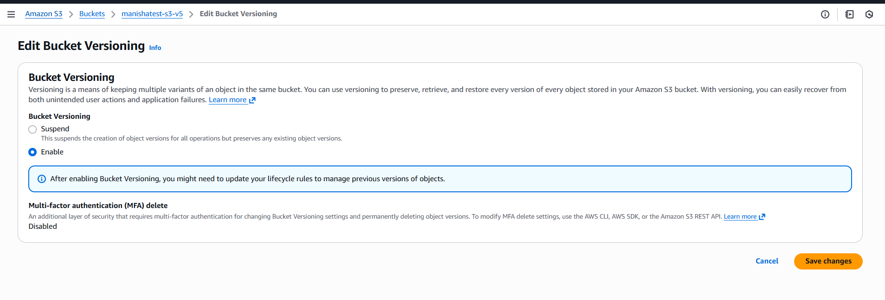

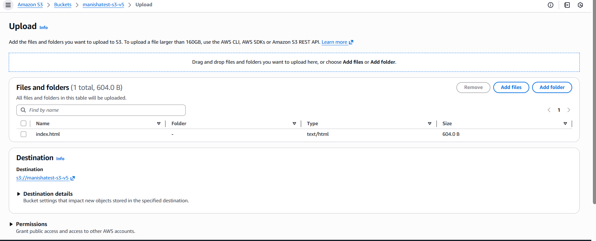

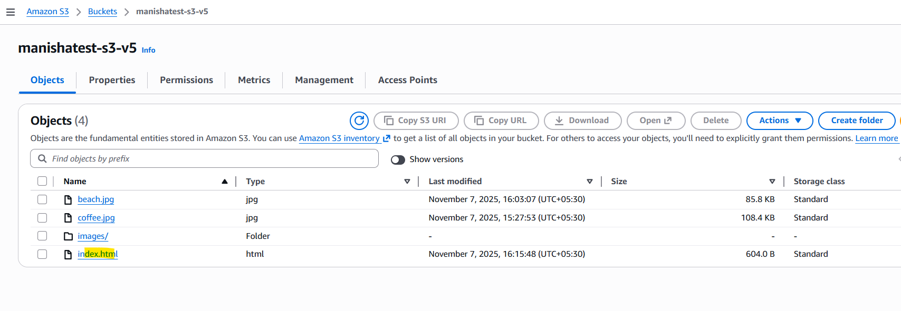

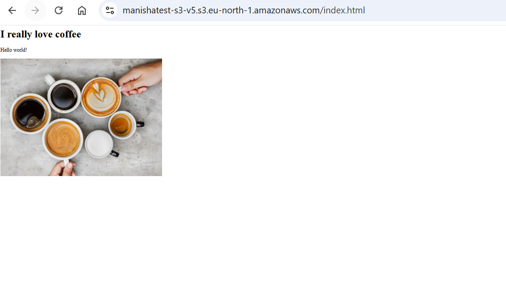

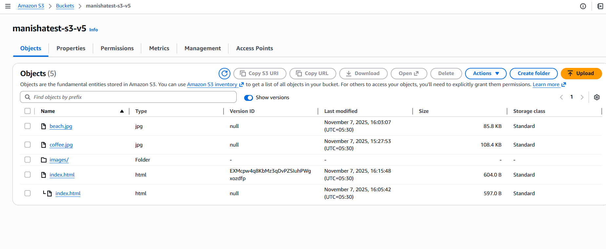

Amazon S3 – Replication
- Must enable Versioning in source and destination buckets
- Cross-Region Replication (CRR)
- Same-Region Replication (SRR)
- Buckets can be in different AWS accounts
-  Copying is asynchronous
- Must give proper IAM permissions to S3

Replication 
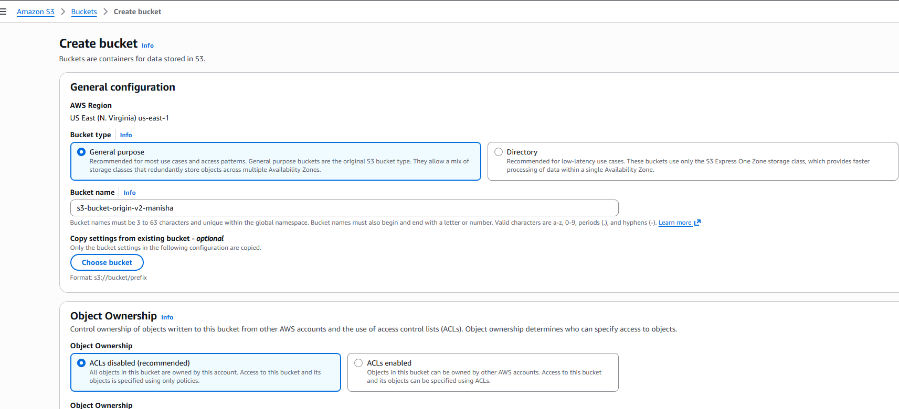

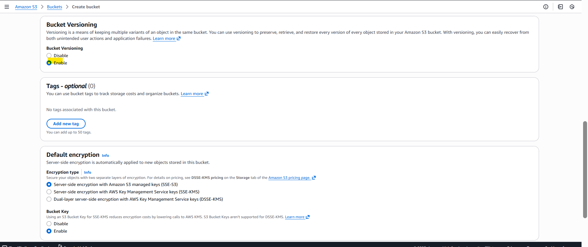

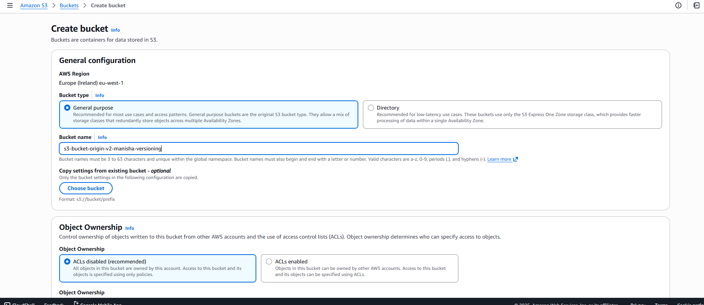

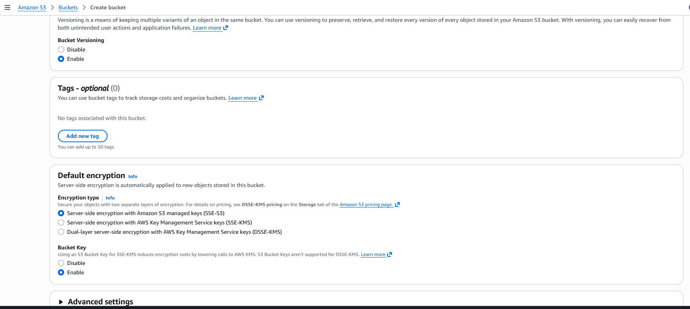

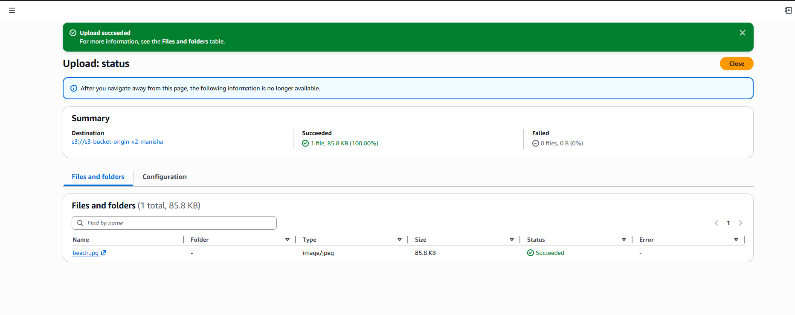

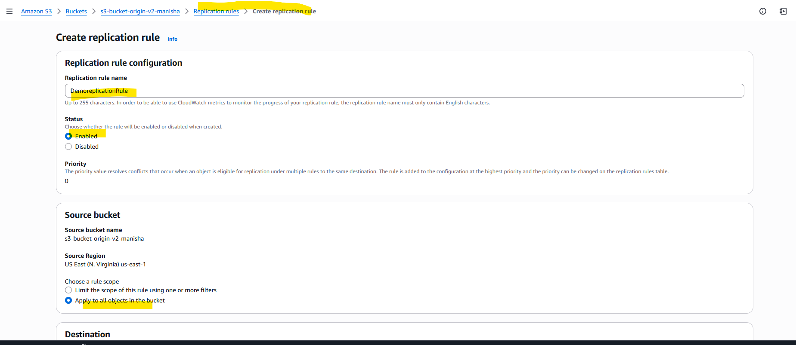

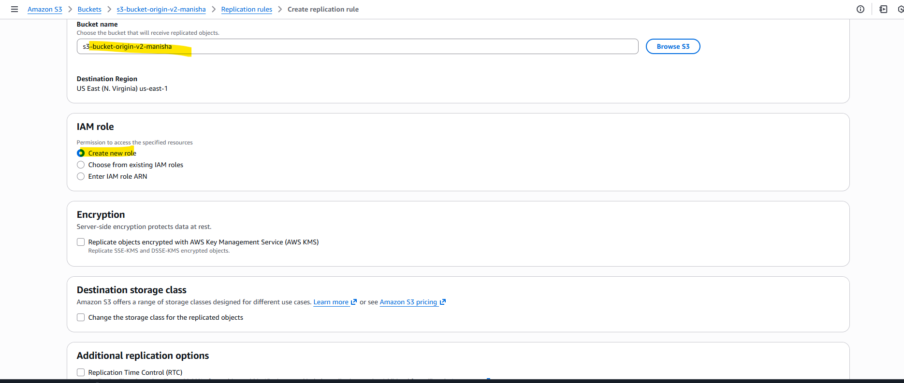

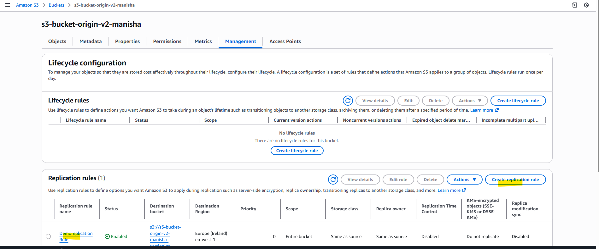

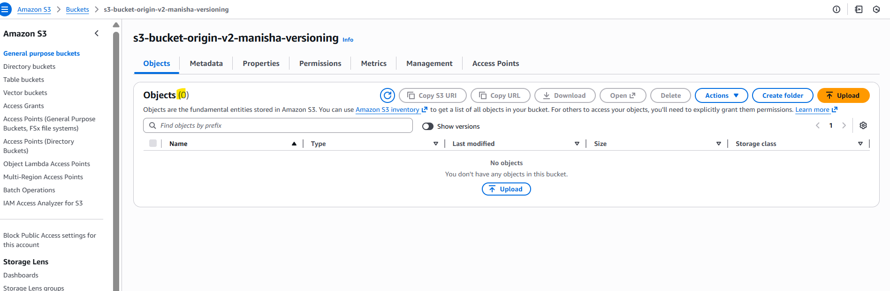

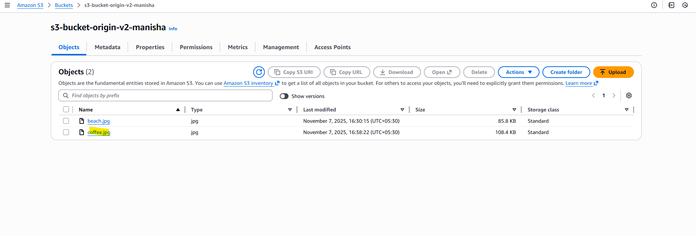

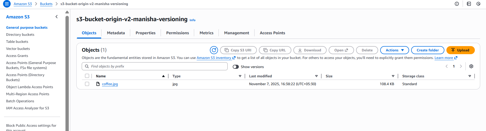

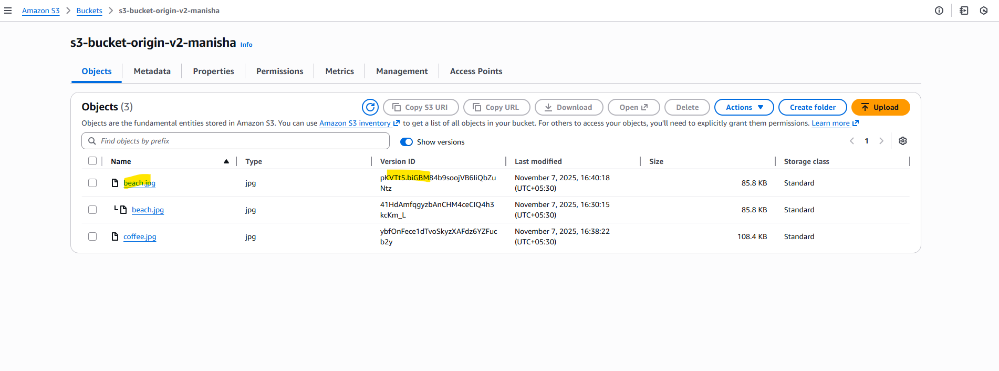

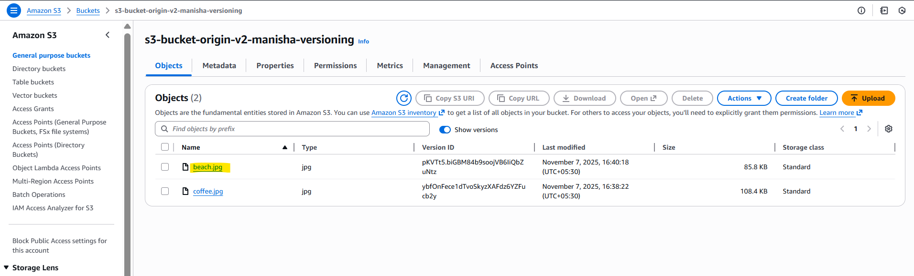