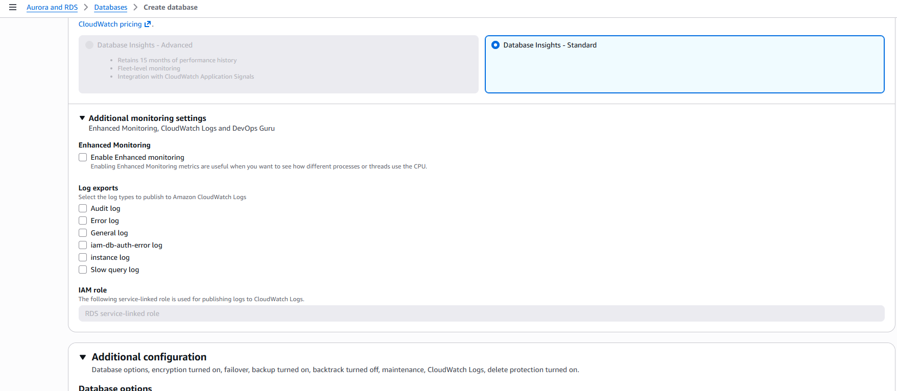
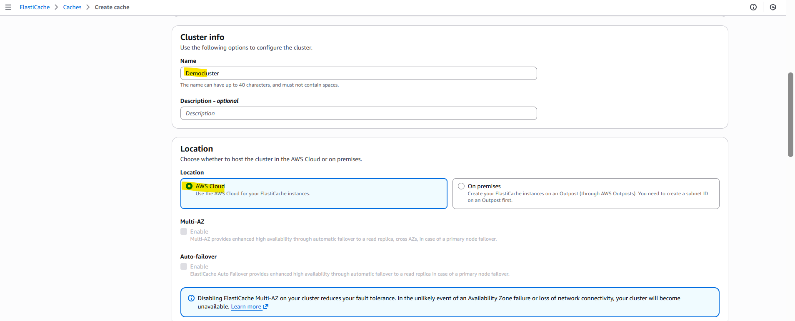
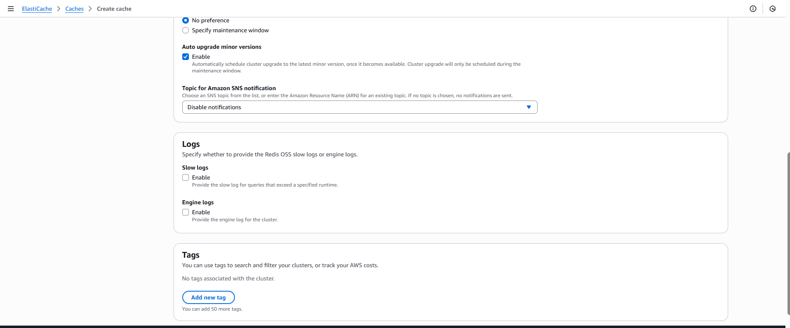
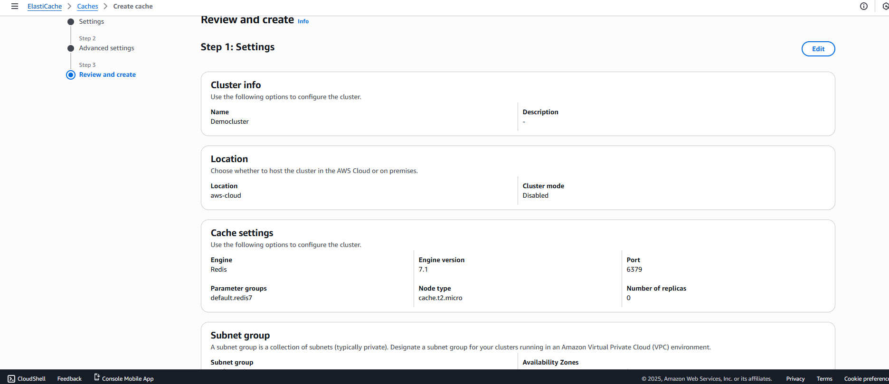

Amazon Aurora
- Aurora is a proprietary technology from AWS (not open sourced)
- Postgres and MySQL are both supported as Aurora DB (that means your drivers will work as if Aurora was a Postgres or MySQL database)
- Aurora is “AWS cloud optimized” and claims 5x performance improvement over MySQL on RDS, over 3x the performance of Postgres on RDS
- Aurora storage automatically grows in increments of 10GB, up to 128 TB. 
- Aurora can have up to 15 replicas and the replication process is faster than MySQL (sub 10 ms replica lag)
- Failover in Aurora is instantaneous. It’s HA (High Availability) native. 
- Aurora costs more than RDS (20% more) – but is more efficient

Aurora High Availability and Read Scaling
6 copies of your data across 3 AZ:
- 4 copies out of 6 needed for writes
- 3 copies out of 6 need for reads
- Self healing with peer-to-peer replication
- Storage is striped across 100s of volumes
- One Aurora Instance takes writes (master)
- Support for Cross Region Replication

Features of Aurora
- Automatic fail-over
- Backup and Recovery
- Isolation and security
- Industry compliance
- Push-button scaling

Aurora handson

RDS Backups
- Automated backups:
• Daily full backup of the database (during the backup window)
• Transaction logs are backed-up by RDS every 5 minutes
• => ability to restore to any point in time (from oldest backup to 5 minutes ago)
• 1 to 35 days of retention, set 0 to disable automated backups
- Manual DB Snapshots
• Manually triggered by the user
• Retention of backup for as long as you want

Aurora Backups
Automated backups 
- 1 to 35 days (cannot be disabled) 
- point-in-time recovery in that timeframe - 
Manual DB Snapshots -
- Manually triggered by the user 
- Retention of backup for as long as you want

Amazon ElastiCache Overview
- The same way RDS is to get managed Relational Databases…
- ElastiCache is to get managed Redis or Memcached
- Caches are in-memory databases with really high performance, low latency
- Helps reduce load off of databases for read intensive workloads
- Helps make your application stateless

Elastic handson-

