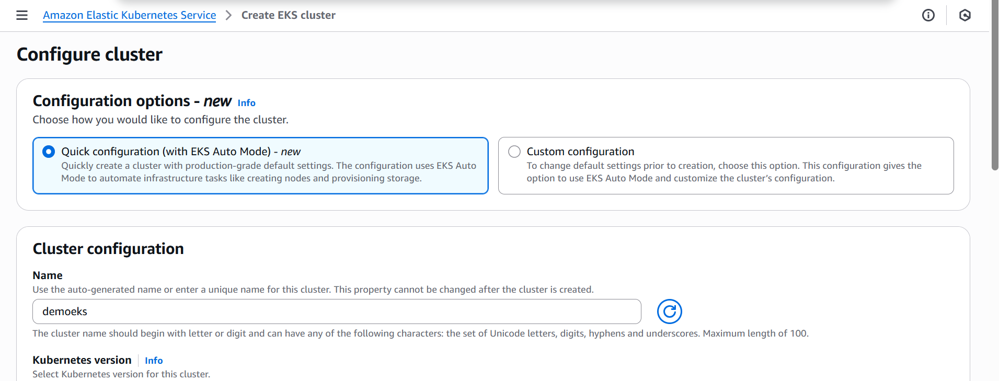
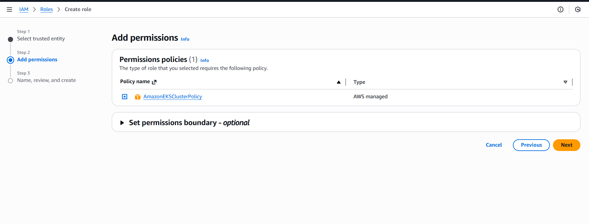
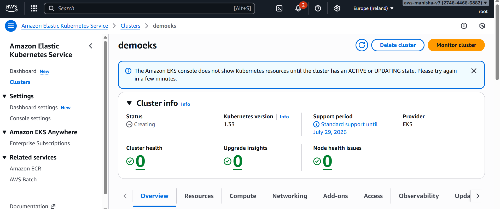

What is Docker?
- Docker is a software development platform to deploy apps
- Apps are packaged in containers that can be run on any OS
- Apps run the same, regardless of where they’re run 
- Any machine
- No compatibility issues
- Predictable behavior
- Less work
- Easier to maintain and deploy

Where are Docker images stored?
- Docker images are stored in Docker Repositories
- Docker Hub (https://hub.docker.com)
- Public repository
- Find base images for many technologies or OS (e.g., Ubuntu, MySQL, …)
- Amazon ECR (Amazon Elastic Container Registry)
- Private repository
- Public repository (Amazon ECR Public Gallery https://gallery.ecr.aws)

Amazon ECS – Fargate Launch Type
- Launch Docker containers on AWS
- You do not provision the infrastructure (no EC2 instances to manage)
- It’s all Serverless!
- You just create task definitions
- AWS just runs ECS Tasks for you based on the CPU / RAM you need

Amazon ECR
- ECR = Elastic Container Registry
- Store and manage Docker images on AWS
- Private and Public repository (Amazon ECR Public Gallery https://gallery.ecr.aws)
- Fully integrated with ECS, backed by Amazon S3

Amazon EKS Overview
- Amazon EKS = Amazon Elastic Kubernetes Service 
- It is a way to launch managed Kubernetes clusters on AWS
- Kubernetes is an open-source system for automatic deployment, scaling and management of containerized (usually Docker) application 
- It’s an alternative to ECS, similar goal but different API
- EKS supports EC2 if you want to deploy worker nodes or Fargate to deploy serverless containers

Amazon EKS – Node Types
Managed Node Groups
- Creates and manages Nodes (EC2 instances) for you
- Nodes are part of an ASG managed by EKS
- Supports On-Demand or Spot Instances
Self-Managed Nodes
- Nodes created by you and registered to the EKS cluster and managed by an ASG
- You can use prebuilt AMI - Amazon EKS Optimized AMI
- Supports On-Demand or Spot Instances
AWS Fargate
- No maintenance required; no nodes managed

AWS App Runner
- Fully managed service that makes it easy to deploy web applications and APIs at scale
- No infrastructure experience required
- Start with your source code or container image
- Automatically builds and deploy the web app

AWS Lamba  -
Virtual Servers in the Cloud
- Limited by RAM and CPU
- Continuously running
- Scaling means intervention to add / remove servers

Amazon DynamoDB 
- Fully managed, highly available with replication across multiple AZs
- NoSQL database - not a relational database - with transaction support
- Scales to massive workloads, distributed database

Database Types
- RDBMS (= SQL / OLTP): RDS, Aurora – great for joins
- NoSQL database – no joins, no SQL : DynamoDB (~JSON), ElastiCache (key / value pairs), Neptune (graphs), DocumentDB (for MongoDB), Keyspaces (for Apache Cassandra)
- Object Store: S3 (for big objects) / Glacier (for backups / archives)
- Data Warehouse (= SQL Analytics / BI): Redshift (OLAP), Athena, EMR
- Search: OpenSearch (JSON) – free text, unstructured searches
- Graphs: Amazon Neptune – displays relationships between data
- Ledger: Amazon Quantum Ledger Database
- Time series: Amazon Timestream