Amazon S3
- Amazon S3 is one of the main building blocks of AWS
- It’s advertised as ”infinitely scaling” storage
- Many AWS services use Amazon S3 as an integration as well

Amazon S3 Use cases 
- Backup and storage 
- Disaster Recovery 
- Archive 
- Hybrid Cloud storage 
- Application hosting

Amazon S3 - Buckets
- Amazon S3 allows people to store objects (files) in “buckets” (directories)
- Buckets must have a globally unique name (across all regions all accounts)
- Buckets are defined at the region level 
- S3 looks like a global service but buckets are created in a region

Amazon S3 – Replication (CRR & SRR)
- Must enable Versioning in source and destination buckets
- Cross-Region Replication (CRR)
- Same-Region Replication (SRR)
- Buckets can be in different AWS accounts
- Copying is asynchronous
- Must give proper IAM permissions to S3

- After you enable Replication, only new objects are replicated
- Optionally, you can replicate existing objects using S3 Batch Replication
    - Replicates existing objects and objects that failed replication

Amazon Athena
- Serverless query service to analyze data stored in Amazon S3
- Uses standard SQL language to query the files (built on Presto)
- Supports CSV, JSON, ORC, Avro, and Parquet
- Pricing: $5.00 per TB of data scanned

S3 Access Logs
- For audit purpose, you may want to log all access to S3 buckets
- Any request made to S3, from any account, authorized or denied, will be logged into another S3 bucket
- That data can be analyzed using data analysis tools

AWS DataSync
- Move large amount of data to and from
    - On-premises / other cloud to AWS (NFS, SMB, HDFS, S3 API…) – needs agent
    - AWS to AWS (different storage services) – no agent needed
- Can synchronize to:
    - Amazon S3 (any storage classes – including Glacier)
    - Amazon EFS
    - Amazon FSx (Windows, Lustre, NetApp, OpenZFS) 
- Replication tasks can be scheduled hourly, daily, weekl

AWS Backup 
- Fully managed service 
- Centrally manage and automate backups across AWS services 
- No need to create custom scripts and manual processes 
- Supported services: 
    - Amazon EC2 / Amazon EBS 
    - Amazon S3 
    - Amazon RDS (all DBs engines) / Amazon Aurora / Amazon DynamoDB 
    - Amazon DocumentDB / Amazon Neptune 
    - Amazon EFS / Amazon FSx (Lustre & Windows File Server) 
    - AWS Storage Gateway (Volume Gateway) 
- Supports cross-region backups

AWS WAF – Web Application Firewall
- Protects your web applications from common web exploits (Layer 7)
- Layer 7 is HTTP (vs Layer 4 is TCP/UDP)
- Deploy on 
- Application Load Balancer
- API Gateway
- CloudFront
- AppSync GraphQL API
- Cognito User Pool

AWS Shield: protect from DDoS attack
- DDoS: Distributed Denial of Service – many requests at the same time
- AWS Shield Standard:
	- Free service that is activated for every AWS customer
	- Provides protection from attacks such as SYN/UDP Floods, Reflection attacks and other layer 3/layer 4 attacks
- AWS Shield Advanced: 
	- Optional DDoS mitigation service ($3,000 per month per organization) 
	- Protect against more sophisticated attack on Amazon EC2, Elastic Load Balancing (ELB), Amazon CloudFront, AWS Global Accelerator, and Route 53
	- 24/7 access to AWS DDoS response team (DRP)
	- Protect against higher fees during usage spikes due to DDoS
	- Shield Advanced automatic application layer DDoS mitigation automatically creates, evaluates and deploys AWS WAF rules to mitigate layer 7 attacks

AWS Firewall Manager
- Manage rules in all accounts of an AWS Organization
- Security policy: common set of security rules
	- WAF rules (Application Load Balancer, API Gateways, CloudFront)	
	- AWS Shield Advanced (ALB, CLB, NLB, Elastic IP, CloudFront)
	- Security Groups for EC2, Application Load BAlancer and ENI resources in VPC
	- AWS Network Firewall (VPC Level)
	- Amazon Route 53 Resolver DNS Firewall
	- Policies are created at the region level

Networking Route53
What is DNS?
- Domain Name System which translates the human friendly hostnames into the machine IP addresses
- www.google.com => 172.217.18.36
- DNS is the backbone of the Internet
- DNS uses hierarchical naming structure
     -.com
     - example.com
     - api.example.com

DNS Terminologies
- Domain Registrar: Amazon Route 53, GoDaddy, …
- DNS Records: A, AAAA, CNAME, NS, …
- Zone File: contains DNS records
- Name Server: resolves DNS queries (Authoritative or Non-Authoritative)
- Top Level Domain (TLD): .com, .us, .in, .gov, .org, …
- Second Level Domain (SLD): amazon.com, google.com

Amazon Route 53
- A highly available, scalable, fully managed and Authoritative DNS
    - Authoritative = the customer (you) can update the DNS records
- Route 53 is also a Domain Registrar
- Ability to check the health of your resources
- The only AWS service which provides 100% availability SLA

Route 53 – Record Types
- A – maps a hostname to IPv4
- AAAA – maps a hostname to IPv6
- CNAME – maps a hostname to another hostname
    - The target is a domain name which must have an A or AAAA record
    - Can’t create a CNAME record for the top node of a DNS namespace (Zone Apex)
    - Example: you can’t create for example.com, but you can create for www.example.com
- NS – Name Servers for the Hosted Zone
    - Control how traffic is routed for a domain

Route 53 – Hosted Zones
- A container for records that define how to route traffic to a domain and its subdomains
- Public Hosted Zones – contains records that specify how to route traffic on the Internet (public domain names)
application1.mypublicdomain.com
- Private Hosted Zones – contain records that specify how you route traffic within one or more VPCs (private domain names)
application1.company.internal

register domain
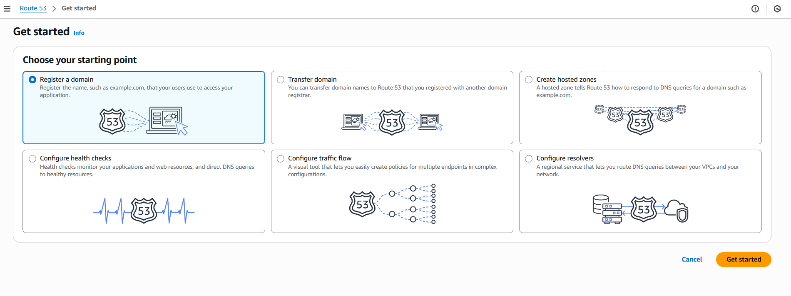

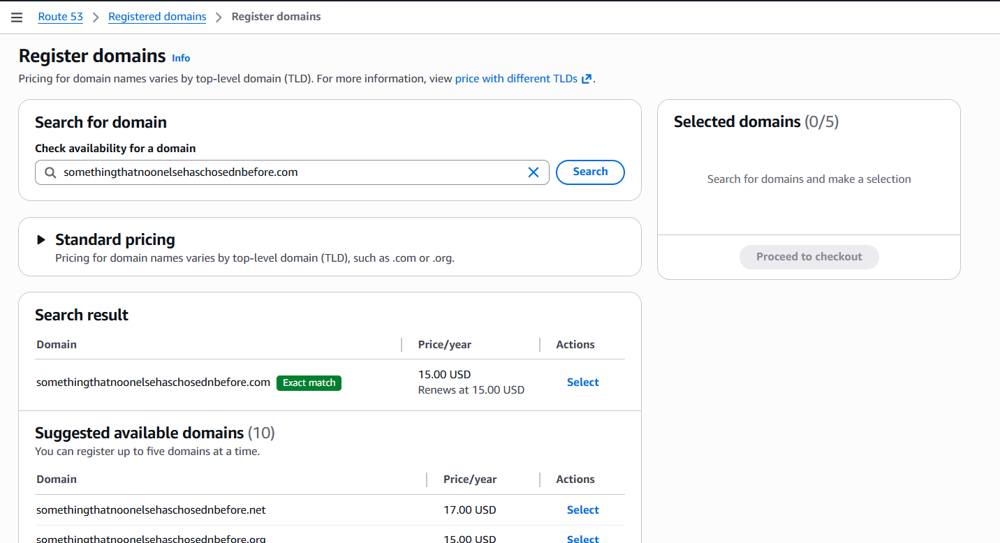

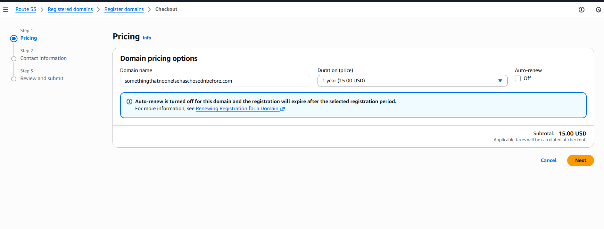

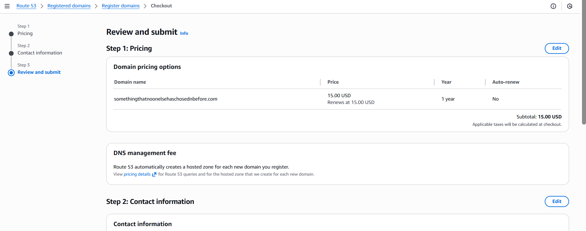

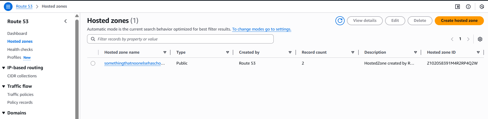

creating records
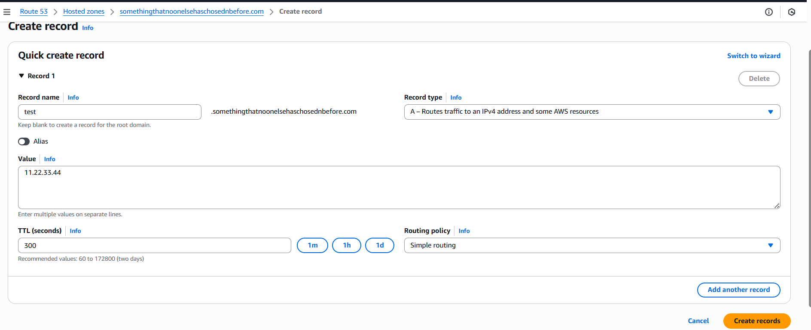

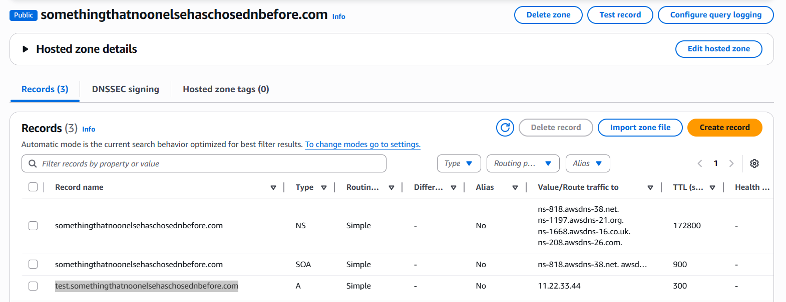

ec2setup

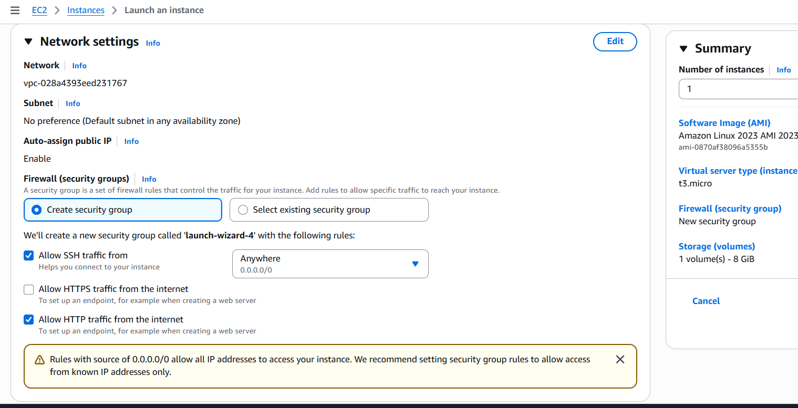

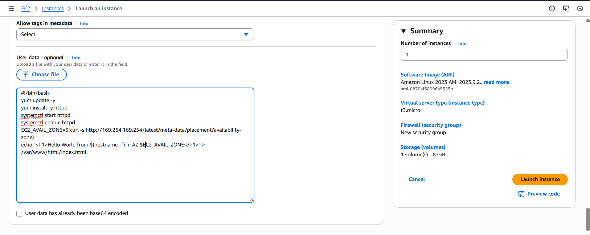

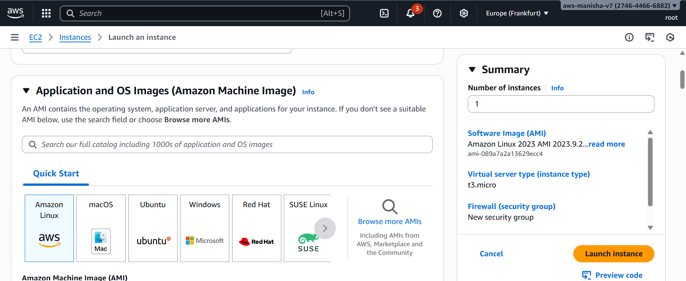

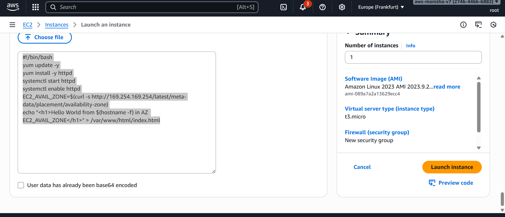

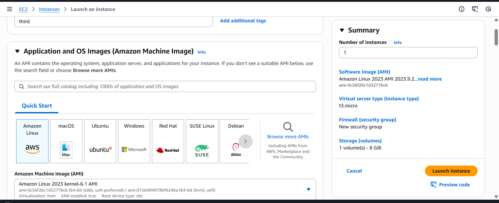

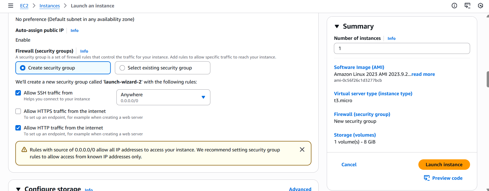

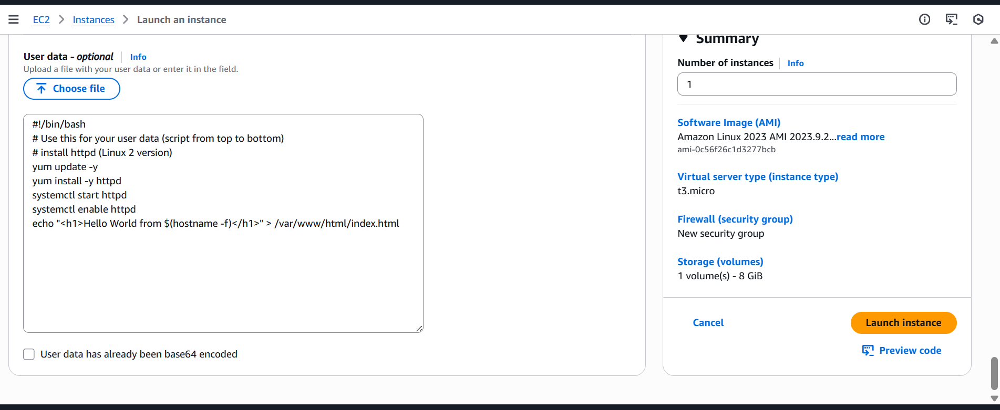

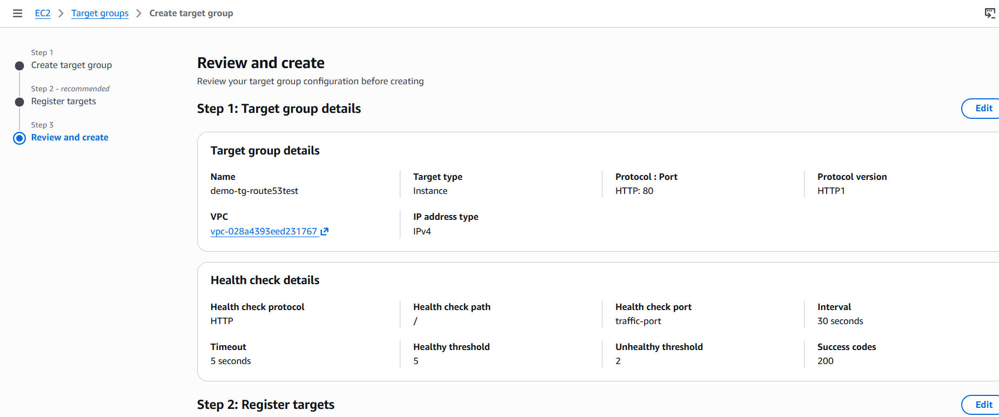

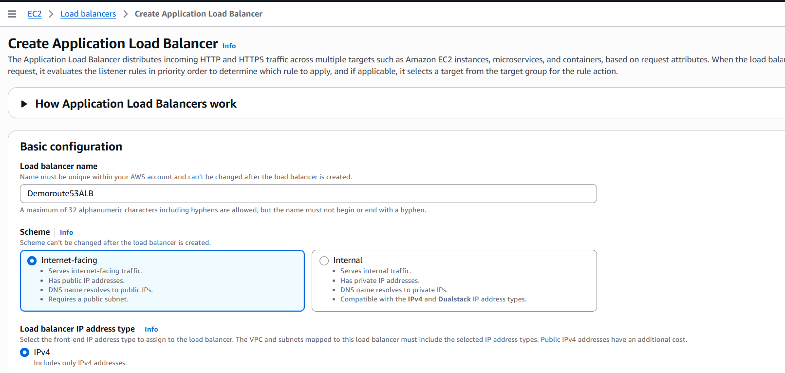

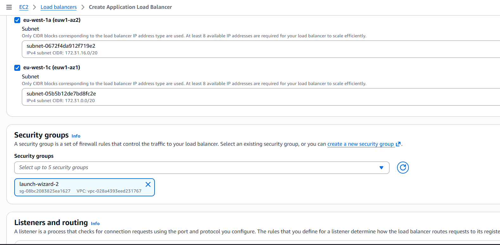

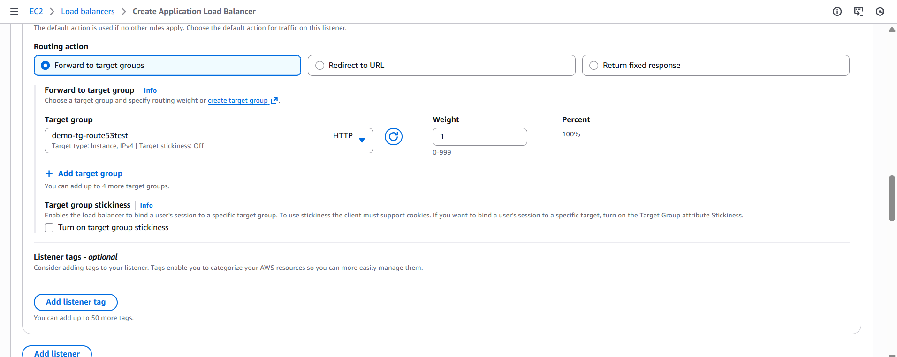

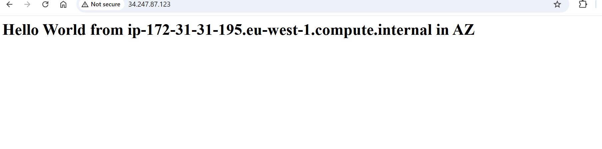

Amazon VPC
Understanding CIDR – IPv4
- Classless Inter-Domain Routing – a method for allocating IP addresses
- Used in Security Groups rules and AWS networking in genera
- They help to define an IP address range:
    - We’ve seen WW.XX.YY.ZZ/32 => one IP
    - We’ve seen 0.0.0.0/0 => all IPs
    - But we can define:192.168.0.0/26 =>192.168.0.0 – 192.168.0.63 (64 IP addresses)
- A CIDR consists of two components 
- Base IP - 
    - Represents an IP contained in the range (XX.XX.XX.XX) 
    - Example: 10.0.0.0, 192.168.0.0, 
- Subnet Mask 
    - Defines how many bits can change in the IP 
    - Example: /0, /24, /32    

Public vs. Private IP (IPv4)
- The Internet Assigned Numbers Authority (IANA) established certain blocks of IPv4 addresses for the use of private (LAN) and public (Internet) addresses
- Private IP can only allow certain values:
    - 10.0.0.0 – 10.255.255.255 (10.0.0.0/8) ç in big networks
    - 172.16.0.0 – 172.31.255.255 (172.16.0.0/12) ç AWS default VPC in that range
    - 192.168.0.0 – 192.168.255.255 (192.168.0.0/16) ç e.g., home networks
- All the rest of the IP addresses on the Internet are Public

VPC in AWS – IPv4
- VPC = Virtual Private Cloud
- You can have multiple VPCs in an AWS region (max. 5 per region – soft limit)
- Max. CIDR per VPC is 5, for each CIDR:
    - Min. size is /28 (16 IP addresses)
    - Max. size is /16 (65536 IP addresses

VPC – Subnet (IPv4)
- AWS reserves 5 IP addresses (first 4 & last 1) in each subnet
- These 5 IP addresses are not available for use and can’t be assigned to an EC2 instance
- Example: if CIDR block 10.0.0.0/24, then reserved IP addresses are:
    - 10.0.0.0 – Network Address
    - 10.0.0.1 – reserved by AWS for the VPC router
    - 10.0.0.2 – reserved by AWS for mapping to Amazon-provided DNS
    - 10.0.0.3 – reserved by AWS for future use
    - 10.0.0.255 – Network Broadcast Address. AWS does not support broadcast in a VPC therefore the address is reserved
       