Amazon S3
- Amazon S3 is one of the main building blocks of AWS
- It’s advertised as ”infinitely scaling” storage
- Many AWS services use Amazon S3 as an integration as well

Amazon S3 Use cases 
- Backup and storage 
- Disaster Recovery 
- Archive 
- Hybrid Cloud storage 
- Application hosting

Amazon S3 - Buckets
- Amazon S3 allows people to store objects (files) in “buckets” (directories)
- Buckets must have a globally unique name (across all regions all accounts)
- Buckets are defined at the region level 
- S3 looks like a global service but buckets are created in a region

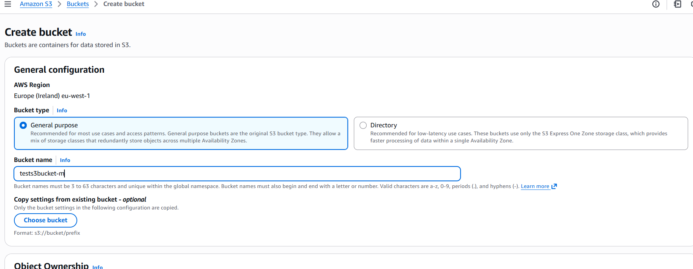

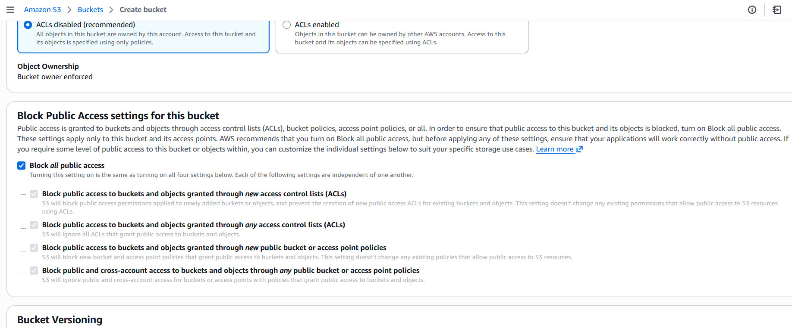

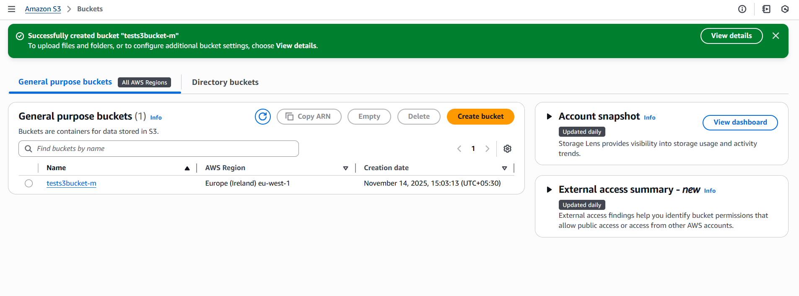

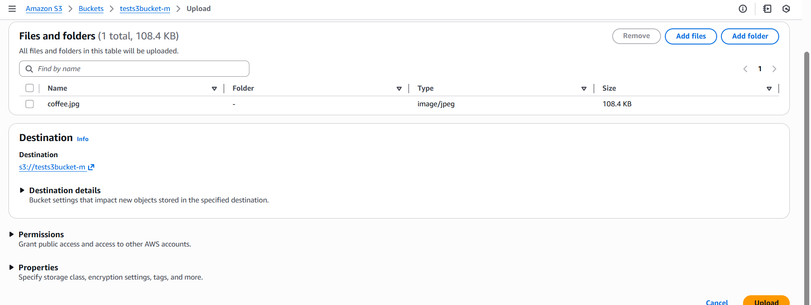

Amazon S3 – Replication (CRR & SRR)
- Must enable Versioning in source and destination buckets
- Cross-Region Replication (CRR)
- Same-Region Replication (SRR)
- Buckets can be in different AWS accounts
- Copying is asynchronous
- Must give proper IAM permissions to S3

- After you enable Replication, only new objects are replicated
- Optionally, you can replicate existing objects using S3 Batch Replication
    - Replicates existing objects and objects that failed replication

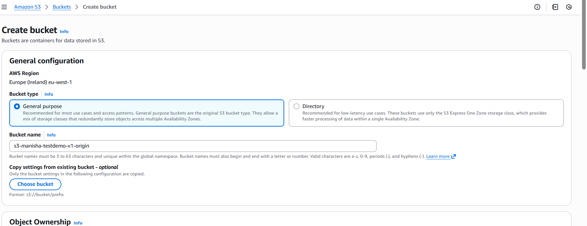

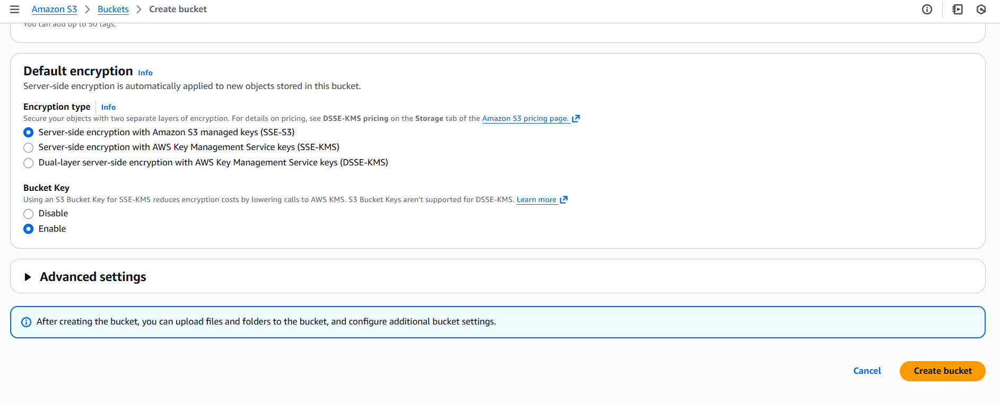

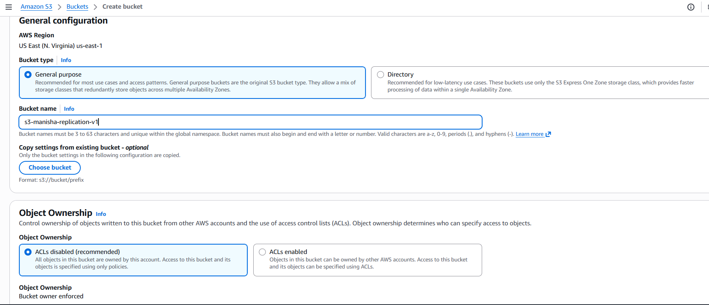

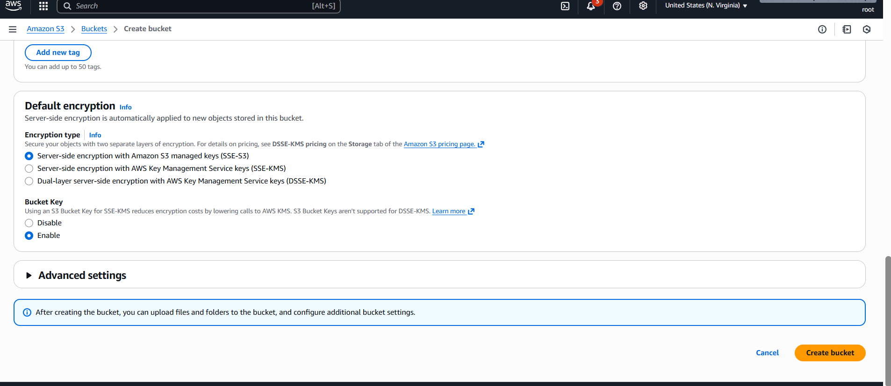

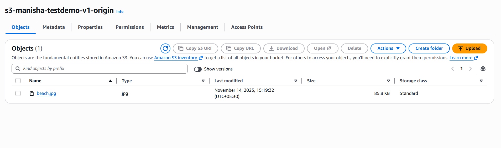

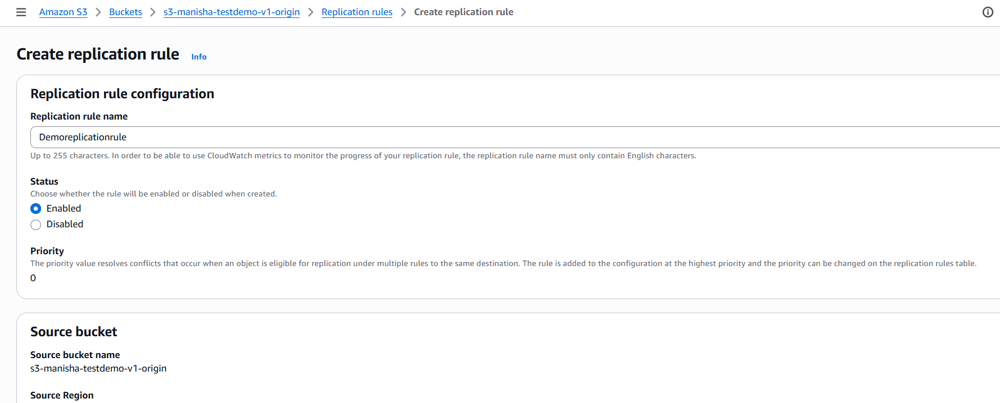

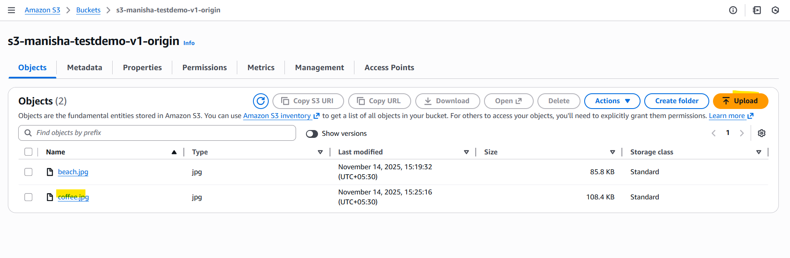

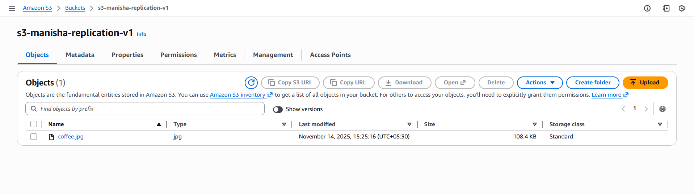

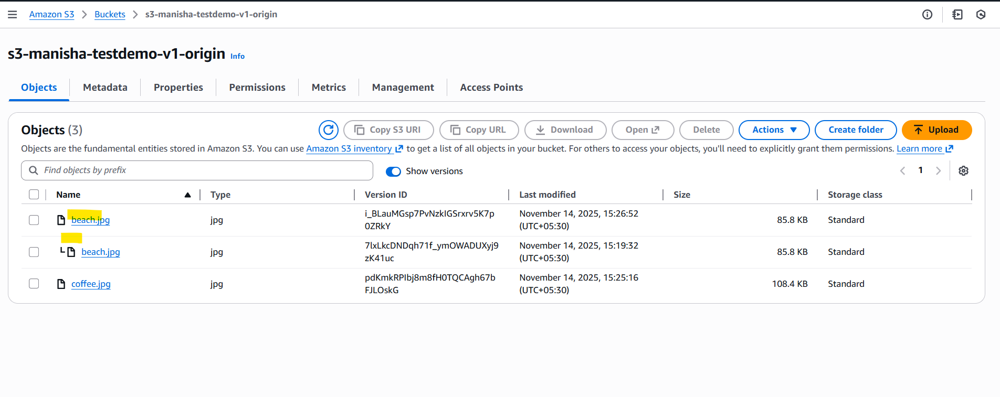

Amazon Athena
- Serverless query service to analyze data stored in Amazon S3
- Uses standard SQL language to query the files (built on Presto)
- Supports CSV, JSON, ORC, Avro, and Parquet
- Pricing: $5.00 per TB of data scanned

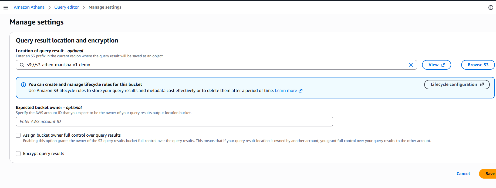

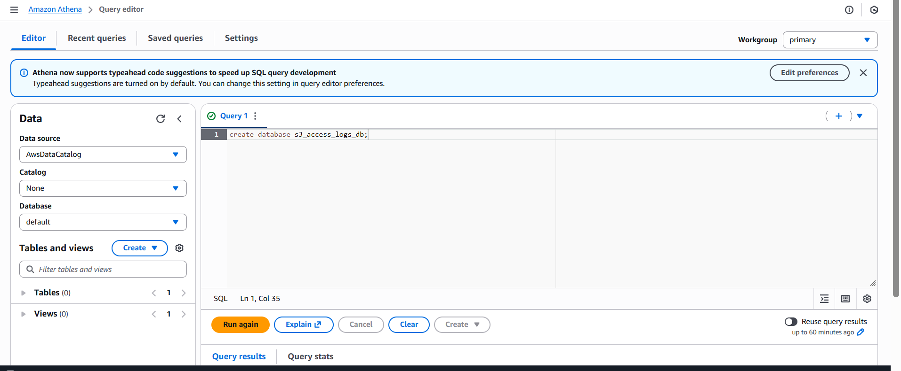

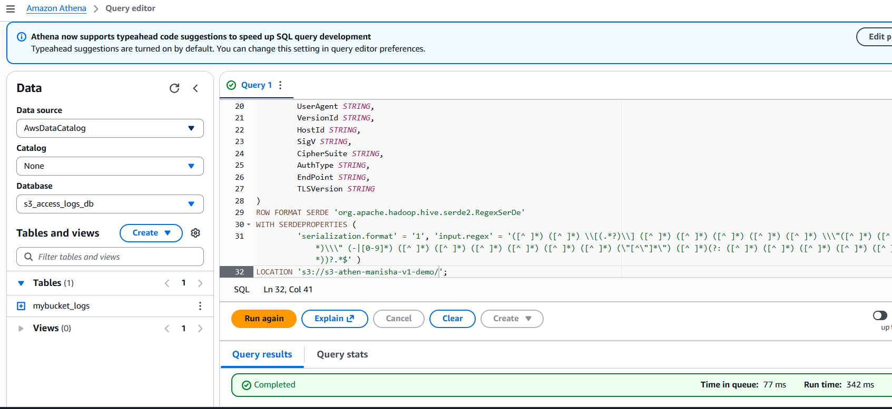

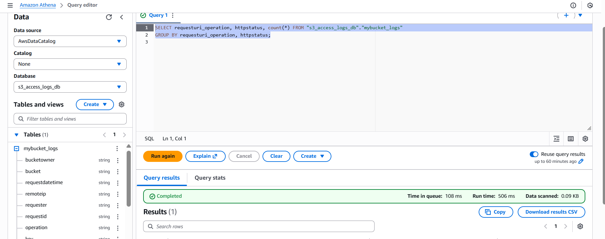

S3 Access Logs
- For audit purpose, you may want to log all access to S3 buckets
- Any request made to S3, from any account, authorized or denied, will be logged into another S3 bucket
- That data can be analyzed using data analysis tools

AWS DataSync
- Move large amount of data to and from
    - On-premises / other cloud to AWS (NFS, SMB, HDFS, S3 API…) – needs agent
    - AWS to AWS (different storage services) – no agent needed
- Can synchronize to:
    - Amazon S3 (any storage classes – including Glacier)
    - Amazon EFS
    - Amazon FSx (Windows, Lustre, NetApp, OpenZFS) 
- Replication tasks can be scheduled hourly, daily, weekl

AWS Backup 
- Fully managed service 
- Centrally manage and automate backups across AWS services 
- No need to create custom scripts and manual processes 
- Supported services: 
    - Amazon EC2 / Amazon EBS 
    - Amazon S3 
    - Amazon RDS (all DBs engines) / Amazon Aurora / Amazon DynamoDB 
    - Amazon DocumentDB / Amazon Neptune 
    - Amazon EFS / Amazon FSx (Lustre & Windows File Server) 
    - AWS Storage Gateway (Volume Gateway) 
- Supports cross-region backups

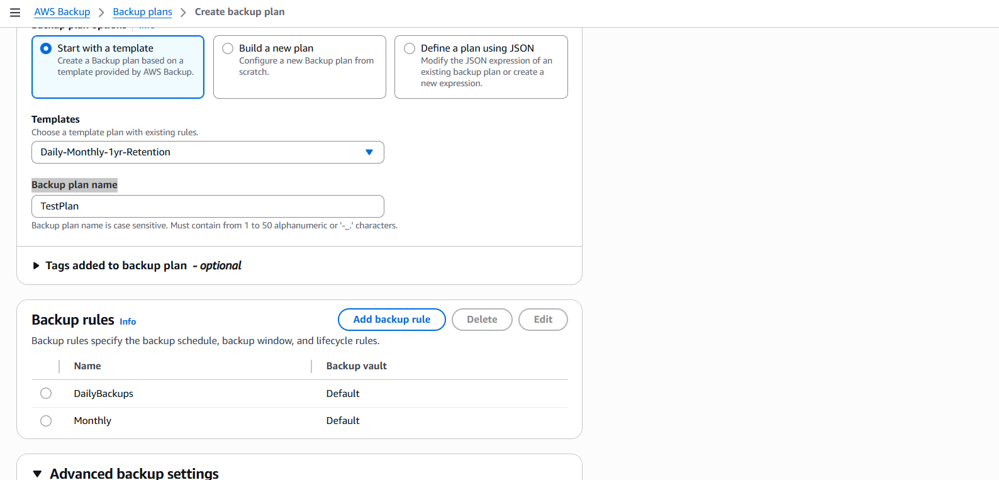

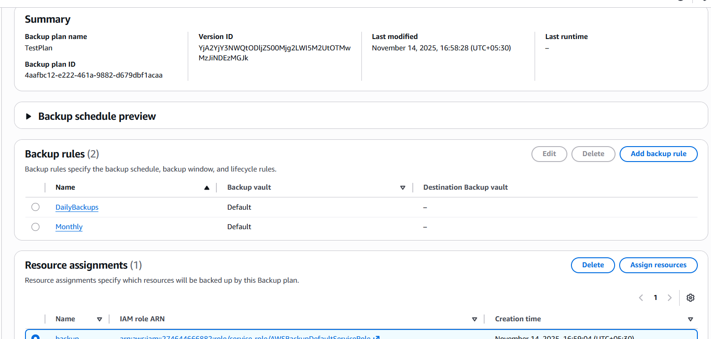