Script1

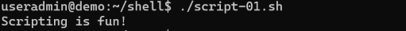

Script2

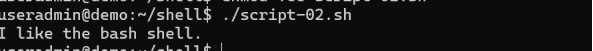

Script-03

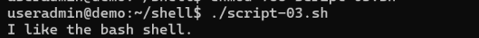

Script-04

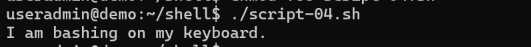

Script -05

Script -06

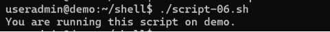

Script 07

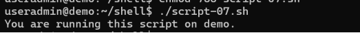

Script 08

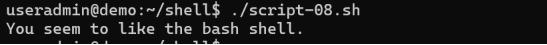

Script 09

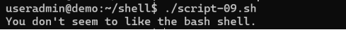

Script 10

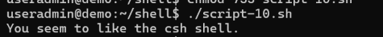

Script -color

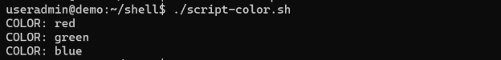

Script-color1

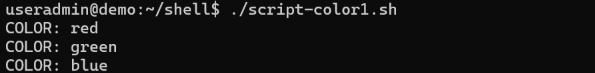

archive.sh

Archive-user

Archive-user1

**Exercise 1:**

Write a shell script that prints "Shell Scripting is Fun!" to the screen.

Hint 1: Remember to make the shell script executable with the chmod command.

Hint 2: Remember to start your script with a shebang! 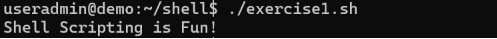

**Exercise 2:**

Modify the shell script from exercise 1 to include a variable. The variable will hold the contents of the message "Shell Scripting is Fun!".

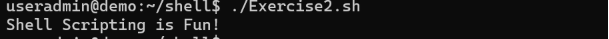

**Exercise 3:**

Store the output of the command "hostname" in a variable. Display "This script is running on \_\_\_\_\_\_\_." where "\_\_\_\_\_\_\_" is the output of the "hostname" command.

Hint: It's a best practice to use the ${VARIABLE} syntax if there is text or characters that directly precede or follow the variable.

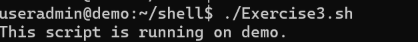

**Exercise 4:**

Write a shell script to check to see if the file "/etc/shadow" exists. If it does exist, display "Shadow passwords are enabled." Next, check to see if you can write to the file. If you can, display "You have permissions to edit /etc/shadow." If you cannot, display "You do NOT have permissions to edit /etc/shadow."

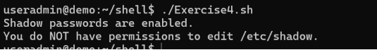

**Exercise 5:**

Write a shell script that displays "man", "bear", "pig", "dog", "cat", and "sheep" to the screen with each appearing on a separate line. Try to do this in as few lines as possible.

Hint: Loops can be used to perform repetitive tasks.

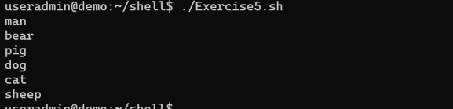

**Exercise 6:**

Write a shell script that prompts the user for a name of a file or directory and reports if it is a regular file, a directory, or other type of file. Also perform an ls command against the file or directory with the long listing option.

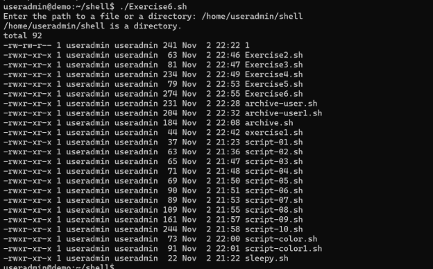

**Exercise 7:**

Modify the previous script so that it accepts the file or directory name as an argument instead of prompting the user to enter it.

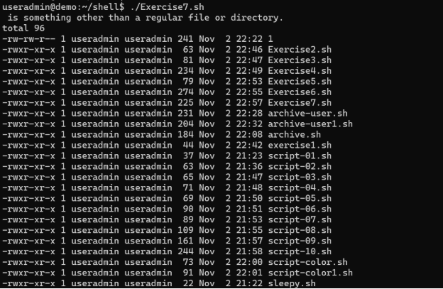

**Exercise 8:**

Modify the previous script to accept an unlimited number of files and directories as arguments. Hint: You'll want to use a special variable.

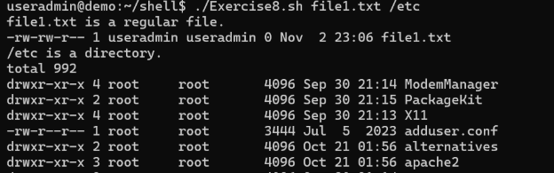

