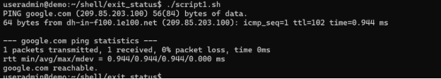
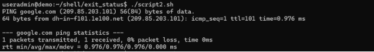
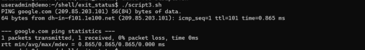
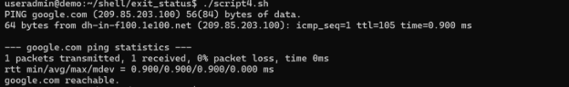
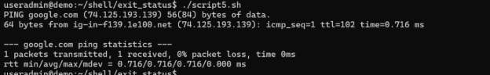
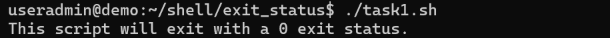
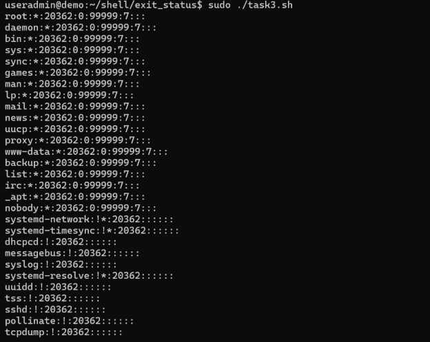

Script1

Script 2

Script3

Script4

Script5

Script6

**Exercise 1:**

Write a shell script that displays "This script will exit with a 0 exit status." Be sure that the script does indeed exit with a 0 exit status.

**Exercise 2:**

Write a shell script that accepts a file or directory name as an argument. Have the script report if it is a regular file, a directory, or other type of file. If it is a regular file, exit with a 0 exit status. If it is a directory, exit with a 1 exit status. If it is some other type of file, exit with a 2 exit status.

**Exercise 3:**

Write a script that executes the command "cat /etc/shadow". If the command returns a 0 exit status report "Command succeeded" and exit with a 0 exit status. If the command returns a nonzero exit status report "Command failed" and exit with a 1 exit status.

