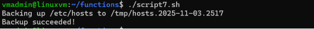
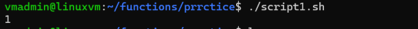

Function 

Positional parameters

1\.functionas can accept parameters

2\.the first parameter is stored in $1

3\.the second parameter is stored in $2 etc

4\.$@ contains all of the parameters

5\.just like shell scripts

`  `$0 = the script itself , not function name

Script1

Script2

Script3

Script4

Script5

Script 6

**Script7**

**Exercise 1:**

**Write a shell script that consists of a function that display the number of files in the present working directory. Name this function "file\_count" and call it in your script. If you use a variable in your function, remember to make it a local variable.**

**Hint: The wc utility is used to count the number of lines, words, and bytes.** 

**Exercise 2:**

**Modify the script from the previous exercise. Make the "file\_count" function accept a directory as an argument. Next have the function display the name of the directory followed by a colon. Finally, display the number of files to the screen on the next line. Call the function three times. First, on the "/etc" directory, next on the "/var" directory and finally on the "/usr/bin" directory.**

**Example output:**

1. **/etc:**
1. **85**

