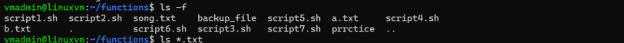
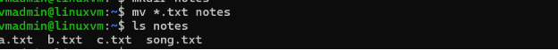
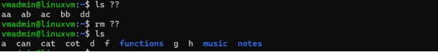

Wildcards-

1\.\* matches zero or more character

.\*txt

a\*

a\*.txt

2\.? Matches exactly one character

?.txt

a?

a?.txt

Exercise 1:

Write a shell script that renames all files in the current directory that end in ".jpg" to begin with today's date in the following format: YYYY­MM­DD. For example, if a picture of my cat was in the current directory and today was October 31, 2016 it would change name from "mycat.jpg" to "2016­10­31­mycat.jpg".

Hint: Look at the format options to the date command.

For "extra credit" make sure to gracefully handle instances where there are no ".jpg" files in the current directory. (Hint: Man bash and read the section on the nullglob option.)

Exercise 2:

Write a script that renames files based on the file extension. The script should prompt the user for a file extension. Next, it should ask the user what prefix to prepend to the file name(s). By default the prefix should be the current date in YYYY­MM­DD format. So, if the user simply presses enter the date will be used. Otherwise, whatever the user entered will be used as the prefix. Next, it should display the original file name and the new name of the file. Finally, it should rename the file.

Example output 1:

Please enter a file extension: jpg Please enter a file prefix: (Press ENTER for 2015­08­10). vacation Renaming mycat.jpg to vacation­mycat.jpg.

Example output 2:

Please enter a file extension: jpg Please enter a file prefix: (Press ENTER for 2015­08­10). Renaming mycat.jpg to 2015­08­10­mycat.jpg.

