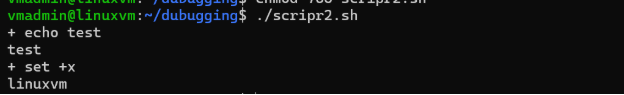

Case Statements

Practice Exercises – 

Case Statements Exercise 1: Create a startup script for an application called sleepwalkingserver, which is provided below. The script should be named sleepwalking and accept "start" and "stop" as arguments. If anything other than "start" or "stop" is provided as an argument, display a usage statement: "Usage sleepwalking start|stop" and terminate the script with an exit status of 1. To start sleepwalkingserver, use this command: "/tmp/sleepwalkingserver &" To stop sleepwalkingserver, use this command: "kill $(cat /tmp/sleepwalkingserver.pid)" Here is the contents of "sleepwalkingserver". Be sure to put this file in /tmp and run chmod 755 /tmp/sleepwalkingserver #!/bin/bash PID\_FILE="/tmp/sleepwalkingserver.pid" trap "rm $PID\_FILE; exit" SIGHUP SIGINT SIGTERM echo "$$" > $PID\_FILE while true do : done

Logging

Exercise 1:

Write a shell script that displays one random number to the screen and also generates a syslog message with that random number. Use the "user" facility and the "info" facility for your messages.

Hint: Use $RANDOM

Exercise 2:

Modify the previous script so that it uses a logging function. Additionally tag each syslog message with "randomly" and include the process ID. Generate 3 random numbers.

debuging

