Docker -
Docker is a platform that allows you to package, ship, and run applications in lightweight, portable containers.

A container = A small, isolated environment that contains:

Why do you need docker?
- Compatibility/Dependency
- Long setup time
- Different Dev/Test/Prod environments

Run – start a container
docker run nginx

ps – list containers
docker ps
docker ps -a
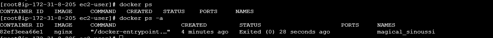

STOP – stop a container
docker ps

docker stop silly_sammet

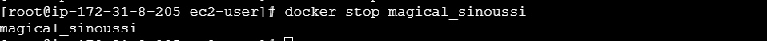

docker ps -a
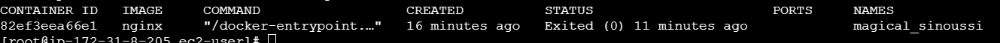

Rm – Remove a container
docker rm name
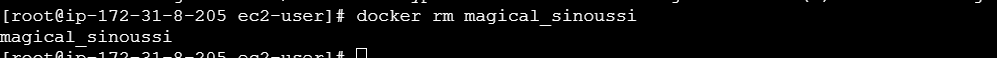

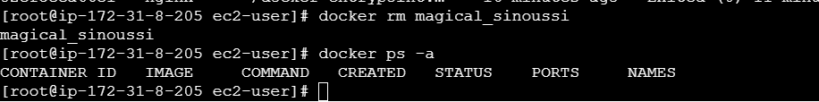

images – List images
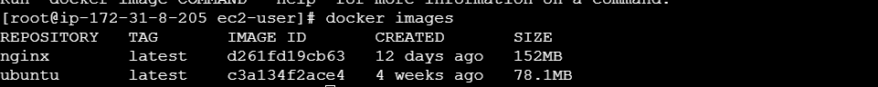

rmi – Remove images
docker rmi nginx

Pull – download an imag
docker pull nginx
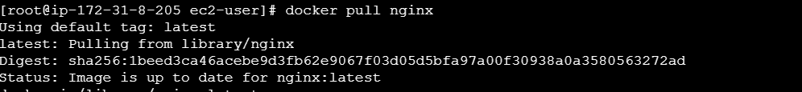

Append a command
docker run ubuntu sleep 5
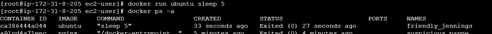

Exec – execute a command

docker run commands
Run – tag
docker run redis
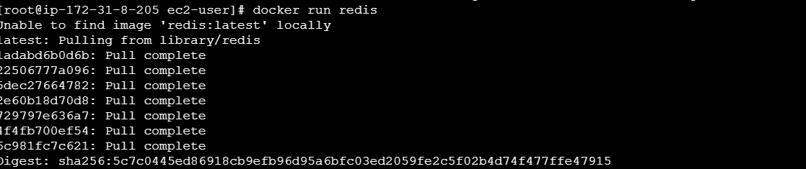

Environment Variables
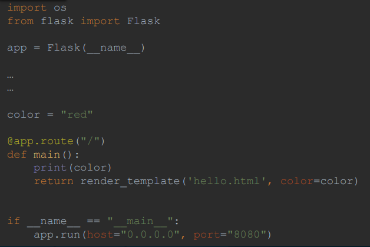

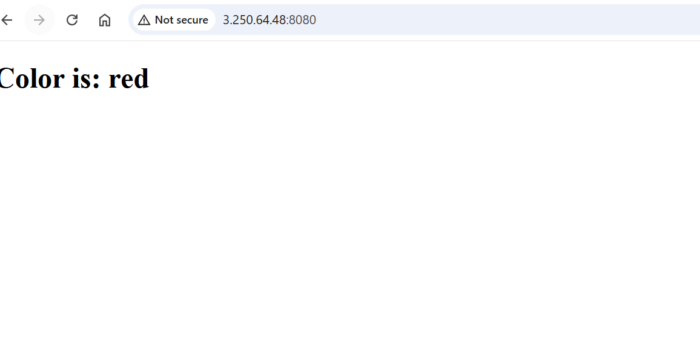

Docker image -
A Docker Image is a template or blueprint used to create containers.

How to create my own image?
Dockerfile
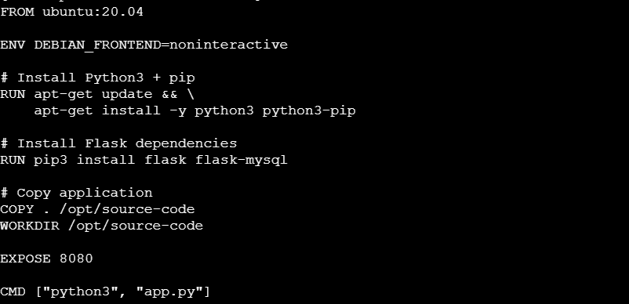

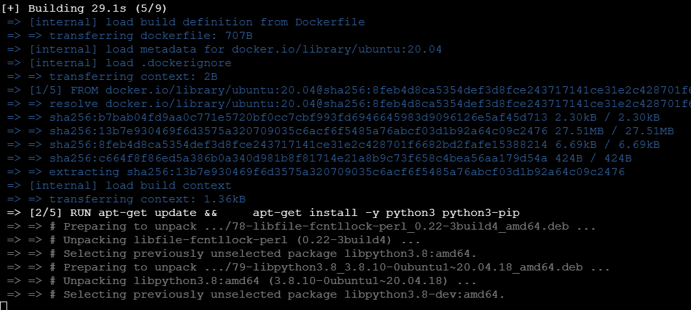

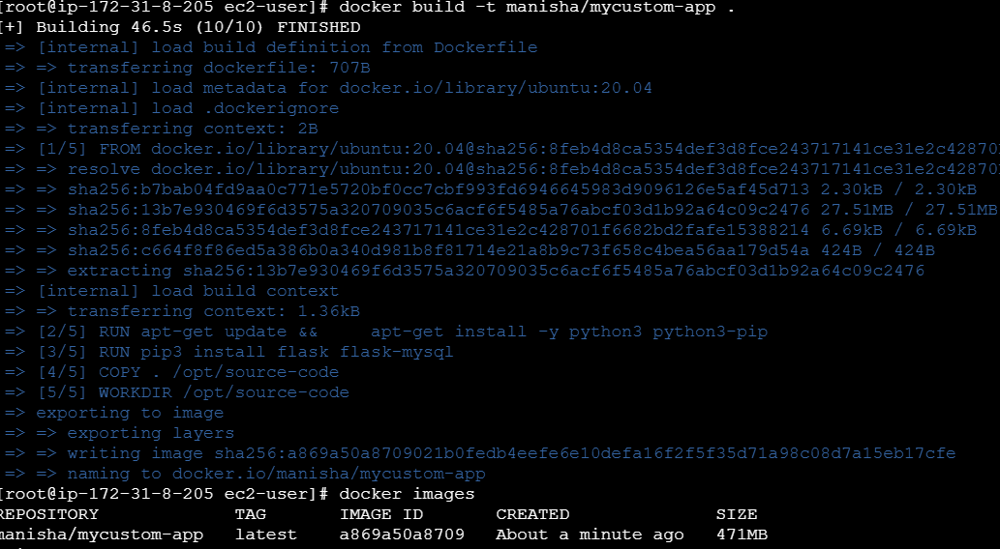

Default networks
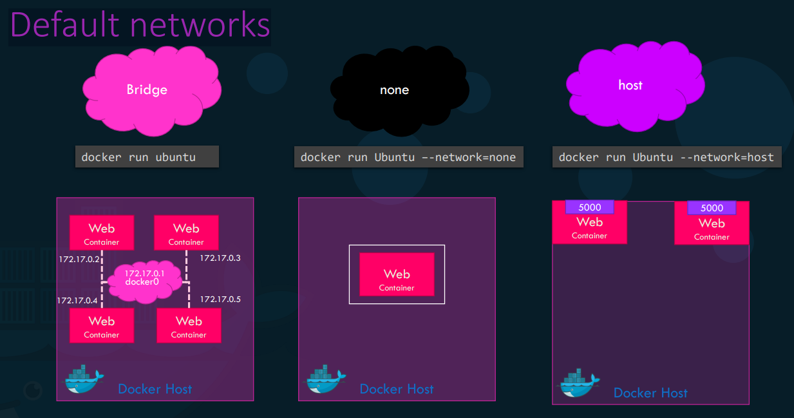

docker compose
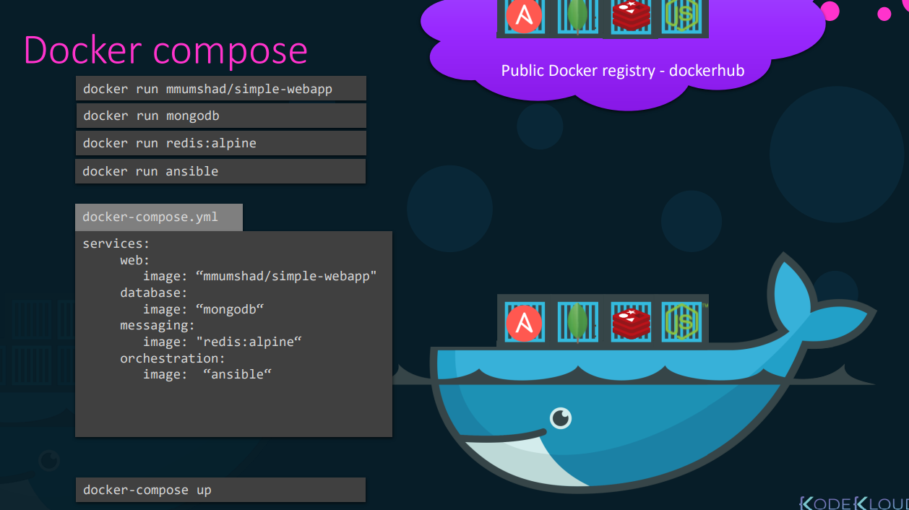

docker run links
docker run -d --name=redis redis 
docker run -d --name=db
docker run -d --name=vote –p 5000:80
docker run -d --name=result –p 5001:80
docker run -d --name=worker

docker registry
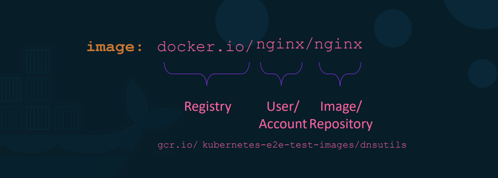

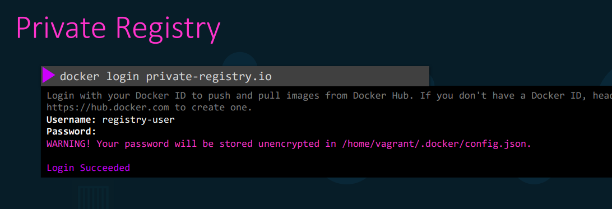