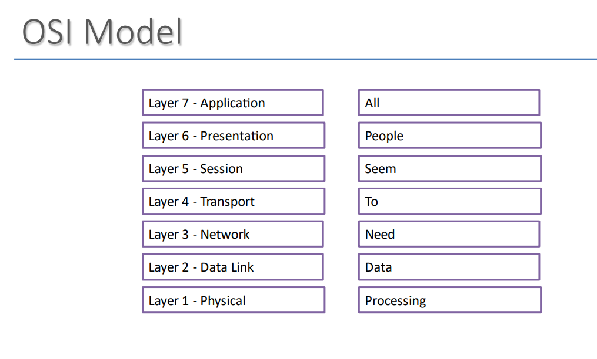
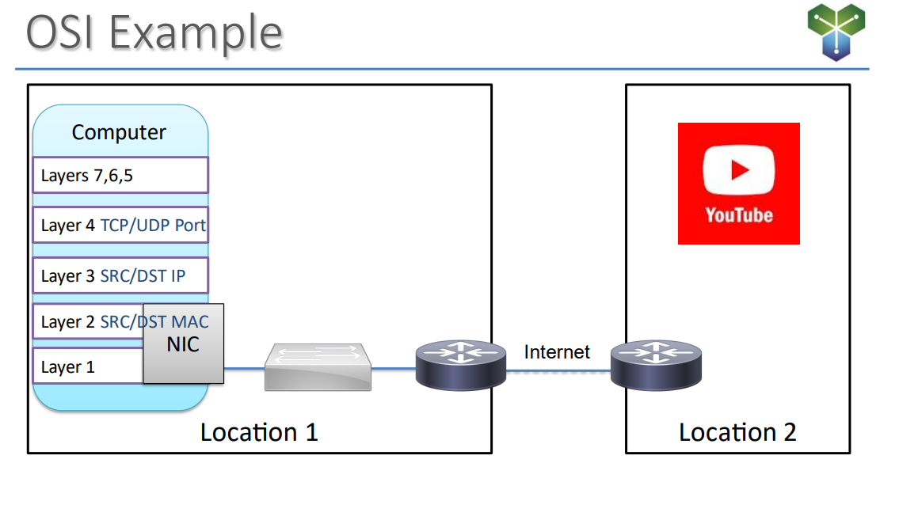
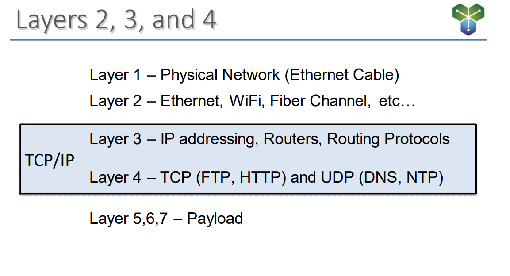
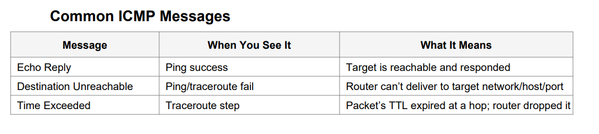
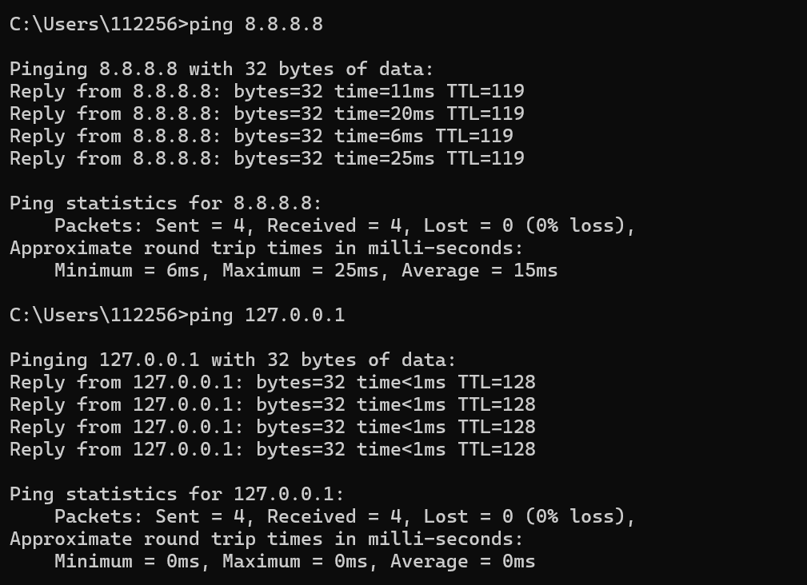
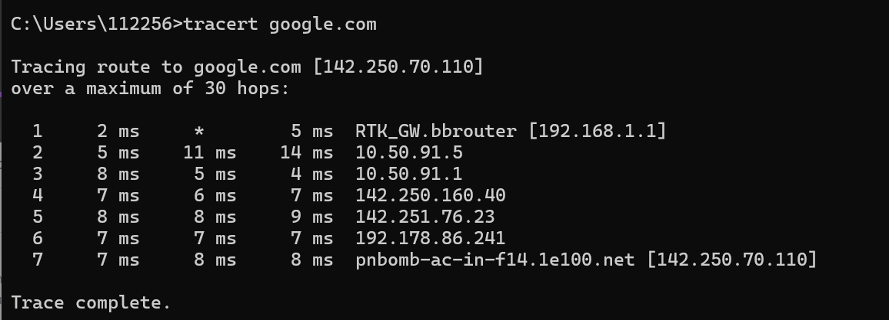
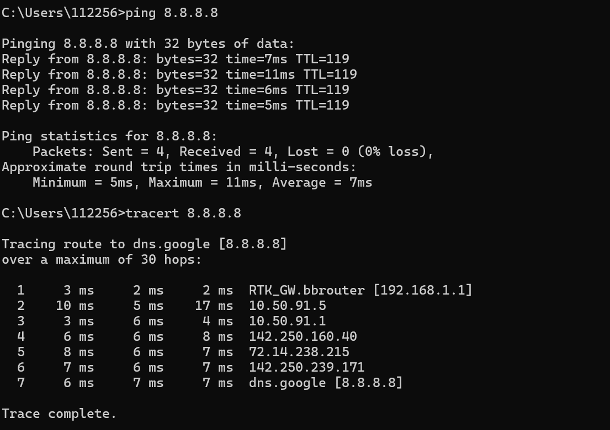
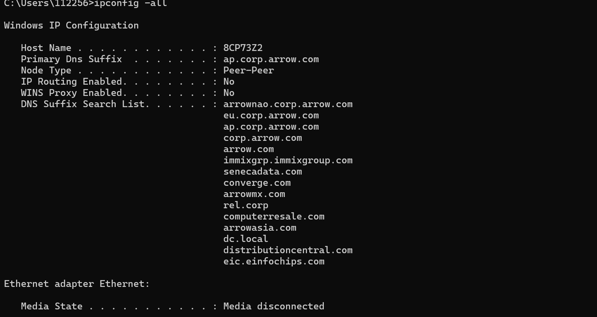
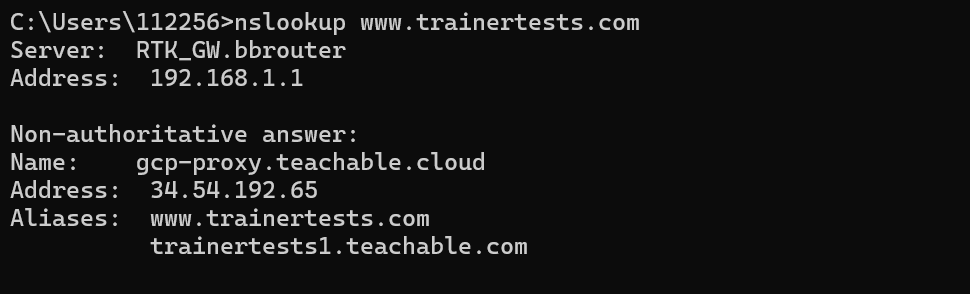
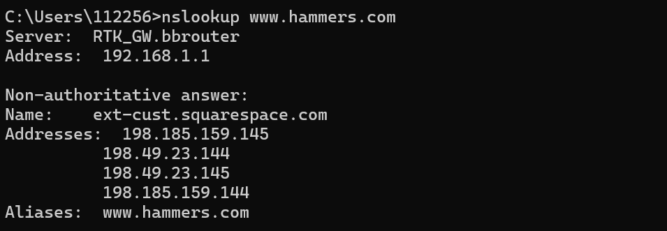

Introduction to Local Area Networks
- LANs are networks designed to connect multiple devices in a single physical location, enabling 
seamless communication between computers and other devices such as printers.
- LANs can be established using both wired and wireless technologies

Ethernet Switches and Their Role
- Ethernet switches are crucial physical network devices used to connect computers and other networked devices within a LAN.
- These switches come with multiple ports, where Ethernet cables from various devices can be connected, allowing them to communicate with each other.

Network Topologies
- LANs typically follow a star topology, where an Ethernet switch acts as the central hub, connecting all devices to each other.
- The switch serves as a focal point for communication, ensuring efficient data exchange between 
connected devices.

Understanding the OSI Model
- The OSI (Open Systems Interconnection) model is a conceptual framework that divides networking tasks into distinct layers.
- It helps network administrators and engineers organize and troubleshoot complex network systems.

Layer One - Physical Layer
- Layer One of the OSI model deals with the physical aspects of networking, such as cables, connectors, and network hardware.
- Ethernet cables, like Category 5 or Category 6, are commonly used in LANs for physical connectivity.

Wireless Connection
- While Ethernet is a standard for wired connections, LANs can also utilize Wi-Fi access points to connect devices wirelessly.
- Regardless of the medium used, LANs aim to connect devices within the same physical location.

Ethernet in Local Area Network
Evolving Ethernet Standards
- Ethernet is a well-established networking technology used to connect devices in LANs.
- While standards and speeds have evolved over time, Ethernet remains a core technology in LANs 
worldwide.

Network Interface Cards (NICs)
- Network Interface Cards are hardware components, typically built into modern computers, responsible for connecting devices to a LAN.
- NICs have physical ports to which Ethernet cables are connected, allowing devices to access the LAN

MAC Addresses
- Every NIC has a unique Media Access Control (MAC) address, a hardware-based identifier hard-coded by manufacturers.
- A MAC address is permanently associated with a specific NIC and is used for addressing and routing data in a LAN.

Viewing MAC Addresses
- Users can view their computer's MAC address using commands like 'ipconfig /all' on Windows or 'ifconfig' on Linux and Mac.
- This address helps devices within a LAN recognize and communicate with one another

Ethernet Frames
Understanding Ethernet Frames
- Communication in a LAN involves the exchange of Ethernet frames, consisting of three key 
components:
o Payload: The actual data being transmitted.
o Destination MAC: The MAC address of the recipient device.
o Source MAC: The MAC address of the sending device.

Analogous to Envelopes
- Ethernet frames are similar to envelopes for mailing letters, where addressing information is placed on the outside:
o Destination Address: The central address for routing the frame to the recipient.
o Source Address: The return address, indicating the sender.
o Payload: The content being sent, residing inside the frame.

Hubs, Bridges, and Switches-
1. Hub:
- Hubs are basic network devices that flood incoming traffic to all connected ports.
- Inefficient for unicast communication, leading to collision domains where devices must take turns transmitting

2. Collision Domain:
- In the context of Hubs, a collision domain is a group of devices sharing the same communication channel, resulting in potential collisions if two devices attempt to transmit simultaneously.

3. Bridge (Layer 2 Bridge):
- Bridges improve network efficiency by using MAC tables to forward traffic selectively.
- Collision domains are reduced, enhancing network performance.
- Bridges are a precursor to switches.

4.Switch:
- Switches operate similarly to bridges but are more advanced.
- They have MAC tables associating MAC addresses with specific ports, enabling targeted forwarding.
- Each port on a switch is its own collision domain, reducing collision issues.
- Switches improve network efficiency by minimizing unnecessary traffic.

5. Unicast:
- Unicast is a one-to-one communication, where one device communicates directly with another.
- Efficient and targeted communication compared to broadcast or multicast.

6. Broadcast Domain:
- In the context of switches, a broadcast domain includes all devices connected to the switch.
- Broadcast traffic is flooded to every port within the broadcast domain.
- The size of the broadcast domain affects network efficiency and the switch's ability to handle broadcasts.

7. Router:
- Routers can be used to break up broadcast domains and reduce broadcast traffic.
- Routers separate LANs into different broadcast domains

8. MAC Table:
- Both bridges and switches use MAC tables to associate MAC addresses with specific ports.
- MAC tables enhance network efficiency by allowing targeted forwarding of traffic.

9. Review:
- Unicast is one-to-one communication.
- Hubs flood incoming traffic to all ports, causing inefficiency and collision domains.
- Bridges reduce collision domains by selectively forwarding traffic based on MAC tables.
- Switches further improve efficiency with individual collision domains for each port.
- Broadcast domains in switches can be large, impacting network efficiency and MAC table size.
- Routers can be used to break up broadcast domains and reduce broadcast traffic

Overview of OSI Layers
- Layer 1: Physical layer
    -Deals with the physical connection between devices through cables, switches, and other hardware.
    -Involves the transmission and reception of raw bit streams over a physical medium.
- Layer 2: Data Link Layer
    - Manages node-to-node communication and error handling in the immediate link.
    - Uses MAC addresses for device identification on the local network, crucial for Ethernet networks.
- Layer 3: Network Layer
    - Responsible for packet forwarding including routing through intermediate routers.
    - Utilizes IP addresses to identify devices across networks, ensuring data reaches its correct destination.
- Layer 4: Transport Layer
    - Manages end-to-end communication and data flow control across the network.
    - Protocols like TCP (Transmission Control Protocol) and UDP (User Datagram Protocol) operate at this layer, handling things like data segmentation and reliable transmission.
- Layer 5: Session Layer
    - Controls dialogues (sessions) between computers, managing the setup, maintenance, and termination of connections.
- Layer 6: Presentation Layer
    - Translates data between the application layer and the network.
    - Ensures data is in the usable format and may encrypt/decrypt data for security.
- Layer 7: Application Layer
    - Closest to the end-user, this layer includes applications that interact with the network.
    - Handles high-level protocols, including HTTP for web browsing

Introducing Routers 
1. Role of Routers in Network Architecture:
    o Routers are essential devices that serve as a boundary between different Layer 2 networks, enabling distinct network segments.
    o The presence of routers between segments reduces broadcast traffic and isolates network domains.
2. Challenges in Large Layer 2 Networks:
    o In larger Layer 2 networks with interconnected switches, broadcast traffic can become overwhelming and challenging to manage.
    o The expansion of networks increases the size of MAC address tables and broadcast domains.
3. Router Placement:
    o Placing a router between multiple interconnected switches effectively creates separate Layer 2 segments, each with its own broadcast domain.
    o Routers can be connected to individual interfaces on the switches, providing segmentation.
4. Subnets and IP Addresses:
    o Each segment established by a router has its own unique IP address range and subnet.
    o Devices within each segment are assigned IP addresses specific to their respective subnets.
5. ARP Requests and Broadcasts:
    o ARP (Address Resolution Protocol) requests, which are Layer 2 broadcasts, serve as an example of broadcast traffic in network communication.
    o ARP requests are generated when a device needs to find the MAC address associated with a particular IP address.
6. Router's Role in Broadcast Management:
    o Routers do not propagate Layer 2 broadcasts between segments. Instead, they contain broadcast traffic within the originating segment.
    o Each segment, connected through a router, forms its own distinct broadcast domain.
7. Size Reduction of MAC Address Tables:
    o Routers contribute to the reduction in the size of MAC address tables on interconnected switches
    o Each switch only needs to maintain information about devices on its own segment.
8. Default Gateway and Routing Decisions:
    o Routers act as default gateways for devices within their respective segments.
    o When devices need to communicate with other segments or networks, they send traffic to the router, which makes routing decisions based on Layer 3 IP addresses.
9. Routing Decisions and Route Tables:
    o Routers automatically establish routes for directly connected networks.
    o They possess route tables that include entries for the networks they are directly connected to, simplifying routing within the segment

TCP & UDP
UDP (User Datagram Protocol)
- Connectionless: No handshake; just sends.
- No reliability mechanisms: No acknowledgements or retransmissions; best-effort delivery.
- Terminology: Layer-4 data units are called datagrams.
- Good fit: Real-time apps like Voice over IP (VoIP) and live streaming—late data is useless to resend.

TCP (Transmission Control Protocol)
- Connection-oriented: Establishes a session before sending data.
- Reliability: Uses sequence numbers and acknowledgements (ACKs) to confirm delivery; missing data is retransmitted.
- Error checking: Includes a checksum to detect corruption; mismatches trigger retransmission.
- Terminology: Layer-4 data units are called segments.
- Good fit: Web browsing, file downloads, email—where completeness matters.

TCP Reliability – Mini Flow
1) Sender transmits segments with sequence numbers (e.g., 201, 202, 203, 204).
2) Receiver replies with ACKs for each segment received.
3) If an ACK for a segment (e.g., 204) is not received in time, the sender retransmits it.
4) Checksums on each segment detect corruption; corrupted segments are not acknowledged and are resent

Quick Comparison
- Latency vs Reliability: UDP favors low latency; TCP favors guaranteed delivery.
- Overhead: UDP has minimal overhead; TCP adds control fields and requires ACKs.
- Use Case Fit: Choose UDP for time-sensitive media; choose TCP for integrity-critical data

Power over Ethernet (PoE)
Key Concepts
- Power over Ethernet (PoE) allows both data and electrical power to be delivered over a single Ethernet cable.
- This eliminates the need for separate power supplies for devices such as IP phones, wireless access points, and security cameras.
- PoE is defined by standards such as IEEE 802.3af, 802.3at (PoE+), and 802.3bt (PoE++), which provide increasing levels of power.
- The injector or PoE-capable switch supplies power, while the connected device (like a camera or AP) draws it.

How It Works
- Ethernet cables have four twisted pairs of wires; PoE can deliver power using the same pairs that
carry data or the spare pairs.
- Devices are classified to ensure they only draw as much power as needed.
- Modern switches negotiate power requirements dynamically with connected devices

Use cases
- IP Phones: Simplifies deployment by requiring only a network cable.
- Wireless Access Points: Convenient for ceiling or wall installations without nearby power outlets.
- Security Cameras: Enables placement in locations where running electrical wiring would be difficult or expensive.
- IoT Devices: Supports sensors and controllers in smart building deployments.

Advantages
- Reduces cabling costs and complexity.
- Increases flexibility for device placement.
- Centralizes power management through the network switch.

IP Addressing and Subnets
Basics of IP Addressing
- Introduction to IP Addressing
    - IP addresses are essential for identifying devices on a network. They allow devices to communicate and locate each other

IP Address Structure
- An IP address consists of four sections separated by dots (e.g., 10.1.1.11).
- Each section is called an octet, composed of eight binary digits. These octets make up the four sections of the IP address    

Private IP Addresses
- Certain IP address ranges are designated as private and intended for use within private networks.
- Understanding private IP address ranges is crucial, and we will explore them in more detail in a future lesson on Network Address Translation (NAT)

Subnetting and Slash Notation
- Subnet Notation (Slash Notation)
- Subnet notation is represented with a forward slash followed by a number (e.g., /24).
- The number indicates the number of bits used for the network portion of the IP address, leaving the remaining bits for host addresses.

Breaking Down Slash Notation
- A /24 subnet, for example, means the first 24 bits are the network portion, and the last 8 bits are available for host addresses.
- Subnet notation simplifies the division of IP address ranges into network and host portions

Subnetting an IP Address
Creating Subnets
- Subnetting allows you to divide a larger IP address range into smaller subnets for better organization and routing.
- Smaller subnets can be further divided into even smaller subnets.

Example: 10.1.0.0 Subnet
- An IP address range like 10.1.0.0 can be subnetted into smaller subnets.
- For instance, a /16 subnet means the first 16 bits are the network portion, and the remaining 16 bits can be allocated to create subnets.

Calculating Address Range
- Subnet calculators can help determine the address range for each subnet, making it easier to manage IP address assignments and routing.

Special Addresses Within a Subnet
Network Address
- The Network Address is the first address within a subnet, often ending with .0.
- It is reserved for network identification and cannot be assigned to devices. 

Default Gateway (First Usable Address)
- The first usable address in a subnet, typically ending with .1, is assigned to the router's interface 
connecting to the subnet.
- This address serves as the Default Gateway for devices within the subnet, allowing them to connect to other networks.

Broadcast Address (Last Usable Address)
- The Broadcast Address is the highest possible address in a subnet, often ending with .255.
- Packets sent to this address are received by every device within the subnet.

Usable Addresses
- The range between the Default Gateway and the Broadcast Address is available for assigning to devices within the subnet.
- For example, in a /24 subnet (e.g., 10.1.1.0/24), devices can use addresses from 10.1.1.2 to 10.1.1.254

Packet Walk
1. Packet Routing Overview:
o The packet walk demonstrates how data travels from a source computer to a destination computer via routers and switches.
2. Source and Destination IP Addresses:
o Each IP packet contains a source and destination IP address. These addresses determine the sender and recipient of the data.
3. Default Gateway Role:
o The default gateway, typically residing on a router within the same local area network, serves as the bridge for outbound traffic destined for other networks.
4. Layer 2 Addressing:
o When an IP packet is prepared for transmission, it includes Layer 2 addressing information. This information encompasses the source and destination MAC addresses.
5. Ethernet Frame Creation:
o The source computer generates an Ethernet frame by appending the source and destination MAC addresses, corresponding to its network segment.
6. Switch Analysis:
o The Ethernet frame arrives at a physical switch. The switch analyzes the Layer 2 addressing, identifies the destination MAC, and forwards the frame within the local segment.
7. Router Inspection:
o Upon reaching the router, the Ethernet frame is examined. The router deciphers the destination MAC, acknowledging its role in the transmission process.
8. Layer 3 Address Evaluation:
o The router proceeds to inspect the destination IP address within the IP packet. It determines if the packet should be routed to another network.
9. ARP Table Utilization:
o To forward the packet to the next network segment, the router checks its ARP table to link the destination IP with the appropriate MAC address.
10. New Layer 2 Headers:
o The router appends new Layer 2 headers to the packet to accommodate its journey into the next network segment, including source and destination MAC addresses.
11. Switch Forwarding:
o The updated Ethernet frame is sent to the switch, which forwards it based on the new destination MAC address, ensuring it reaches the intended segment.
12. Final Destination:
o The Ethernet frame arrives at the destination computer. The computer recognizes its MAC address, proceeds to extract the Layer 3 addressing information, and retrieves the payload for processing.

ICMP, Ping, and Traceroute
What is ICMP?
- ICMP = Internet Control Message Protocol (Layer 3).
- Not used for user data (e.g., emails or web pages).
- Designed for error reporting and diagnostics (e.g., Destination Unreachable, Time Exceeded).

Ping: Echo Requests & Echo Replies
- Sends ICMP Echo Request and expects an Echo Reply from the target.
- Confirms reachability and shows round-trip time (latency) and packet loss.
- Typical output includes reply IP/DNS, time in ms, and TTL (Time To Live) value of the reply.
- Good rule of thumb: Packet loss > 0% can indicate a problem (1–2%+ is suspicious).
- Loopback test: ping 127.0.0.1 to verify your local TCP/IP stack even without network access.

TTL (Time To Live)
- TTL limits how many router hops a packet can traverse; each router decrements TTL by 1.
- If TTL reaches 0, a router drops the packet and returns ICMP Time Exceeded.
- Example: If a reply shows TTL 118 and you assume an initial TTL of 128, the packet traversed about 10 hops.
- Prevents packets from circulating indefinitely when routing loops occur.

Traceroute (tracert on Windows)
- Discovers each hop between source and destination and measures per-hop latency.
- Windows: tracert (ICMP by default). Linux/macOS: traceroute (often UDP/ICMP depending on options).
- * * * (asterisks) indicate no reply (e.g., hop ignoring ICMP or filtered by a firewall).
- Paths and timing can change between runs due to dynamic internet routing

Virtual LANs (VLANs)
1. Introduction to VLANs:
o VLANs are logical network segments created within a single physical switch to ensure the efficient and secure operation of networks.
2. Scenario-Based Example:
o Imagine a small office with multiple devices, each requiring network access. VLANs help address the challenge of isolating traffic and maintaining network security.
3. The Need for Segmentation:
o In many cases, devices within a network need isolation from each other to bolster security. VLANs provide the means to achieve this without requiring separate physical switches for each segment.
4. Physical vs. Logical Segmentation:
o Physical segmentation would involve multiple switches, each connected to a router. Logical segmentation is the focus of VLANs, allowing devices within the same switch to be grouped into different logical segments.
5. VLAN Basics:
o VLANs are composed of multiple switches and routing devices. Each VLAN has a specific function and can communicate independently with its associated subnet.
6. Broadcast Domains:
o Each VLAN acts as an independent broadcast domain. Broadcast traffic within a VLAN only reaches devices within that specific VLAN.
7. MAC Address Tables:
o VLANs maintain their own MAC address tables, isolating devices within the same VLAN from devices in other VLANs.
8. Routing Between VLANs:
o To enable communication between VLANs, a router is required. Traffic flows through the router, which enforces security rules and routes data appropriately.
9. VLAN Tagging:
o When data travels between the switch and the router, it is tagged with a VLAN identifier. The router uses this tag to determine the destination VLAN
10. Trunk Ports and Access Ports:
o Switches contain both Trunk Ports and Access Ports. Trunk Ports carry multiple VLANs, while Access Ports are linked to a specific VLAN, connecting devices to the switch.
11. Implementation in Network Diagrams:
o A visual representation illustrates how VLANs are deployed within a network, with a single physical switch offering logical segmentation for multiple subnets.

Wide Area Networks (WANs)
1. WAN Introduction:
o Wide Area Networks, or WANs, bridge the gap between geographically separated local area networks, enabling them to communicate effectively over long distances.
2. Geographic Network Separation:
o WANs are the solution when multiple networks are not in the same physical location and need to exchange data.
3. Role of Edge Routers:
o In each physical location, an Edge Router serves as the connection point between the local network and the outside world. These routers facilitate WAN communication.
4. Types of WAN Connections:
o WAN connections vary and can include leased T1 circuits, MPLS, fiber optic connections, or other options. Selection depends on specific needs and budget constraints.
5. Creating Routing Logic:
o To enable WAN communication, routers require specific routing instructions. The key to achieving this is the router's route table.
6. Static Routes:
o Static routes are manually programmed into routers. They direct the router on how to reach specific networks via the WAN connection.
7. Dynamic Routing Protocols:
o Dynamic routing protocols, such as BGP (Border Gateway Protocol), allow routers to learn from one another. Routers exchange routing information, enabling dynamic route building.
8. Route Table Building:
o Through manual or dynamic methods, routers construct their route tables. These tables guide the router's decision-making when forwarding data packets.
9. Default Route (Gateway of Last Resort):
o A default route, represented as an all-zero destination address, serves as a catch-all for traffic not explicitly defined in the route table. It ensures data finds a way out, especially to the Internet.
10. Internet Connectivity:
o Wide Area Networks often include an Internet connection, allowing data to flow beyond the local network boundaries. Traffic destined for the Internet follows the default route.
11. Data Center WAN Design:
o Data centers typically utilize WAN connections to link multiple LANs within their infrastructure. Routers manage the flow of data between local networks and WAN connections.

Connecting LANs to the Internet
In this lesson, we learn how a Local Area Network (LAN) connects to the internet, the role of
routers, and the differences between bandwidth and speed.

- LAN to Router
- Inside a LAN, Ethernet switches connect multiple devices. A router connects these switches,segments broadcast domains, and provides a pathway toward the internet.

- Border Router
- The border router acts as the gateway between the LAN and the internet. It connects to anInternet Service Provider (ISP) and serves as the first line of defense with basic traffic rules.Additional devices such as firewalls and intrusion prevention systems typically reinforce security at this boundary.

- Internet Connections
- Common connection types include broadband options such as cable, DSL, or fiber optic internet. These provide cost-effective solutions for homes and small to medium businesses. Other enterprise options, like MPLS and SD-WAN, will be discussed separately.

- Bandwidth vs. Speed
- Bandwidth is the amount of data a connection can handle, measured in Mbps or Gbps. Think of it as the number of lanes on a highway. Speed is how fast the data moves, comparable to the speed limit on that highway. While often used interchangeably in everyday conversation, they are technically distinct.

IPSEC VPNs for Multi-Location Connectivity
IPSEC VPN Introduction:
o IPSEC (Internet Protocol Security) VPNs establish secure communication channels between networks that are not necessarily in the same physical location. These networks often use different IP address ranges.

Challenges of Wide Area Networking:
o As networks expand, connecting every location via Wide Area Network circuits can become prohibitively expensive. IPSEC VPNs provide a more cost-effective solution for network connectivity.

Internet Connectivity:
o IPSEC VPNs leverage the Internet for communication between geographically separated locations. Both physical sites must have access to the Internet for this to work.

Security Concerns:
Using the Internet for data transmission introduces security concerns. Sensitive data should not traverse the Internet in an unprotected state.

IPSEC VPN Configuration:
o Configuring an IPSEC VPN involves setting up a dedicated interface on each router. These interfaces have public IP addresses, visible on the Internet. Public IP addresses function like unique phone numbers in the digital realm.

VPN Setup:
o Routers on both ends of the VPN establish a connection by configuring shared secrets, similar to a password. The routers must also know the public IP address of the router on the other side.

VPN Tunnel Creation:
o When two routers with IPSEC VPN configurations communicate, they initiate a VPN tunnel. This tunnel forms a secure path for data to travel between locations. It is analogous to a secure tunnel through the Internet.

Data Encryption:
o All data traveling through the VPN tunnel is encrypted, ensuring that even if intercepted, it remains secure. The data is decrypted at the destination router.

Data Flow Example:
o To illustrate the VPN process, we tracked an IP packet from its source, through the VPN tunnel, to its destination. The router encrypts the data at the source and decrypts it at the destination.

Secure Multi-Location Connectivity:
o IPSEC VPNs offer a secure, encrypted connection between two physically separated networks over the Internet, allowing them to communicate as if they were on the same local network.

Layer 2 VPNs:
Introduction to Layer 2 VPNs:
o Layer 2 VPNs are a different category of VPN designed to extend Layer 2 network segments over geographic distances. Unlike IPSEC VPNs, they are used when maintaining the same IP address scheme is critical.

Use Case: Primary Datacenter and Disaster Recovery:
o Layer 2 VPNs are invaluable in scenarios where maintaining consistent addressing across locations is essential. For instance, in a setup with a primary datacenter and a disaster recovery site, Layer 2 VPNs offer disaster recovery and mobility capabilities.

Addressing Consistency:
o In disaster recovery or mobility scenarios, it's crucial to avoid changing the IP addresses or MAC addresses of virtual machines when moving workloads between locations. Layer 2 VPNs make this possible.

Layer 2 VPN Configuration:
o Configuring a Layer 2 VPN involves establishing a secure VPN tunnel, similar to IPSEC VPNs. Routers at both ends communicate, sharing secret passwords and using their public IP addresses to set up the tunnel.

Data Flow Example:
o When data transmission is required between two devices on the same Layer 2 segment but at different physical locations, the source device communicates directly with the destination device. The Layer 2 frame generated is sent to the local router, which encrypts it and sends it over the VPN tunnel.

Benefits of Layer 2 VPNs:
o Layer 2 VPNs allow for the extension of Layer 2 networks over geographic distances. This extension provides disaster recovery capabilities, enabling the restoration of workloads at different locations without IP address changes. It also facilitates mobility, as virtual machines can be moved between locations without altering their IP or MAC addresses.

5G and LTE Networks
Mobile Connectivity
- Smartphones connect to the internet using 5G (if available) or LTE as fallback.
- These networks support high-speed tasks such as streaming, browsing, and apps.

Corporate Use Cases
- Branch offices often rely on cable broadband for internet access.
- If the main connection fails, wireless (5G/LTE) can serve as a backup connection.
- In areas without broadband access, 5G can even act as the primary network.
- Temporary sites (e.g., food trucks, pop-ups) can use 5G/LTE for connectivity.

5G vs. LTE Performance
- LTE: 20–50 Mbps, higher latency.
- 5G: 300+ Mbps, much lower latency.
- 5G is typically 10–20x faster than LTE.
- 5G coverage is still expanding, with urban areas prioritized.
- Devices automatically fall back to LTE when 5G is unavailable

Advantages of 5G in Networking
- High Availability: Provides reliable backup when wired broadband fails.
- Scalability: Useful for mobile and temporary locations.
- Low Latency: Improves application responsiveness.

Fiber Optics
- Fiber optics are an essential technology for modern networking. Instead of using copper and electrical signals, fiber optics transmit data using light over thin strands of glass or plastic.This allows for faster speeds, longer distances, and reduced interference.

Copper vs. Fiber Optics
- Traditional coaxial or Ethernet cables use copper wires that carry electrical signals, which are slower and more prone to signal loss (attenuation) and interference. Fiber optics use light, which travels faster, supports higher bandwidth, and maintains signal quality over longer distances.

DNS: Domain Name System
Introduction to DNS
- DNS, or the Domain Name System, acts as the internet's address book, translating human-readable domain names into IP addresses.

How DNS Works
DNS Query Process
- When a user enters a domain name (e.g., www.trainertests.com) into their browser, their computer initiates a DNS query.
- The DNS query is sent to a configured DNS server (usually obtained from DHCP settings).

DNS Server Hierarchy
- DNS servers are organized in a hierarchical structure, with authoritative DNS servers at the top.
- Authoritative DNS servers have direct knowledge of domain names and their corresponding IP 
addresses.

Executing DNS Queries with nslookup
Using nslookup
- The nslookup command allows users to perform DNS queries directly from their computer.
- It provides information about the configured DNS server and the resolved IP address.

Load Balancing
Purpose of Load Balancing
- Distributes traffic across multiple servers to ensure high availability and fault tolerance.
- Helps spread workloads evenly across physical servers, virtual machines, or containers.

How Load Balancers Work
- All traffic is funneled to the load balancer, often via a DNS record pointing to it.
- The load balancer uses a listener configured for a specific protocol and port (e.g., HTTP on port 80).
- Incoming traffic is then distributed across a pool of interchangeable targets

Interchangeable Targets
- Targets may include physical servers, virtual machines, containers, or instances in cloud regions.
- Users receive the same experience regardless of which server responds, since all targets serve identical content.

High Availability
- Load balancers send periodic health checks to each target to confirm functionality.
- If a server fails to respond, it is automatically removed from rotation, preventing downtime.
- In cloud environments, failed instances can often be automatically replaced.

Scaling
- Load balancers enable horizontal scaling: adding more servers or containers increases capacity.
- They distribute workloads dynamically as demand grows.

Public vs. Private IP Addresses
- Public and private IP addresses serve distinct purposes in networking, similar to phone numbers used within and outside a business organization.

Private IP Address Ranges:
- Private IP address ranges, such as 10.0.0.0/8, 172.16.0.0/12, and 192.168.0.0/16, are reserved for internal use and are not routable on the internet.
- These addresses are utilized within organizations to accommodate the growing number of devices without exhausting the limited pool of public IP addresses.

Network Address Translation (NAT):
- NAT enables devices with private IP addresses to access the internet by translating them to a public IP address.
- A router with NAT functionality replaces the private IP address with a public one, allowing communication with internet resources.

