AWS EKS Kubernetes

AWS eks cluster

how Eks work
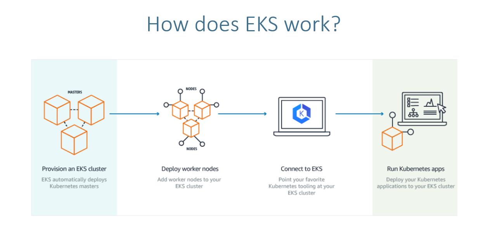

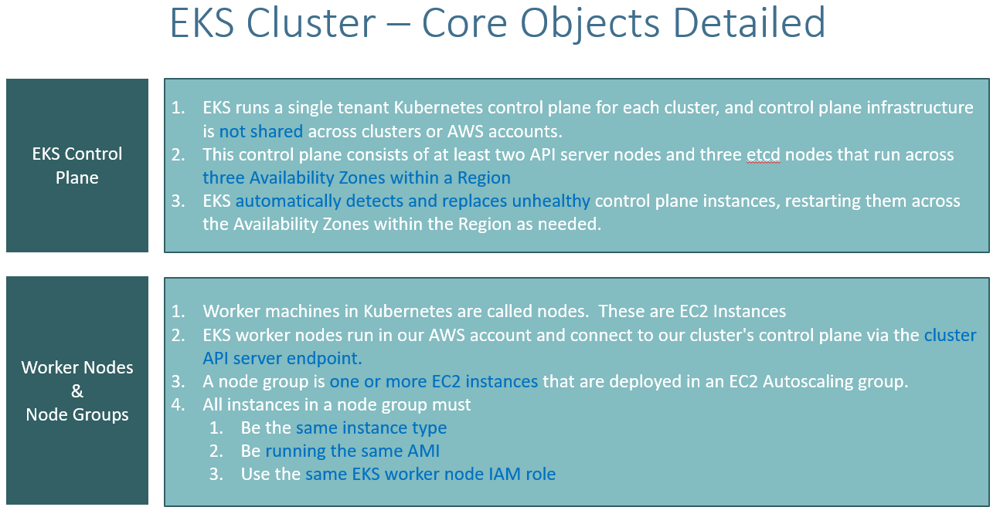

Create EKS Cluster
eksctl create cluster --name=eksdemo1 --region=us-east-1 --zones=us-east-1a,us-east-1b --without-nodegroup 

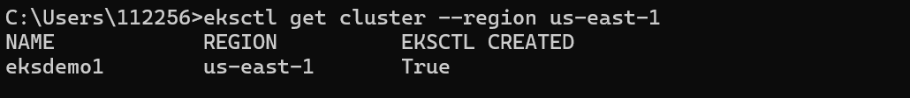

Create EKS Managed Node Group & IAM OIDC Provider

Create EC2 Keypair

Create Node Group with additional Add-Ons in Public Subnets

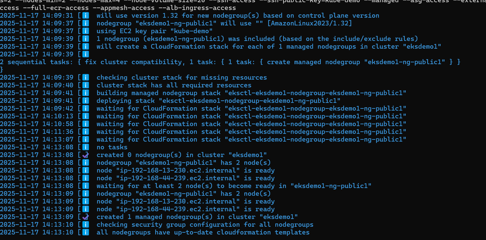

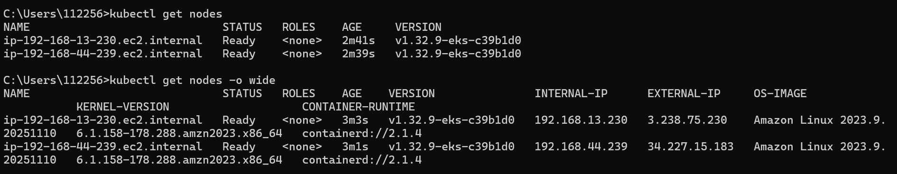

Verify Cluster & Nodes

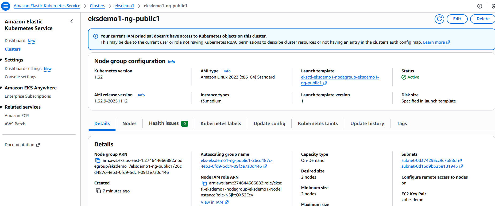

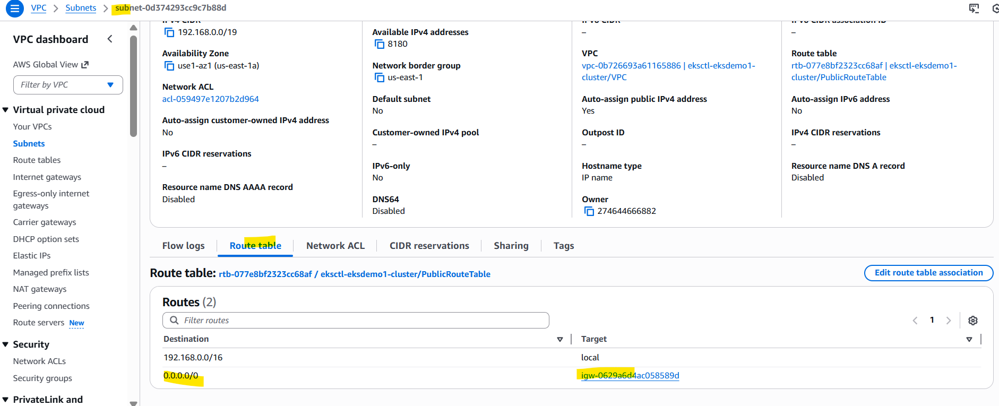

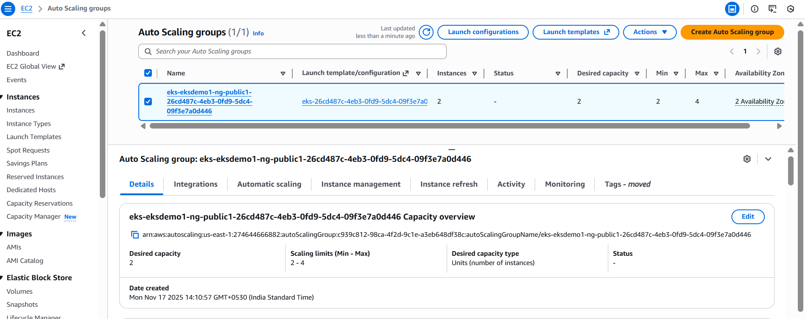

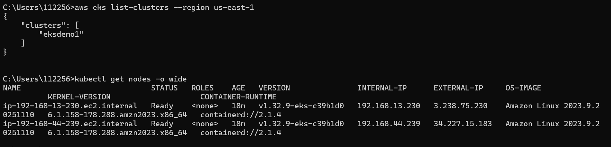

Verify Worker Node IAM Role and list of Policies

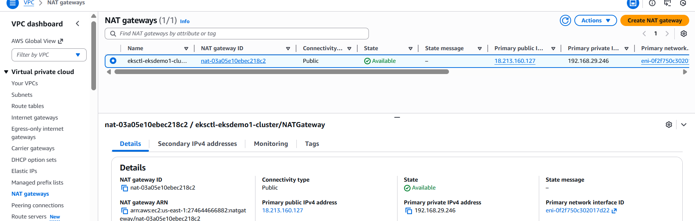

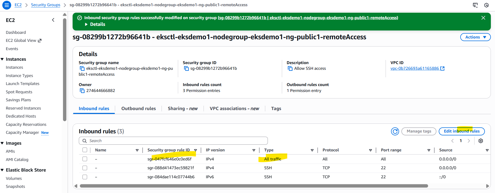

EKS Delete Cluster
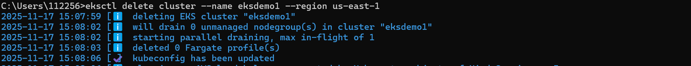

