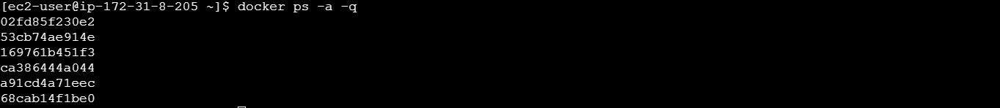
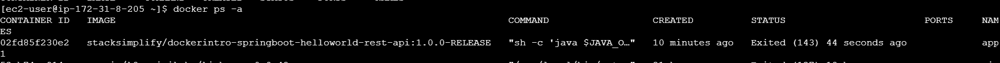
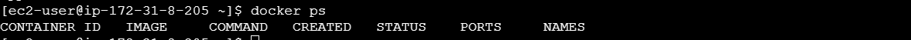
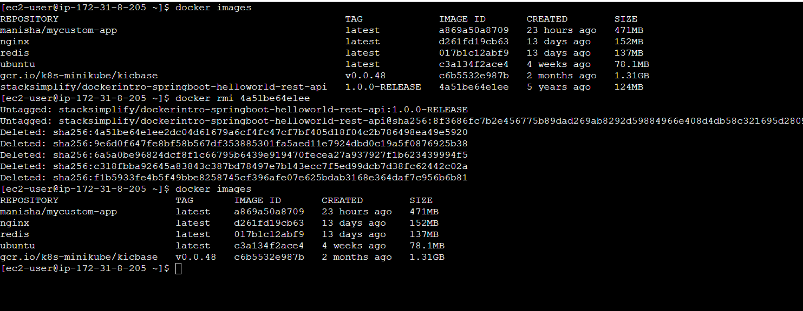
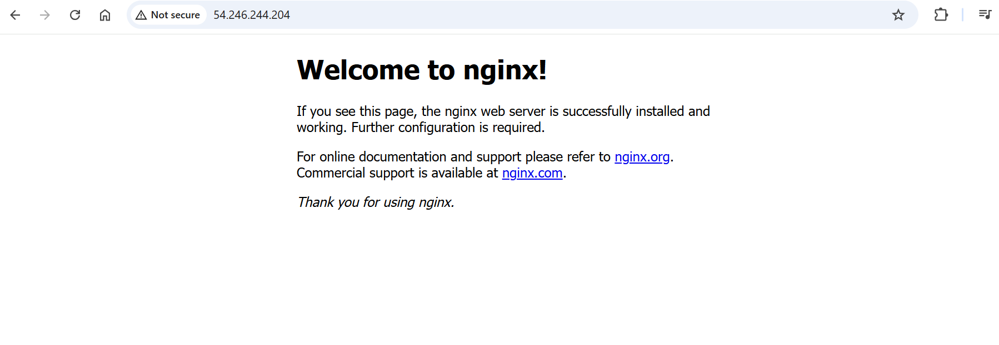
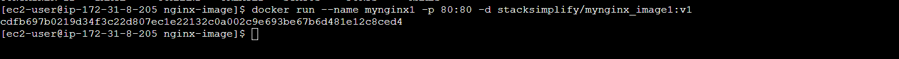
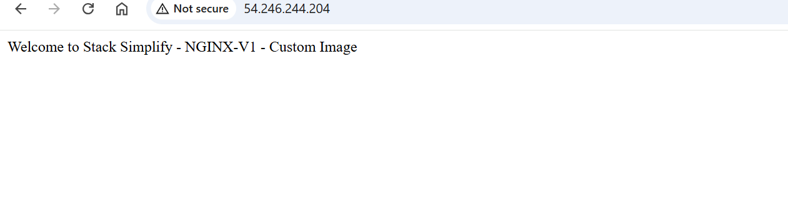
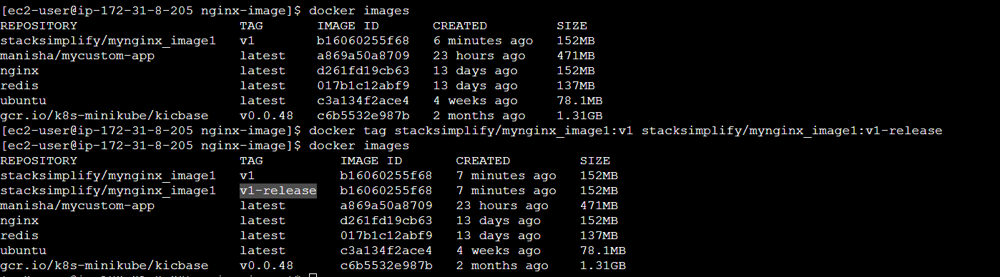

Docker 
What problems we have with Traditional Infra?
- Traditional Approach
- Installation & Configuration
    - Time consuming
    - Need to perform install/configs on every server and everyenvironment (dev, qa, staging, production)
- Compatibility & Dependency
    - Need to keep resolving issues related to libraries and dependencies
- Inconsistencies across Environments
    - Very hard to track changes across Dev/QA/Staging and Prodenvironments and they end up with inconsistencies
- Operational Support
    - Need more resources to handle operational issues on day to day basis
    - Server Support (hardware, software)
    - Patching releases
- Developer Environments
    - When a new developer joins the team, time it takes to provision his development environment in traditional approach is time taking.

Docker - Terminology
- Docker Daemon
    - The Docker daemon (dockerd) listens for Docker API requests and manages Docker objects such as images, containers, networks, and volumes

- Docker Client    
    - Docker client can be present on either Docker Host or any other machine.
    - The Docker client (docker) is the primary way that many Docker users interact with Docker.
    - When you use commands such as docker run, the client sends these commands to dockerd (Docker Daemon), which carries them out.
    - The docker command uses the Docker API.
    - The Docker client can communicate with more than one daemon

- Docker Images
- An image is a read-only template with instructions for creating a Docker container.
- Often, an image is based on another image, with some additional customization.
- For example, we may build an image which is based on the ubuntu image, but installs the Apache web server and our application, as well as the configuration details needed to make our application run.

- Docker Containers
    - A container is a runnable instance of an image.
    - We can create, start, stop, move, or delete a container using the Docker API or CLI.
    - We can connect a container to one or more networks, attach storage to it, or even create a new image based on its current state.
    - When a container is removed, any changes to its state that are not stored in persistent storage disappear.

- Docker Registry or Docker Hub
    - A Docker registry stores Docker images.
    - Docker Hub is a public registry that anyone can use, and Docker is configured to look for images on Docker Hub by default.
    - We can even run our own private registry.
    - When we use the docker pull or docker run commands, the required images are pulled from our configured registry.
    - When we use the docker push command, our image is pushed to our configured registry

Docker - Pull Docker Image from Docker Hub and Run it locally

Run the downloaded Docker Image & Access the Application
- Copy the docker image name from Docker Hub

List Running Containers
docker ps
docker ps -a
docker ps -a -q

Connect to Container Terminal

Container Stop, Start
docker stop <container-name>
docker start  <container-name>

Remove Container
docker stop <container-name> 
docker rm <container-name>

Remove Image
docker rmi  <image-id>

Docker - Build Docker Image locally, Test and Push it to Docker Hub

Create Dockerfile and copy our customized index.html
Dockerfile
FROM nginx
COPY index.html /usr/share/nginx/html

Build Docker Image & run it

Tag & push the Docker image to docker hub

