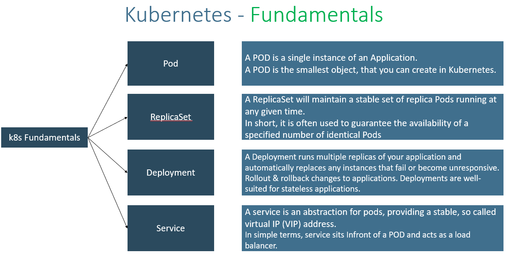
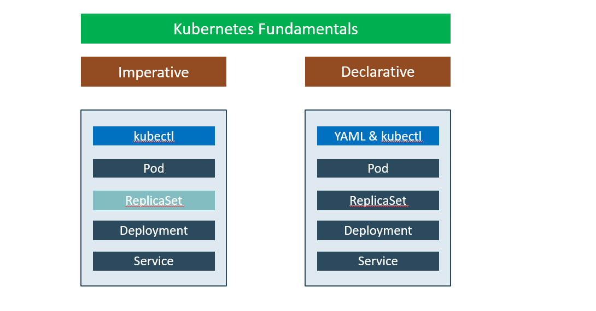
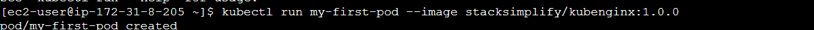
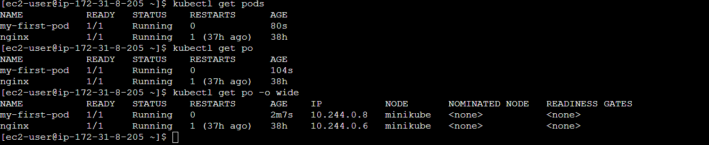
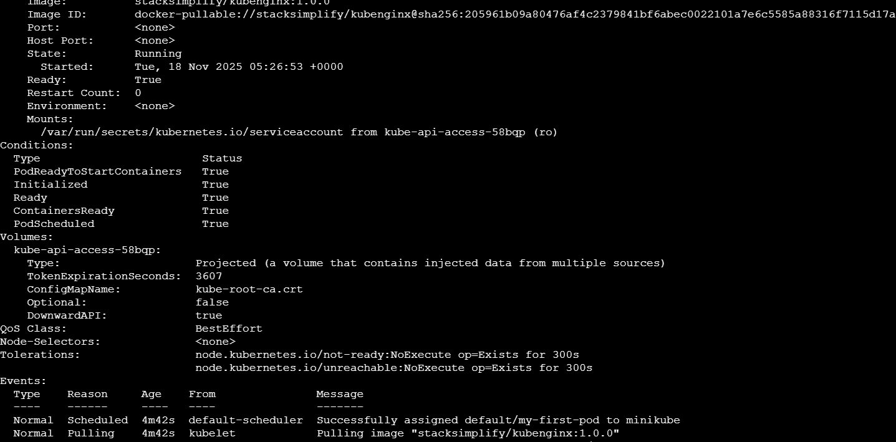
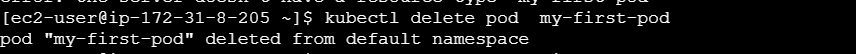

Kubernates
- Kubernetes is a portable, extensible, open source platform for managing container workloads.

Master
- kube-apiserver
    - It acts as front end for the Kubernetes control plane. It exposes the Kubernetes API
    - Command line tools (like kubectl), Users and even Master components (scheduler, controller manager, etcd) and Worker node components like (Kubelet) everything talk with API Server. 
- etcd
    - Consistent and highly-available key value store used as Kubernetes’ backing store for all cluster data.
    - It stores all the masters and worker node information. 
- kube-scheduler
    - Scheduler is responsible for distributing containers across multiple nodes.  
    - It watches for newly created Pods with no assigned node, and selects a node for them to run on.

- kube-controller-manager  
    - Controllers are responsible for noticing and responding when nodes, containers or endpoints go down. They make decisions to bring up new containers in such cases. 
    - Node Controller: Responsible for noticing and responding when nodes go down. 
    - Replication Controller: Responsible for maintaining the correct number of pods for every replication controller object in the system.
    - Endpoints Controller:  Populates the Endpoints object (that is, joins Services & Pods)
    - Service Account & Token Controller: Creates default accounts and API Access for new namespaces

- cloud-controller-manager
    - A Kubernetes control plane component that embeds cloud-specific control logic. 
    - It only runs controllers that are specific to your cloud provider. 
    - On-Premise Kubernetes clusters will not have this component. 
    - Node controller: For checking the cloud provider to determine if a node has been deleted in the cloud after it stops responding
    - Route controller: For setting up routes in the underlying cloud infrastructure
    - Service controller: For creating, updating and deleting cloud provider load balancer

Worker Nodes
- Container Runtime
    - Container Runtime is the underlying software where we run all these Kubernetes components. 
    - We are using Docker, but we have other runtime options like rkt, container-d etc.
- Kubelet
    - Kubelet is the agent that runs on every node in the cluster
    - This agent is responsible for making sure that containers are running in a Pod on a node.
- Kube-Proxy
    - It is a network proxy that runs on each node in your cluster.
    - It maintains network rules on nodes
    - In short, these network rules allow network communication to your Pods from network sessions inside or outside of your cluster.

Kubernates fundamentals -

Kubernetes - Imperative & Declarative

Kubernetes POD -
- With Kubernetes our core goal will be to deploy our applications in the form of containers on worker nodes in a k8s cluster. 
- Kubernetes does not deploy containers directly on the worker nodes.
- Container is encapsulated in to a Kubernetes Object named POD.
- A POD is a single instance of an application
- A POD is the smallest object that we can create in Kubernetes
- PODs generally have one to one relationship with containers. 
- To scale up we create new POD and to scale down we delete the POD. 
- We cannot have multiple containers of same kind in a single POD. 
- Example: Two NGINX containers in single POD serving same purpose is not recommended. 

Kubernetes – Multi-Container Pods
- We can have multiple containers in a single POD, provided they are not of same kind.
- Helper Containers (Side-car)
    - Data Pullers: Pull data required by Main Container
    - Data pushers: Push data by collecting from main container (logs)
    - Proxies: Writes static data to html files using Helper container and Reads using Main Container. 
- Communication
    - The two containers can easily communicate with each other easily as they share same network space.
    - They can also easily share same storage space. 
- Multi-Container Pods is a rare use-case and we will try to focus on core fundamentals. 

Kubernetes Pods Demo
Create a Pod

List Pods
kubectl get pods
kubectl get po

Describe Pod
kubectl describe pod <Pod-Name>

