Kubernetes NodePort Service Introduction-
- We can expose an application running on a set of PODs using different types of Services available in k8s. 
    - ClusterIP
    - NodePort
    - LoadBalancer
- NodePort Service 
    - To access our application outside of k8s cluster, we can use NodePort service.
    - Exposes the Service on each Worker Node's IP at a static port (nothing but NodePort). 
    - A ClusterIP Service, to which the NodePort Service routes, is automatically created. 
    - Port Range 30000-32767

Expose Pod with a Service
- Expose pod with a service (NodePort Service) to access the application externally (from internet)
- Ports
    - port: Port on which node port service listens in Kubernetes cluster internally
    - targetPort: We define container port here on which our application is running.
    - NodePort: Worker Node port on which we can access our application.

# Create  a Pod
kubectl run <desired-pod-name> --image <Container-Image> --generator=run-pod/v1
kubectl run my-first-pod --image stacksimplify/kubenginx:1.0.0 --generator=run-pod/v1

# Expose Pod as a Service
kubectl expose pod <Pod-Name>  --type=NodePort --port=80 --name=<Service-Name>
kubectl expose pod my-first-pod  --type=NodePort --port=80 --name=my-first-service

# Get Service Info
kubectl get service
kubectl get svc
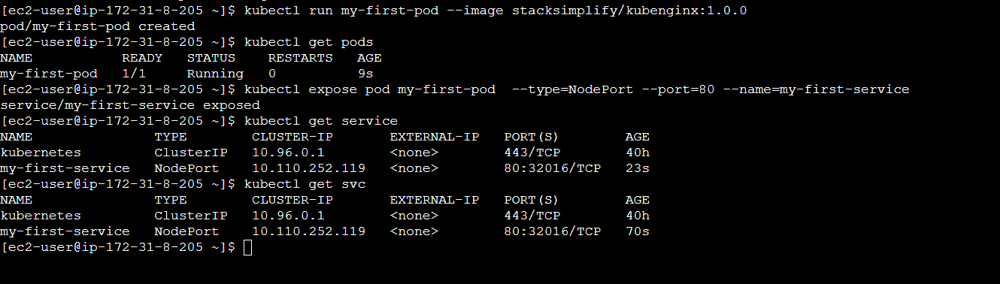

Access the Application using Public IP
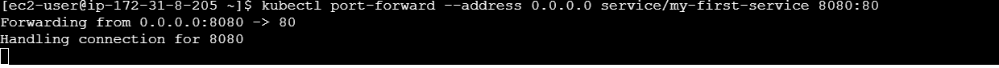

output
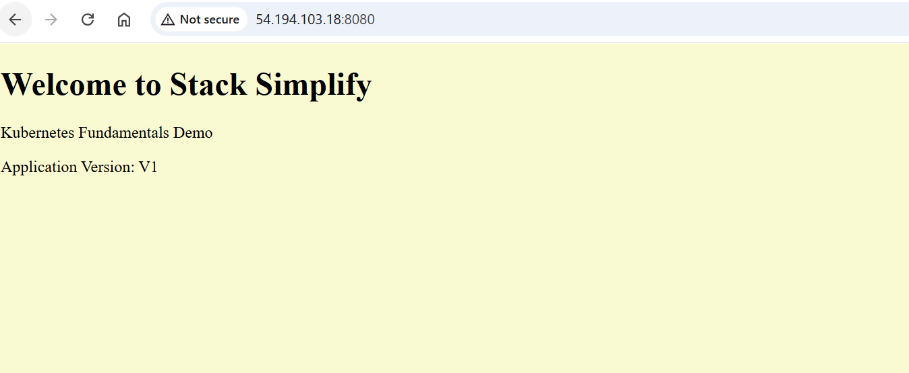

- target-port
- If target-port is not defined, by default and for convenience, the targetPort is set to the same value as the port field.
# Expose Pod as a Service with Container Port (--taret-port)
kubectl expose pod my-first-pod  --type=NodePort --port=81 --target-port=80 --name=my-first-service3

# Get Service Info
kubectl get service
kubectl get svc

# Get Public IP of Worker Nodes
kubectl get nodes -o wide
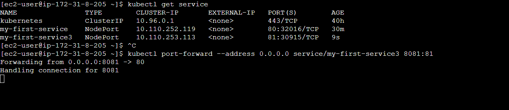

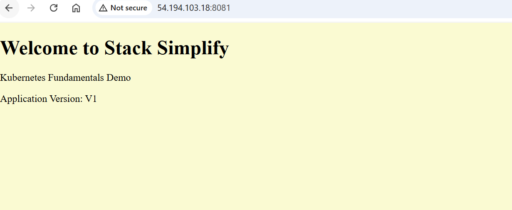

Interact with Pod- Connect to contianer in a pod
kubectl logs <pod-name>
kubectl logs my-first-pod
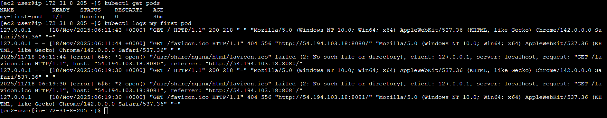

Connect to Container in a POD
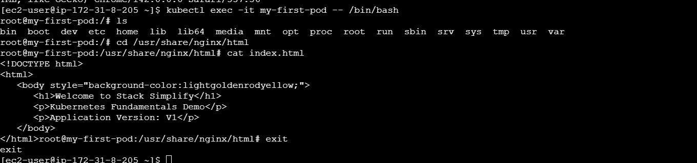

- Running individual commands in a Container
kubectl exec -it <pod-name> env

# Sample Commands
kubectl exec -it my-first-pod env
kubectl exec -it my-first-pod ls
kubectl exec -it my-first-pod cat /usr/share/nginx/html/index.html

Get YAML Output of Pod & Service
kubectl get pod my-first-pod -o yaml
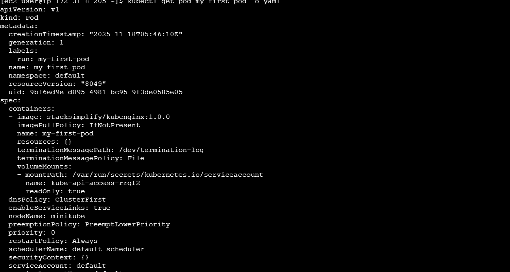

kubectl get service my-first-service -o yaml   
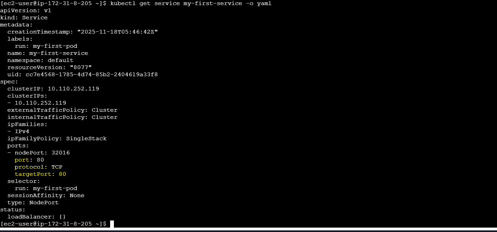

Delete Pod
# Get all Objects in default namespace
kubectl get all

# Delete Services
kubectl delete svc my-first-service
kubectl delete svc my-first-service2
kubectl delete svc my-first-service3

# Delete Pod
kubectl delete pod my-first-pod

# Get all Objects in default namespace
kubectl get all

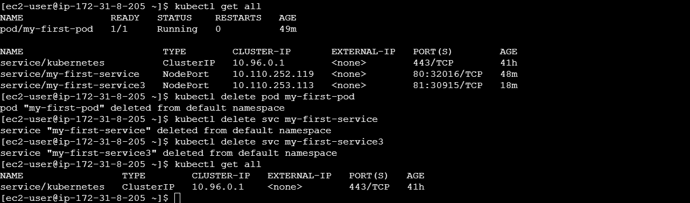

Replicaset
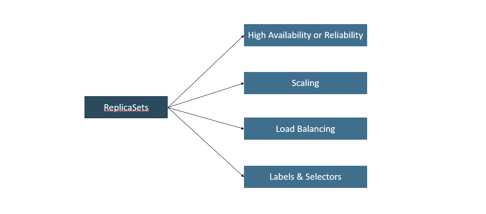

- A ReplicaSet’s purpose is to maintain a stable set of replica Pods running at any given time.
- If our application crashes (any pod dies), replicaset will recreate the pod immediately to ensure the configured number of pods running at any given time. 

- Load Balancing
    - To avoid overloading of traffic to single pod we can use load balancing. 
    - Kubernetes provides pod load balancing out of the box using Services  for the pods which are part of a ReplicaSet
    - Labels & Selectors are the key items which ties all 3 together (Pod, ReplicaSet & Service), we will know in detail when we are writing YAML manifests for these objects

- Scaling
    - When load become too much for the number of existing pods, Kubernetes enables us to easily scale up our application, adding additional pods as needed.
    - This is going to be seamless and super quick

-Create ReplicaSet
kubectl create -f replicaset-demo.yml
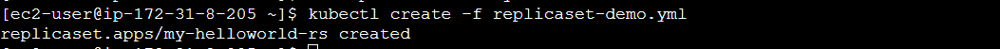  

- List ReplicaSets
    -Get list of ReplicaSets
kubectl get replicaset
kubectl get rs   
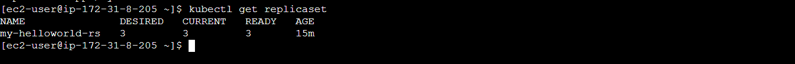  

- Describe ReplicaSet
    -Describe the newly created ReplicaSet
kubectl describe rs/<replicaset-name>

kubectl describe rs/my-helloworld-rs
[or]
kubectl describe rs my-helloworld-rs
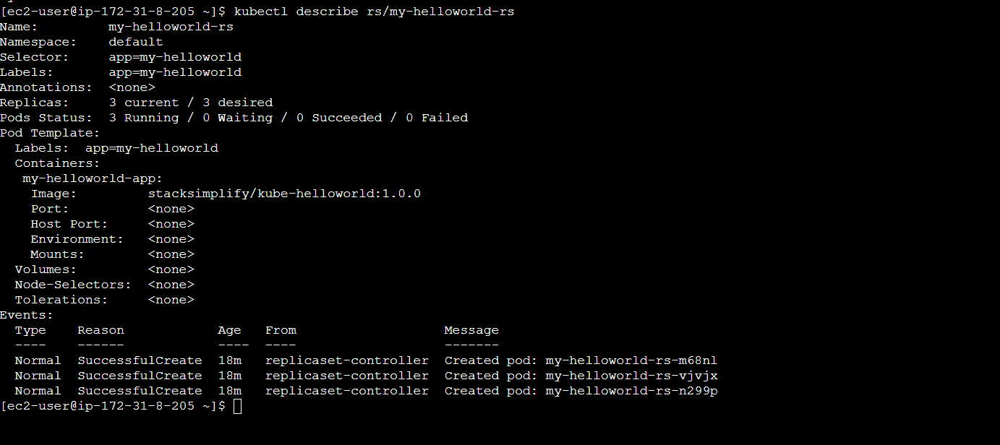  

Verify the Owner of the Pod
- Verify the owner reference of the pod.
kubectl get pods <pod-name> -o yaml
kubectl get pods my-helloworld-rs-vjvjx -o yaml 
 

- Expose ReplicaSet as a Service
- Expose ReplicaSet with a service (NodePort Service) to access the application externally (from internet)

# Expose ReplicaSet as a Service
kubectl expose rs <ReplicaSet-Name>  --type=NodePort --port=80 --target-port=8080 --name=<Service-Name-To-Be-Created>
kubectl expose rs my-helloworld-rs  --type=NodePort --port=80 --target-port=8080 --name=my-helloworld-rs-service
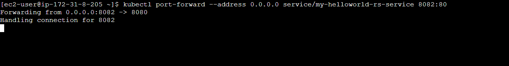 

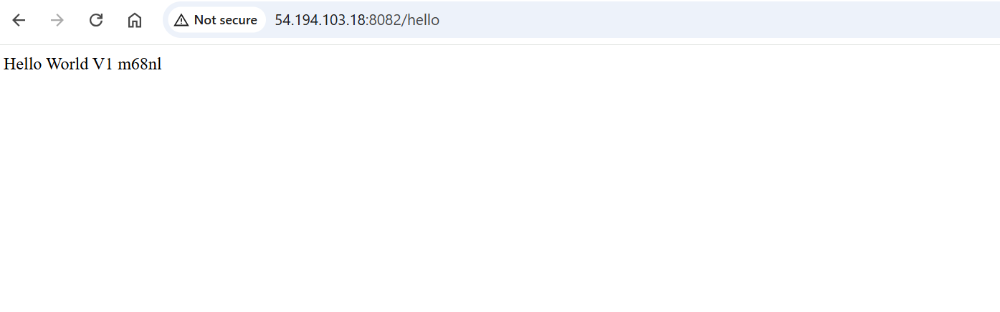 

Test Replicaset Reliability or High Availability
# To get Pod Name
kubectl get pods

# Delete the Pod
kubectl delete pod <Pod-Name>

# Verify the new pod got created automatically
kubectl get pods   (Verify Age and name of new pod)
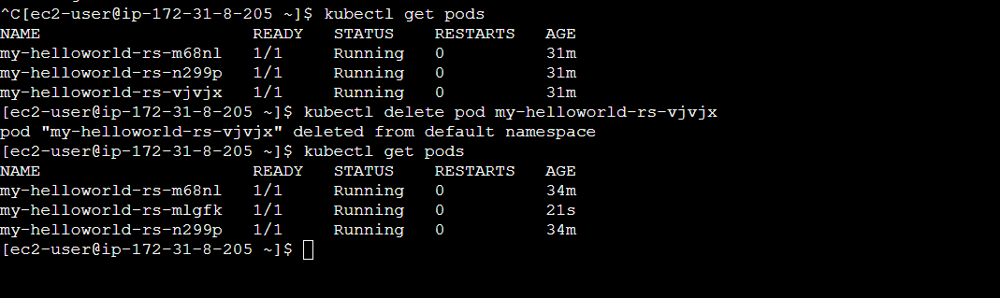 

- Test ReplicaSet Scalability feature
- Test how scalability is going to seamless & quick
- Update the replicas field in replicaset-demo.yml from 3 to 6.
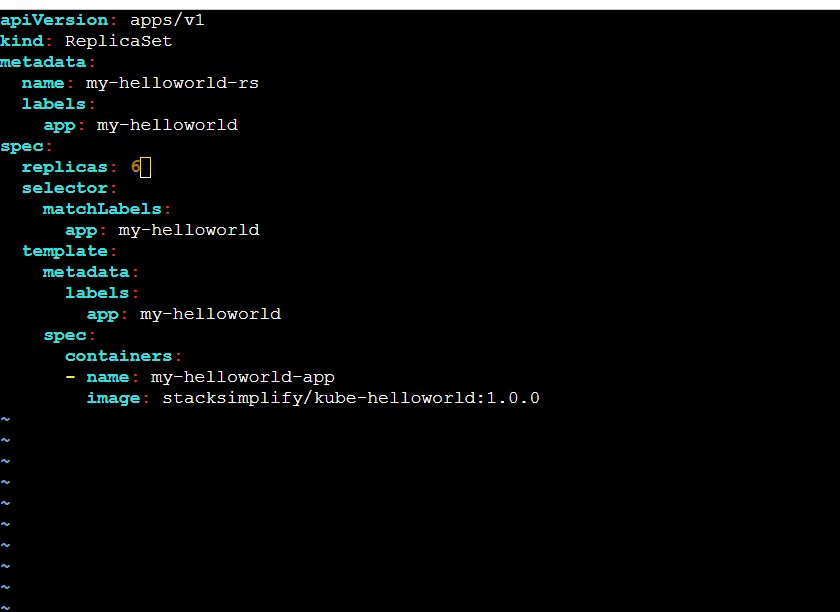 

Update the ReplicaSet
# Apply latest changes to ReplicaSet
kubectl replace -f replicaset-demo.yml

# Verify if new pods got created
kubectl get pods -o wide
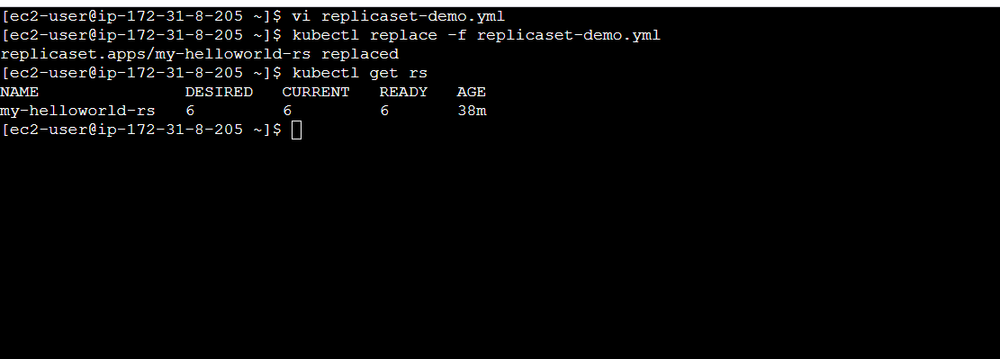 

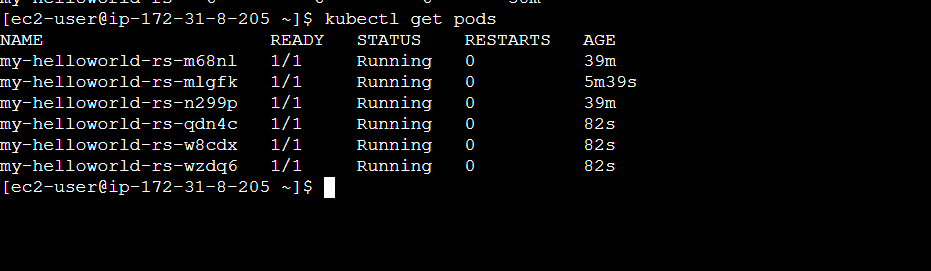

Delete ReplicaSet & Service
# Delete ReplicaSet
kubectl delete rs <ReplicaSet-Name>

# Sample Commands
kubectl delete rs/my-helloworld-rs
[or]
kubectl delete rs my-helloworld-rs

# Verify if ReplicaSet got deleted
kubectl get rs
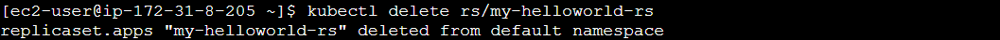

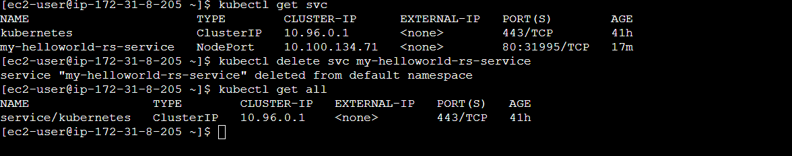

-Kubernetes Deployments
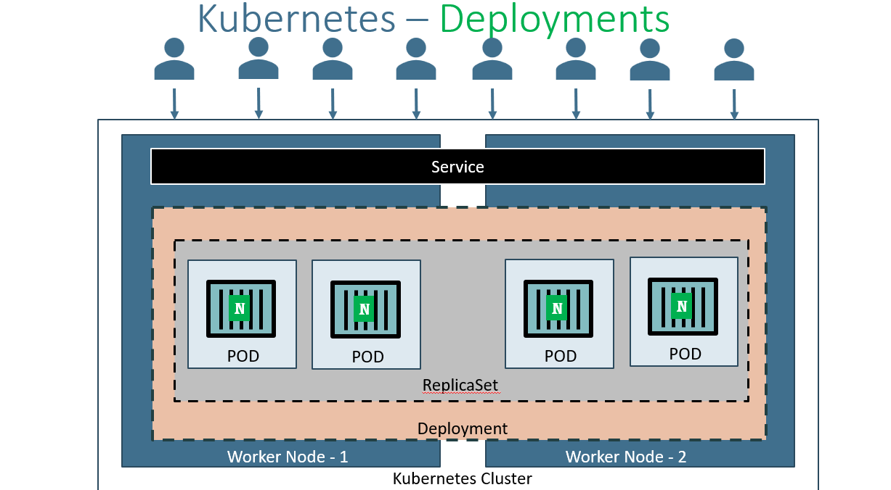

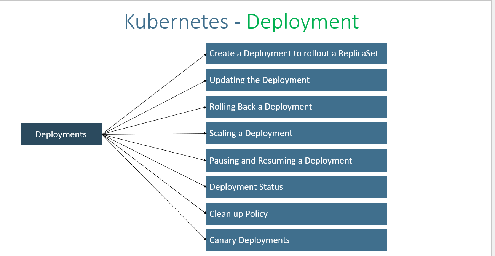

Deployment -demo
Create Deployment
# Create Deployment
kubectl create deployment <Deplyment-Name> --image=<Container-Image>
kubectl create deployment my-first-deployment --image=stacksimplify/kubenginx:1.0.0 
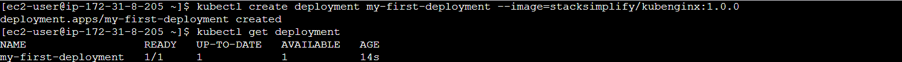

# Verify Deployment
kubectl get deployments
kubectl get deploy 

# Verify ReplicaSet
kubectl get rs

# Verify Pod
kubectl get po
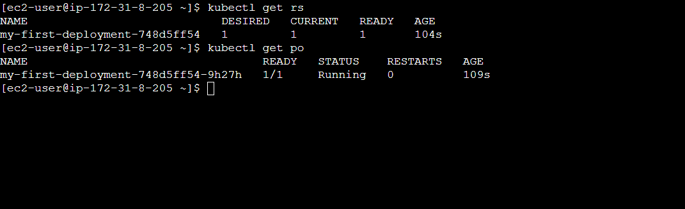

Scaling a Deployment
# Scale Up the Deployment
kubectl scale --replicas=20 deployment/<Deployment-Name>
kubectl scale --replicas=20 deployment/my-first-deployment 

# Verify Deployment
kubectl get deploy
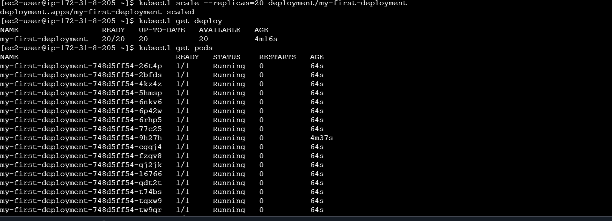

# Verify ReplicaSet
kubectl get rs
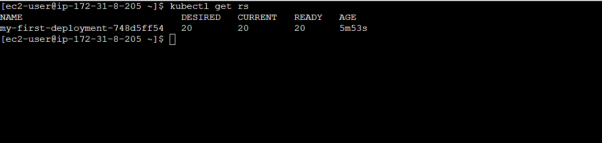

# Scale Down the Deployment
kubectl scale --replicas=10 deployment/my-first-deployment 
kubectl get deploy
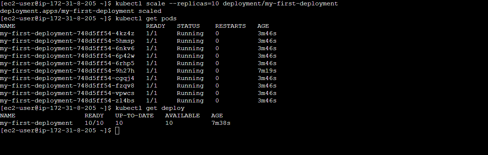