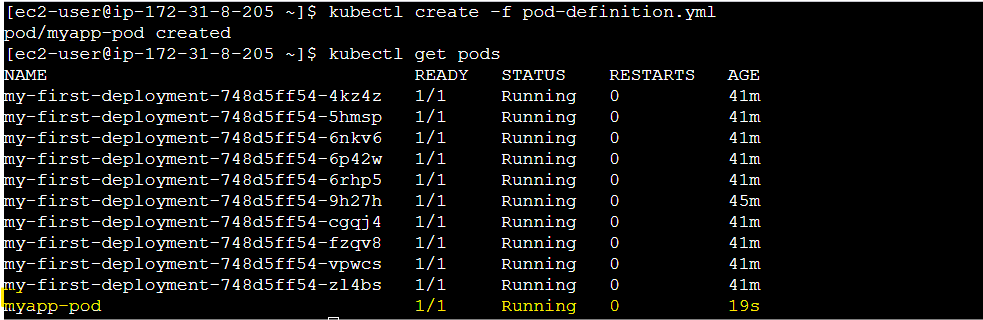
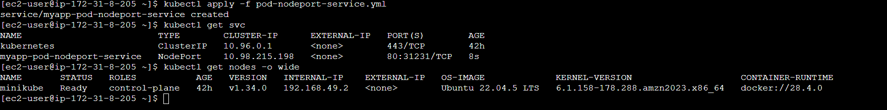
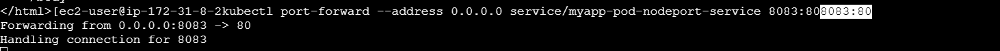
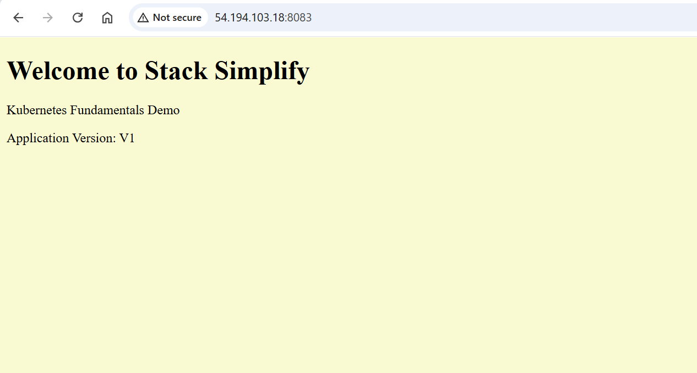
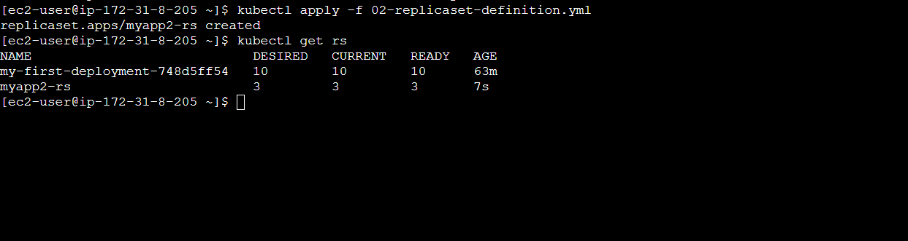
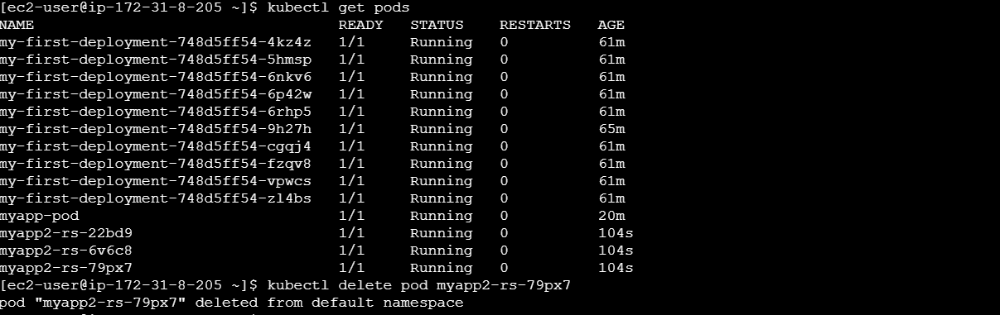
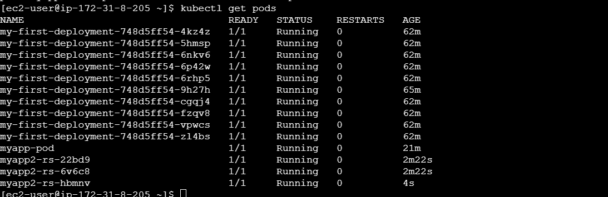
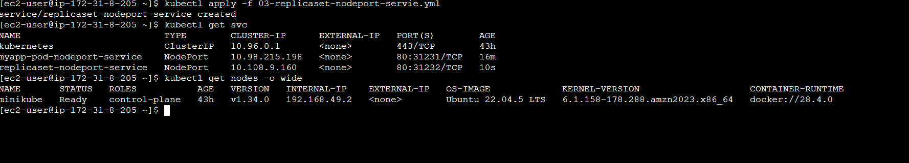

YAML Basics
- YAML is not a Markup Language
- YAML is used to store information about different things
- We can use YAML  to define key, Value pairs like variables, lists and objects
- YAML is very similar to JSON (Javascript Object Notation)
- YAML primarily focuses on readability and user friendliness
- YAML is designed to be clean and easy to read
- We can define YAML files with two different extensions
    - abc.yml
    - abc.yaml

Comments & Key Value Pairs
- Space after colon is mandatory to differentiate key and value
# Defining simple key value pairs
name: kalyan
age: 23
city: Hyderabad

- Dictionary / Map
- Set of properties grouped together after an item
- Equal amount of blank space required for all the items under a dictionary
person:
  name: kalyan
  age: 23
  city: Hyderabad

- Array / Lists
- Dash indicates an element of an array  
person: # Dictionary
  name: kalyan
  age: 23
  city: Hyderabad
  hobbies: # List  
    - cycling
    - cookines
  hobbies: [cycling, cooking]   # List with a differnt notation  

- Multiple Lists
person: # Dictionary
  name: kalyan
  age: 23
  city: Hyderabad
  hobbies: # List  
    - cycling
    - cooking
  hobbies: [cycling, cooking]   # List with a differnt notation  
  friends: # 
    - name: friend1
      age: 22
    - name: friend2
      age: 25              

Create Pods with YAML
-Kubernetes YAML Top level Objects
- Discuss about the k8s YAML top level objects
- 01-kube-base-definition.yml
apiVersion:
kind:
metadata:
  
spec:

- Pod API Objects Reference: https://kubernetes.io/docs/reference/generated/kubernetes-api/v1.18/#pod-v1-core

-Create Simple Pod Definition using YAML
- we are going to create a very basic pod definition
- 02-pod-definition.yml
apiVersion: v1 # String
kind: Pod  # String
metadata: # Dictionary
  name: myapp-pod
  labels: # Dictionary 
    app: myapp         
spec:
  containers: # List
    - name: myapp
      image: stacksimplify/kubenginx:1.0.0
      ports:
        - containerPort: 80

- Create Pod
# Create Pod
kubectl create -f 02-pod-definition.yml
[or]
kubectl apply -f 02-pod-definition.yml

# List Pods
kubectl get pods

Create NodePort Service with YAML and Access Application via Browser
-Create a NodePort Service
    - 03-pod-nodeport-service.yml
apiVersion: v1
kind: Service
metadata:
  name: myapp-pod-nodeport-service  # Name of the Service
spec:
  type: NodePort
  selector:
  # Loadbalance traffic across Pods matching this label selector
    app: myapp
  # Accept traffic sent to port 80    
  ports: 
    - name: http
      port: 80    # Service Port
      targetPort: 80 # Container Port
      nodePort: 31231 # NodePort

- Create NodePort Service for Pod
# Create Service
kubectl apply -f 03-pod-nodeport-service.yml

# List Service
kubectl get svc

# Get Public IP
kubectl get nodes -o wide

# Access Application
http://<WorkerNode-Public-IP>:<NodePort>
http://<WorkerNode-Public-IP>:31231

Create ReplicaSets using YAML
- replicaset-definition.yml
- Create ReplicaSet with 3 Replicas
#  Create ReplicaSet
kubectl apply -f 02-replicaset-definition.yml
# List Replicasets
kubectl get rs

-Delete a pod
- ReplicaSet immediately creates the pod.
# List Pods
kubectl get pods
# Delete Pod
kubectl delete pod <Pod-Name>

Create NodePort Service for ReplicaSet
apiVersion: v1
kind: Service
metadata:
  name: replicaset-nodeport-service
spec:
  type: NodePort
  selector:
    app: myapp2
  ports:
    - name: http
      port: 80
      targetPort: 80
      nodePort: 31232  

- Create NodePort Service for ReplicaSet & Test
# Create NodePort Service
kubectl apply -f 03-replicaset-nodeport-servie.yml

# List NodePort Service
kubectl get svc

# Get Public IP
kubectl get nodes -o wide
