Amazon EKS Pod Identity Agent-
- Amazon EKS Pod Identity – High-Level Flow
    - Amazon EKS Pod Identity enables pods in your cluster to securely assume IAM roles without managing static credentials or using IRSA annotations. The high-level flow is shown below:

Install EKS Pod Identity Agent
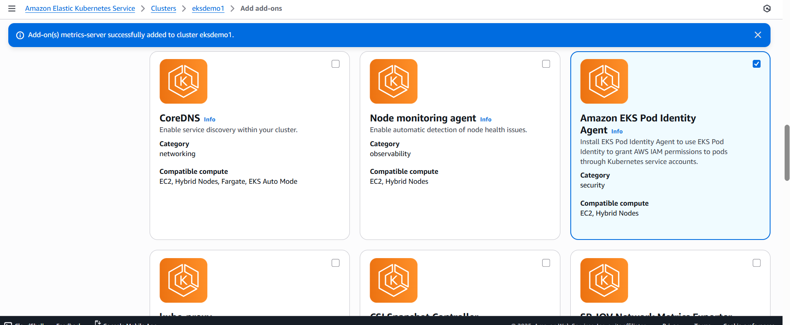

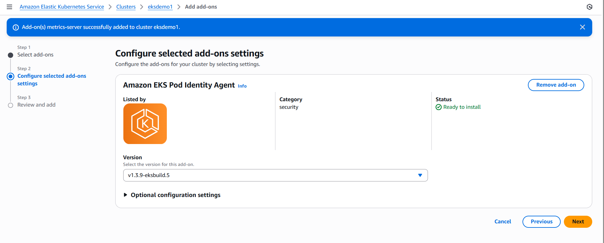

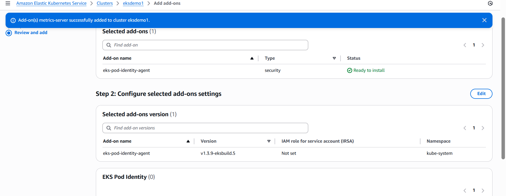

This installs a DaemonSet (eks-pod-identity-agent) that enables Pod Identity associations.

# List k8s PIA Resources
kubectl get daemonset -n kube-system
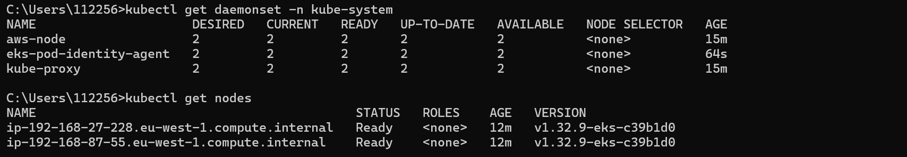

# List k8s Pods
kubectl get pods -n kube-system

Deploy AWS CLI Pod (without Pod Identity Association)
Create Service Account
- 01_k8s_service_account.yaml

Create a simple Kubernetes Pod with AWS CLI image:
- 02_k8s_aws_cli_pod.yaml

Deploy CLI Pod
kubectl apply -f kube-manifests/
kubectl get pods
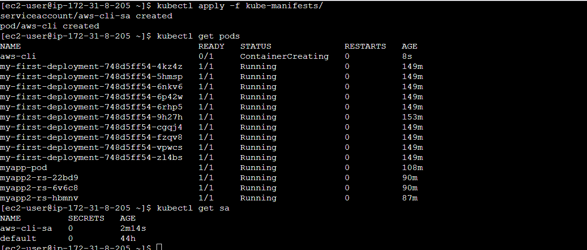

Create IAM Role for Pod Identity
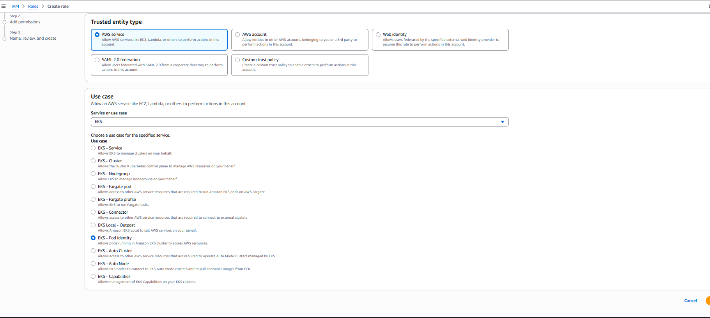

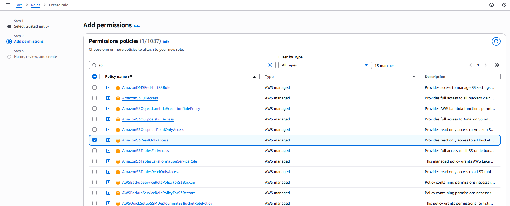

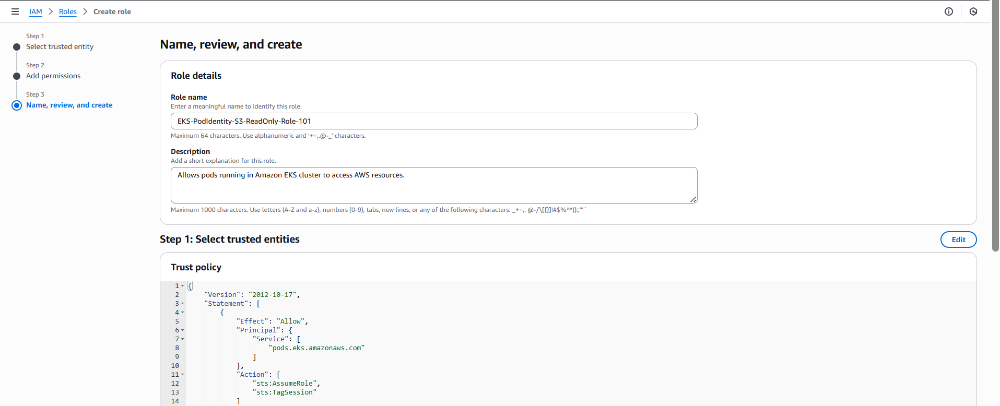

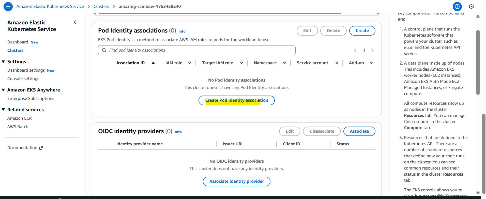

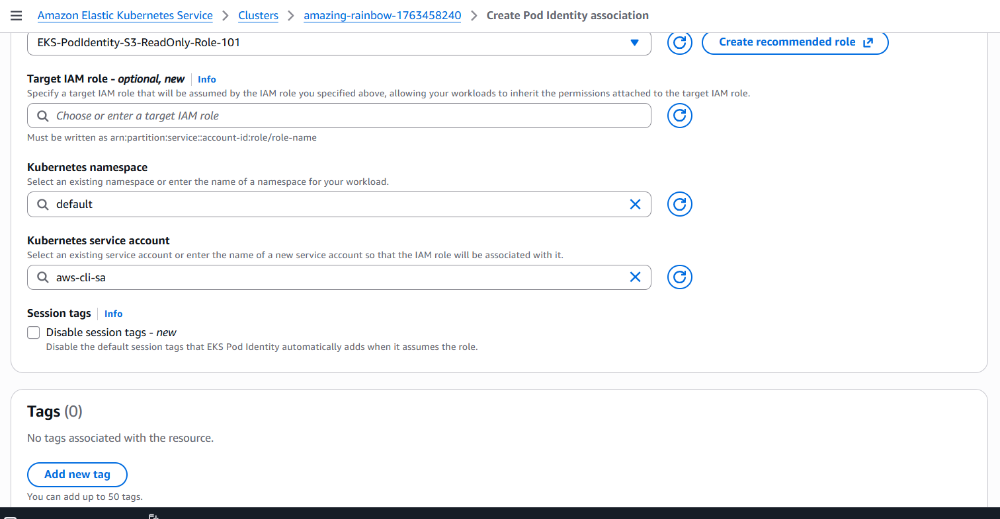

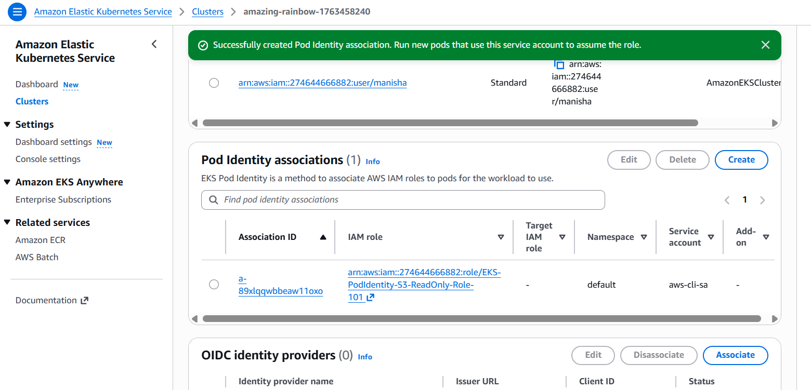

Test Again
- Restart Pod
# Delete Pod
kubectl delete pod aws-cli -n default
# Create Pod
kubectl apply -f kube-manifests/02_k8s_aws_cli_pod.yaml
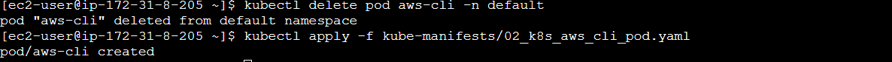

# List Pods
kubectl get pods
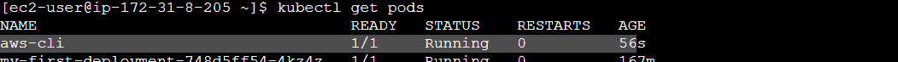

Exec into the Pod:
# List S3 buckets
kubectl exec -it aws-cli -- aws s3 ls

Clean Up
kubectl delete -f kube-manifests/
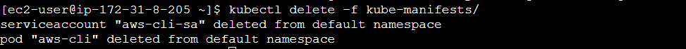

- Without Pod Identity Association: Pod has no IAM permissions → AWS API calls fail
- With Pod Identity Association: Pod Identity Agent maps Pod’s Service Account → IAM Role → AWS Permissions → API calls succeed
