EKS Storage 
Install Amazon EBS CSI Driver
1.on Add-ons → Get more add-ons
2.Search for Amazon EBS CSI driver (aws-ebs-csi-driver)
3.On the Permissions step, choose Create recommended role
    -Console will create an IAM role with the managed policy: AmazonEBSCSIDriverPolicy, and AmazonEKSClusterPolicy
    -Trust is automatically set to pods.eks.amazonaws.com
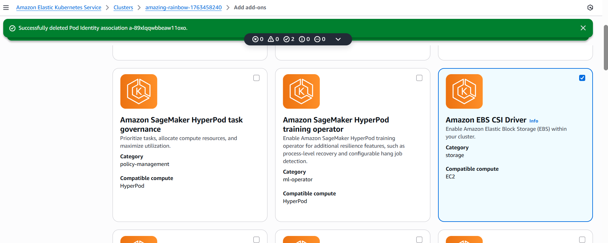

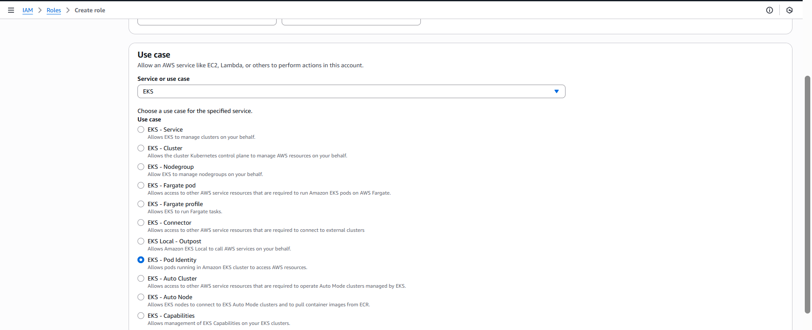

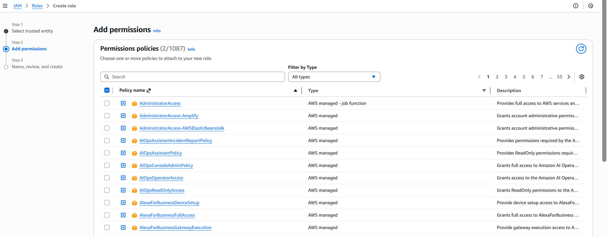

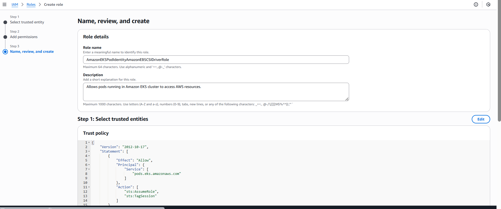

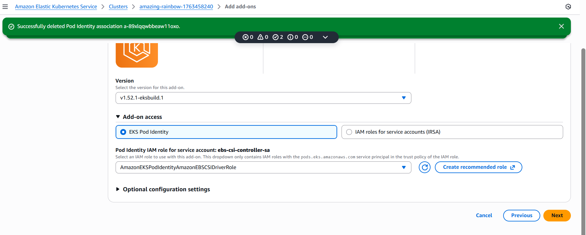

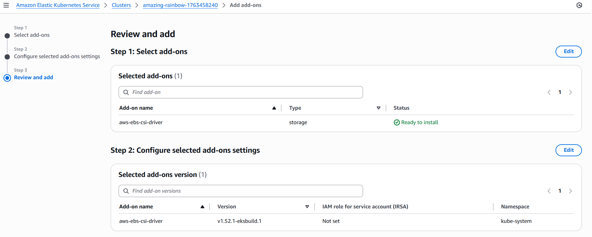

Verify installation
# List pods in kube-system
kubectl get pods -n kube-system
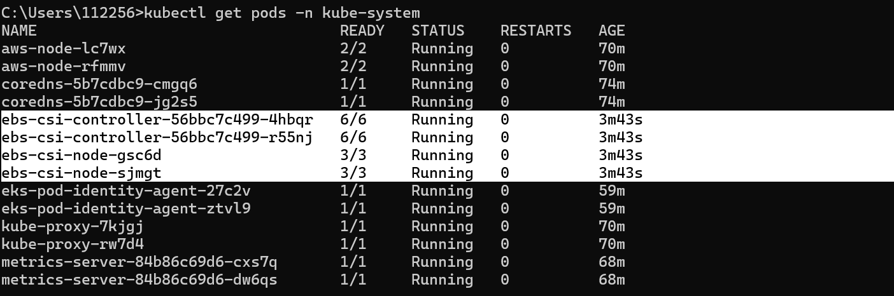

kubectl get ds -n kube-system
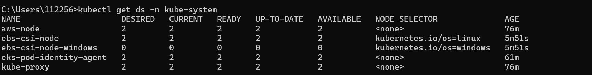

# Deployments
kubectl get deploy -n kube-system
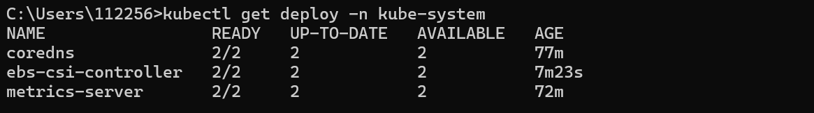

Create Kubernetes Manifests for Storage Class, PVC and ConfigMap
- Create Storage Class manifest
# Create Storage Class & PVC
kubectl apply -f kube-manifests/

# List Storage Classes
kubectl get sc

# List PVC
kubectl get pvc 
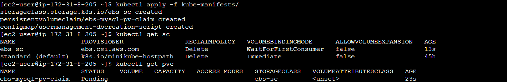

Create Kubernetes Manifests for MySQL Deployment & ClusterIP Service
Create MySQL Database with all above manifests
# Create MySQL Database
kubectl apply -f kube-manifests/
# List Storage Classes
kubectl get sc

# List PVC
kubectl get pvc 

# List PV
kubectl get pv

# List pods
kubectl get pods 
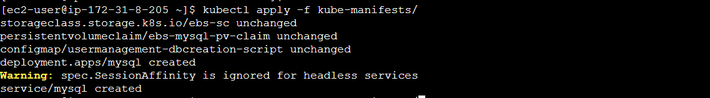

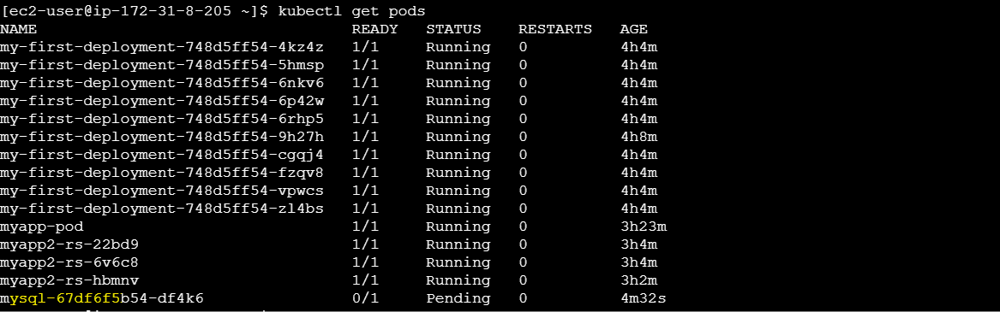

Connect to MySQL Database
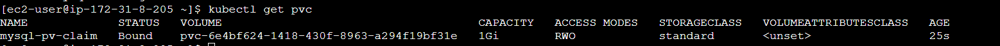

# Connect to MYSQL Database
kubectl run -it --rm --image=mysql:5.6 --restart=Never mysql-client -- mysql -h mysql -pdbpassword11
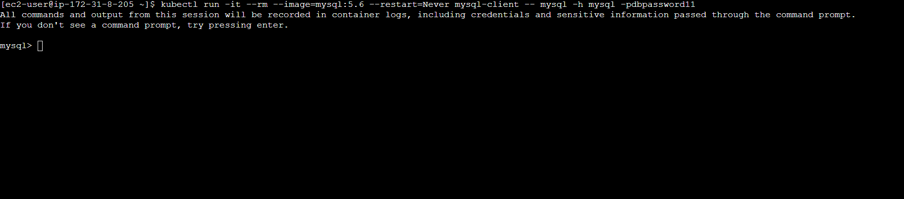

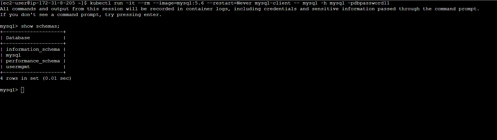
