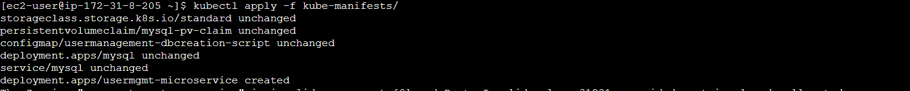
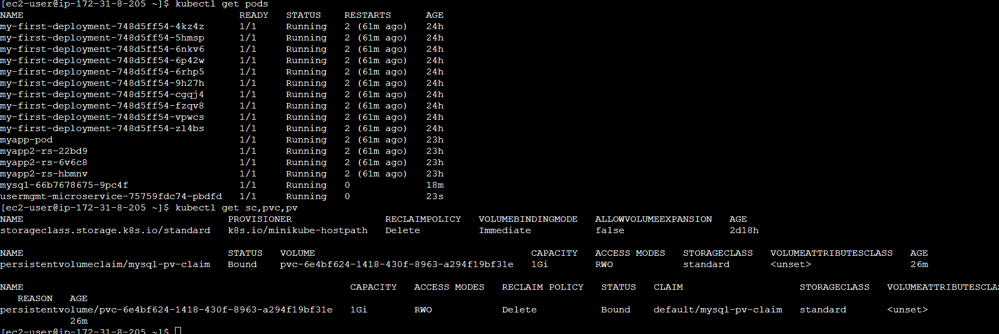

Deploy UserManagement Service with MySQL Database
Create UserManagement Service Deployment & Service
# Create Deployment & NodePort Service
kubectl apply -f kube-manifests/

# List Pods
kubectl get pods

# Verify logs of Usermgmt Microservice pod
kubectl logs -f <Pod-Name>

# Verify sc, pvc, pv
kubectl get sc,pvc,pv

