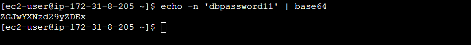

Kubernetes - Secrets
- Kubernetes Secrets let you store and manage sensitive information, such as passwords, OAuth tokens, and ssh keys.
- Storing confidential information in a Secret is safer and more flexible than putting it directly in a Pod definition or in a container image.

Create Secret for MySQL DB Password
- echo -n 'dbpassword11' | base64 or # URL: https://www.base64encode.org

