EKS-Storage-with-RDS-Database
-Create DB Security Group
-Create security group to allow access for RDS Database on port 3306
- Security group name: eks_rds_db_sg
- Description: Allow access for RDS Database on Port 3306
- VPC: eksctl-eksdemo1-cluster/VPC

Inbound Rules
Type: MySQL/Aurora
Protocol: TPC
Port: 3306
Source: Anywhere (0.0.0.0/0)
Description: Allow access for RDS Database on Port 3306
Outbound Rules
Leave to defaults
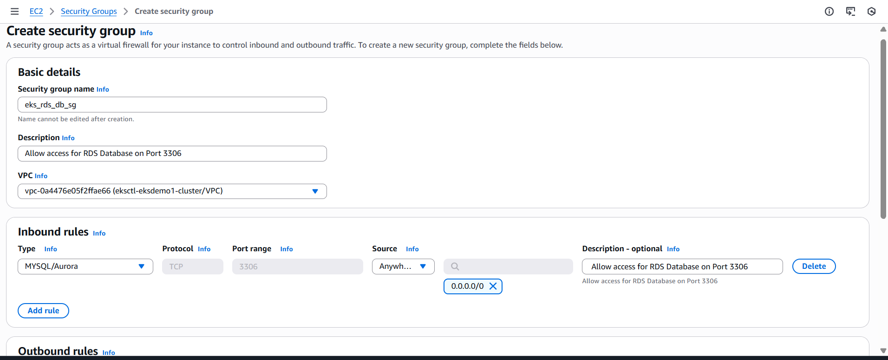

- Create DB Subnet Group in RDS
- Go to RDS -> Subnet Groups
-Click on Create DB Subnet Group
- Name: eks-rds-db-subnetgroup
-Description: EKS RDS DB Subnet Group
-VPC: eksctl-eksdemo1-cluster/VPC
-Availability Zones: us-east-1a, us-east-1b
-Subnets: 2 subnets in 2 AZs
-Click on Create
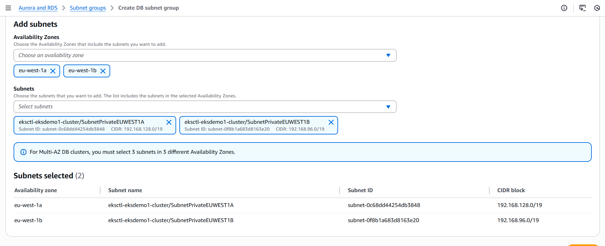

CreateRDS database
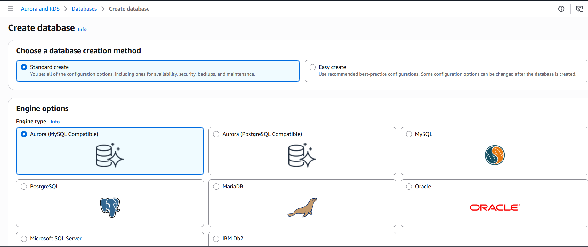

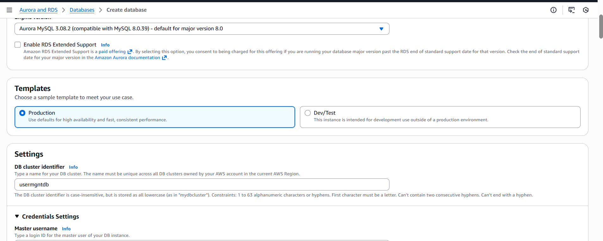

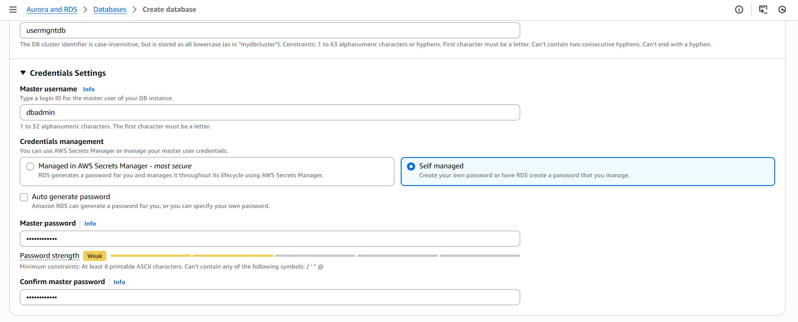

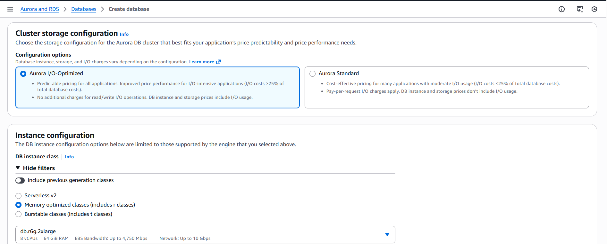

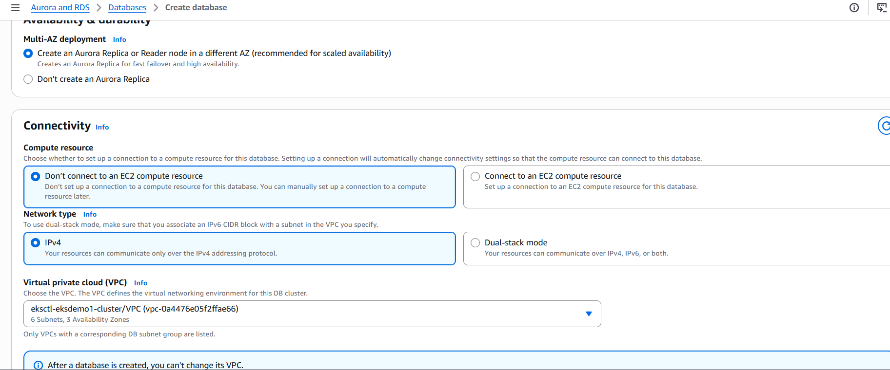

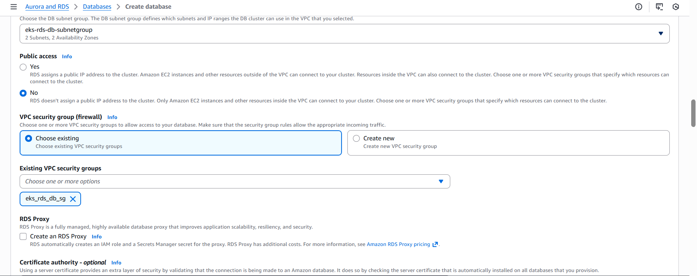

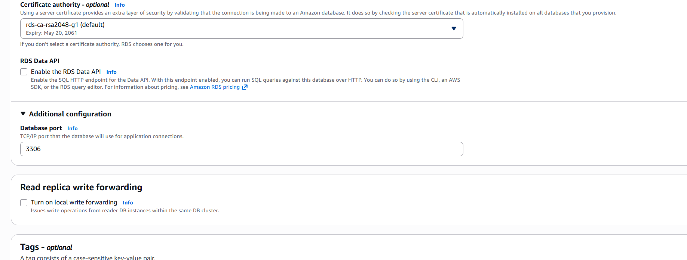

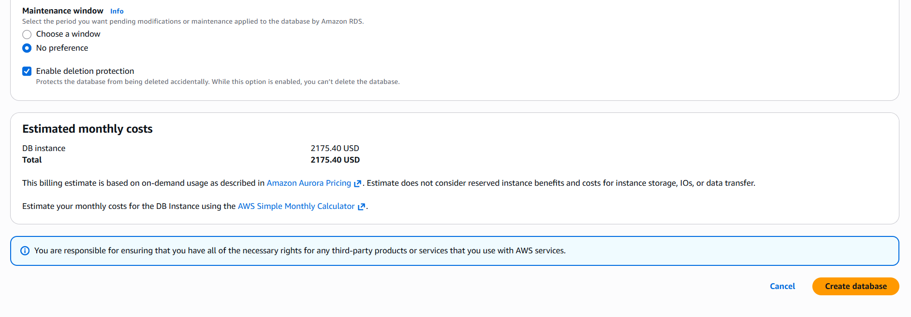

-Edit Database Security to Allow Access from 0.0.0.0/0
    - Go to EC2 -> Security Groups -> eks-rds-db-securitygroup
    -Edit Inboud Rules
    -Source: Anywhere (0.0.0.0/0) (Allow access from everywhere for now)

Create Kubernetes externalName service Manifest and Deploy
- Deploy Manifest
- kubectl apply -f kube-manifests/01-MySQL-externalName-Service.yml
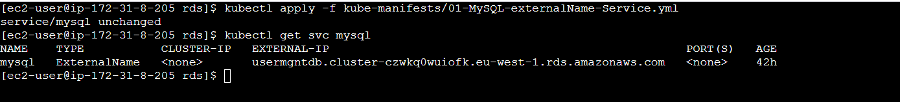

Connect to RDS Database using kubectl and create usermgmt schema/db
mysql> show schemas;
mysql> create database usermgmt;
mysql> show schemas;
mysql> exit
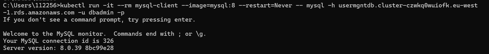

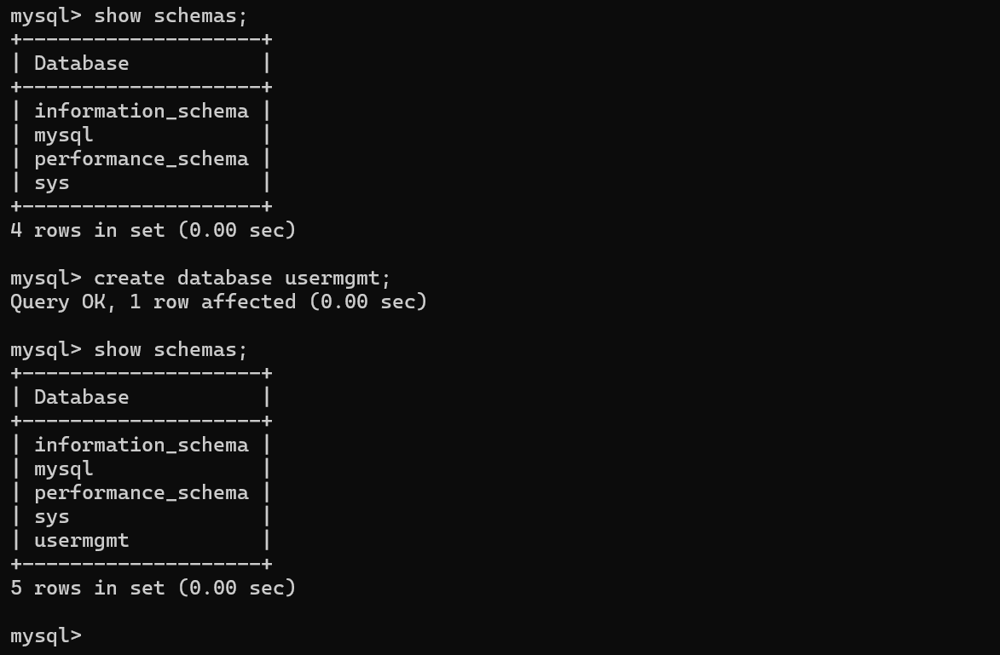

In User Management Microservice deployment file change username from root to dbadmin
- 02-UserManagementMicroservice-Deployment-Service.yml
Deploy User Management Microservice and Test
# Deploy all Manifests
kubectl apply -f kube-manifests/

# List Pods
kubectl get pods

# Stream pod logs to verify DB Connection is successful from SpringBoot Application
kubectl logs -f <pod-name>
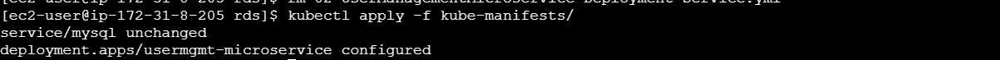

kubectl get nodes -o wide

