ALB -ingress
- ALB Ingress = AWS Application Load Balancer used by Kubernetes to route HTTP/HTTPS traffic to services in your EKS cluster.

AWS Application load balancer(ALB)
ALB is a super advanced, next generation load balancer in AWS.
support for Path-based routing (/app1, /app2. /usermgmt)
support for host-based routing (apps.kubeoncloud.com)

Create EKS Cluster and Worker Nodes (if not created).
Create Cluster
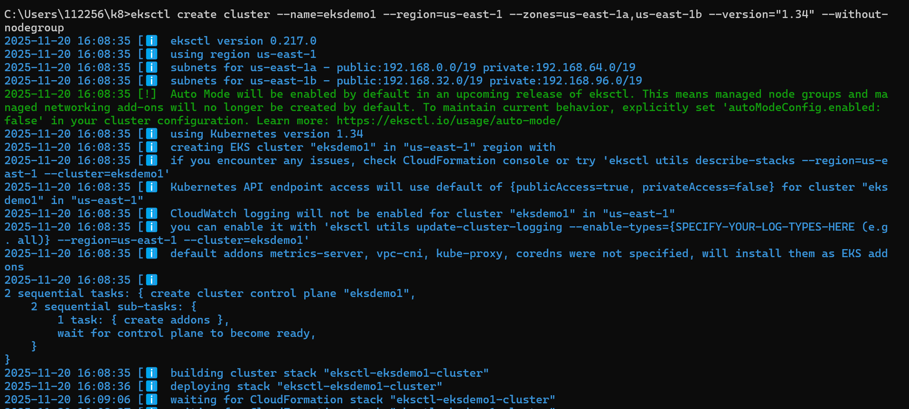

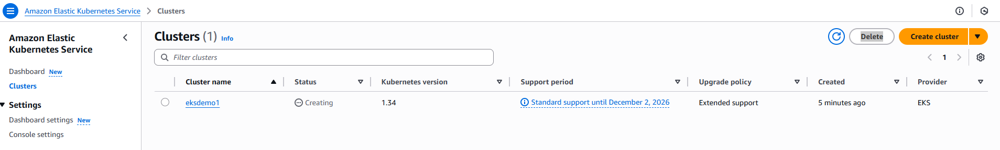

eksctl get cluster   

eksctl utils associate-iam-oidc-provider \
    --region region-code \
    --cluster <cluter-name> \
    --approve
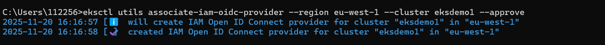

Create EKS NodeGroup in VPC Private Subnets
eksctl create nodegroup --cluster=eksdemo1 --region=eu-west-1 --name=eksdemo1-ng-private1 --node-type=t3.medium --nodes-min=2 --nodes-max=4 --node-volume-size=20 --ssh-access --ssh-public-key=kube-demo --managed --asg-access --external-dns-access --full-ecr-access --appmesh-access --alb-ingress-access --node-private-networking       
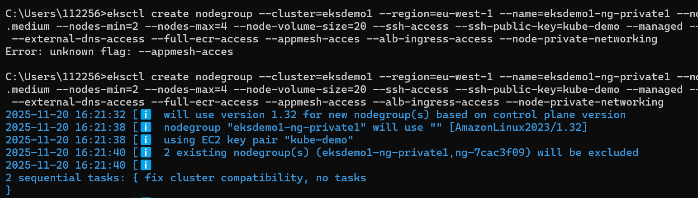

# Verfy EKS Cluster
eksctl get cluster

# Verify EKS Node Groups
eksctl get nodegroup --cluster=eksdemo1

# Verify if any IAM Service Accounts present in EKS Cluster
eksctl get iamserviceaccount --cluster=eksdemo1
Observation:
1. No k8s Service accounts as of now. 
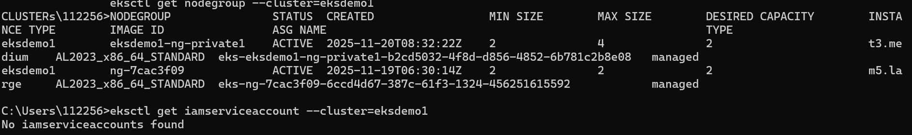

# Configure kubeconfig for kubectl
eksctl get cluster # TO GET CLUSTER NAME
aws eks --region <region-code> update-kubeconfig --name <cluster_name>
aws eks --region us-east-1 update-kubeconfig --name eksdemo1

# Verify EKS Nodes in EKS Cluster using kubectl
kubectl get nodes
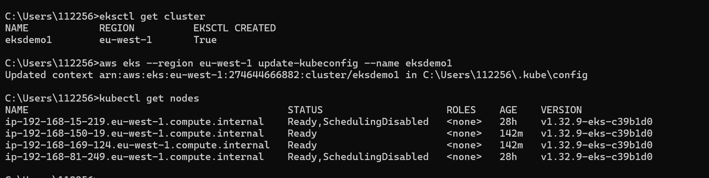

Create IAM Policy
- Create IAM policy for the AWS Load Balancer Controller that allows it to make calls to AWS APIs on your behalf.

curl -o iam_policy_latest.json https://raw.githubusercontent.com/kubernetes-sigs/aws-load-balancer-controller/main/docs/install/iam_policy.json

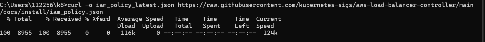

Create IAM Policy using policy downloaded 
aws iam create-policy --policy-name AWSLoadBalancerControllerIAMPolicy --policy-document file://iam_policy_latest.json
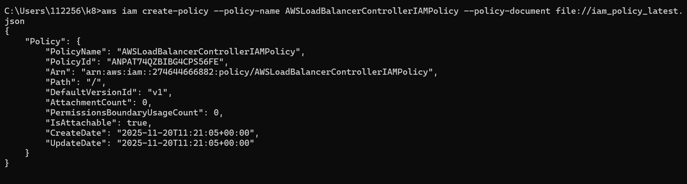

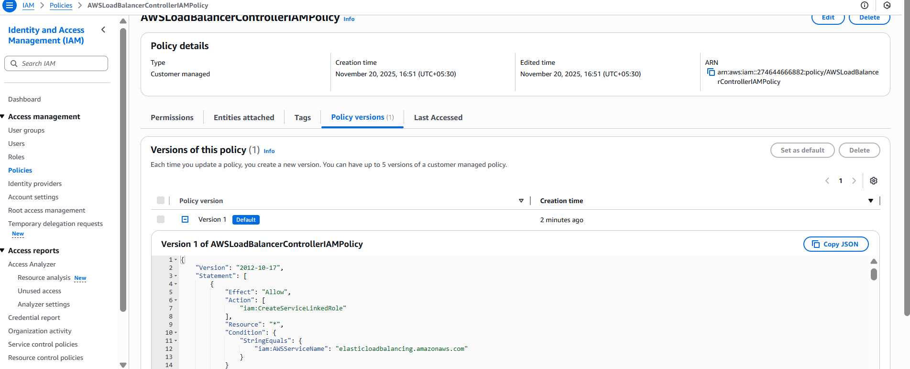

Create an IAM role for the AWS LoadBalancer Controller and attach the role to the Kubernetes service account
- Applicable only with eksctl managed clusters
-  Create IAM Role using eksctl
kubectl get sa -n kube-system
kubectl get sa aws-load-balancer-controller -n kube-system

eksctl create iamserviceaccount \
  --cluster=my_cluster \
  --namespace=kube-system \
  --name=aws-load-balancer-controller \ #Note:  K8S Service Account Name that need to be bound to newly created IAM Role
  --attach-policy-arn=arn:aws:iam::111122223333:policy/AWSLoadBalancerControllerIAMPolicy \
  --override-existing-serviceaccounts \
  --approve
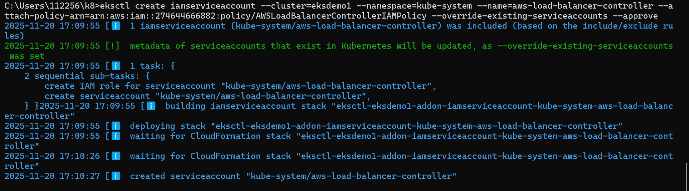

Verify using eksctl cli
eksctl  get iamserviceaccount --cluster eksdemo1
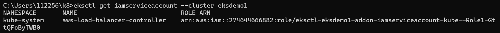

-Verify CloudFormation Template eksctl created & IAM Role
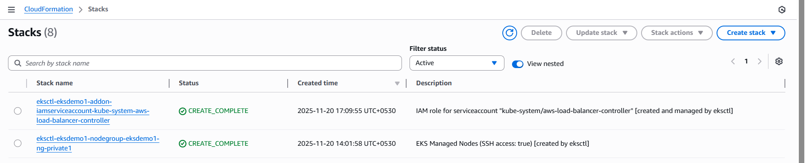

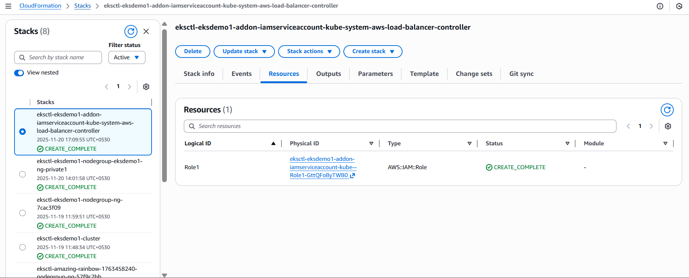