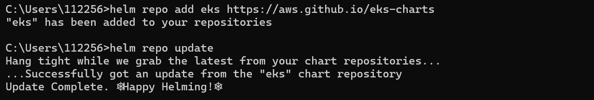
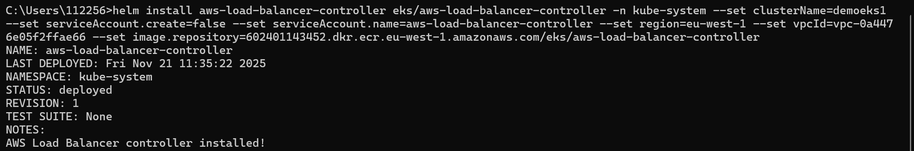
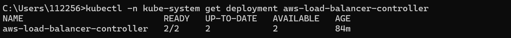
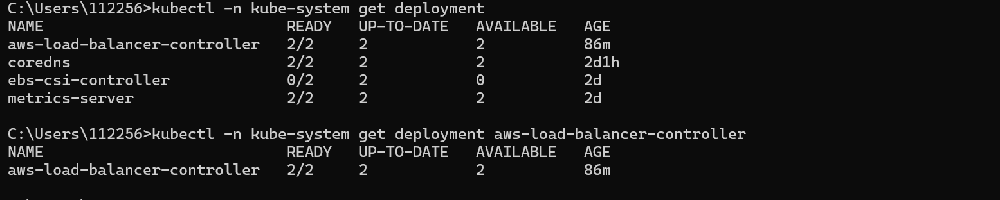
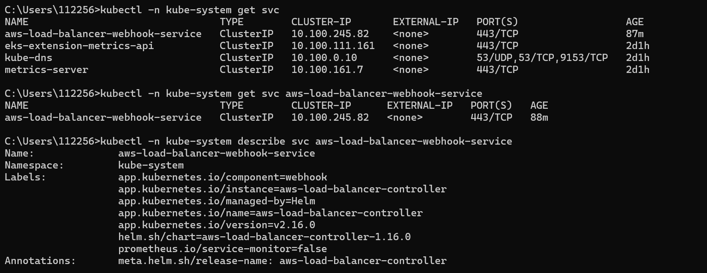
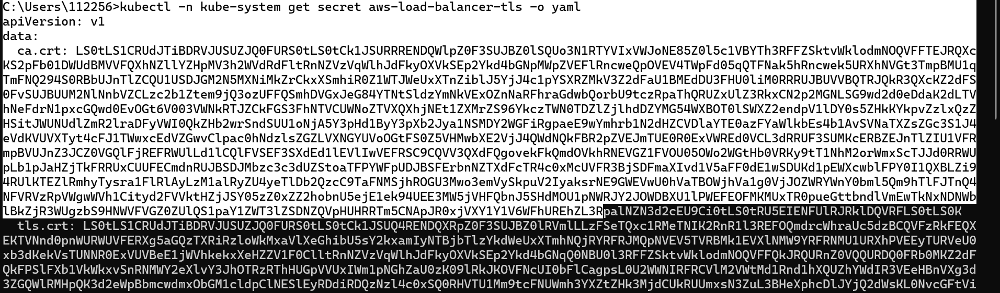
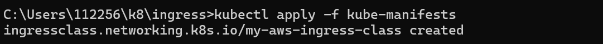
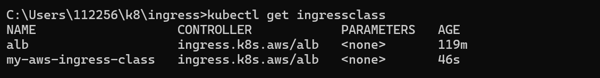
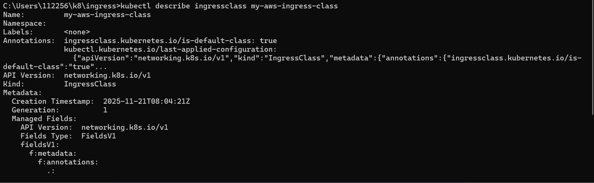

Install the AWS Load Balancer Controller using Helm V3
Install Helm
Install Helm if not installed
Install Helm for AWS EKS

Get Region Code and Account info
https://docs.aws.amazon.com/eks/latest/userguide/add-ons-images.html

Add the eks-charts repository.

# Install the AWS Load Balancer Controller.
helm install aws-load-balancer-controller eks/aws-load-balancer-controller -n kube-system --set clusterName=demoeks1 --set serviceAccount.create=false --set serviceAccount.name=aws-load-balancer-controller --set region=eu-west-1 --set vpcId=vpc-0a4476e05f2ffae66 --set image.repository=602401143452.dkr.ecr.eu-west-1.amazonaws.com/eks/aws-load-balancer-controller

Verify that the controller is installed and Webhook Service created
# Verify that the controller is installed.
kubectl -n kube-system get deployment 
kubectl -n kube-system get deployment aws-load-balancer-controller
kubectl -n kube-system describe deployment aws-load-balancer-controller

Verify that the controller is installed and Webhook Service created
# Verify that the controller is installed.
kubectl -n kube-system get deployment 
kubectl -n kube-system get deployment aws-load-balancer-controller
kubectl -n kube-system describe deployment aws-load-balancer-controller

# Verify AWS Load Balancer Controller Webhook service created
kubectl -n kube-system get svc 
kubectl -n kube-system get svc aws-load-balancer-webhook-service
kubectl -n kube-system describe svc aws-load-balancer-webhook-service

# Verify Labels in Service and Selector Labels in Deployment
# List Pods
kubectl get pods -n kube-system

# Review logs for AWS LB Controller POD-1
kubectl -n kube-system logs -f <POD-NAME> 
kubectl -n kube-system logs -f  aws-load-balancer-controller-86b598cbd6-5pjfk

# Review logs for AWS LB Controller POD-2
kubectl -n kube-system logs -f <POD-NAME> 
kubectl -n kube-system logs -f aws-load-balancer-controller-86b598cbd6-vqqsk

LBC Service Account and TLS Cert Internals
kubectl -n kube-system get secret aws-load-balancer-tls -o yaml

Review IngressClass Kubernetes Manifest
Create IngressClass Resource
kubectl apply -f kube-manifests

# Verify IngressClass Resource
kubectl get ingressclass

# Describe IngressClass Resource
kubectl describe ingressclass my-aws-ingress-class

