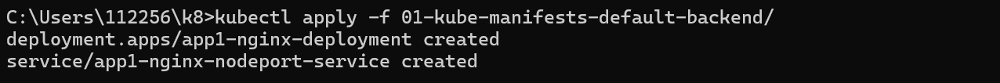
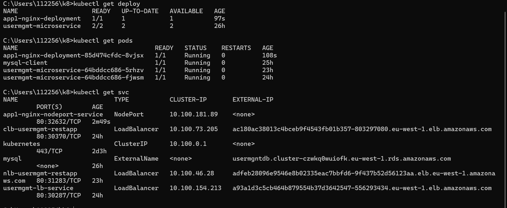
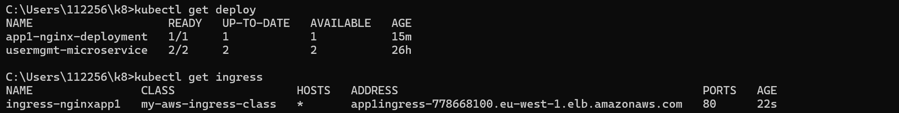
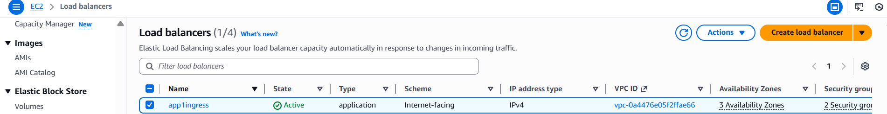
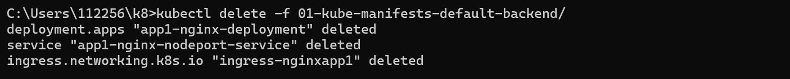
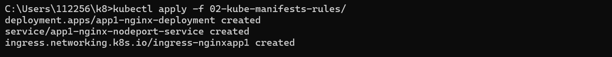
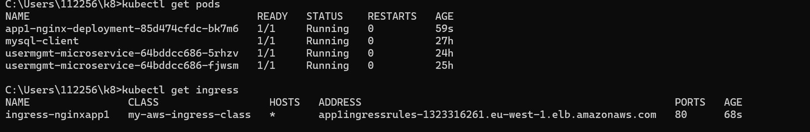
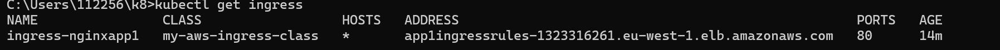
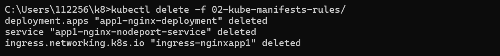
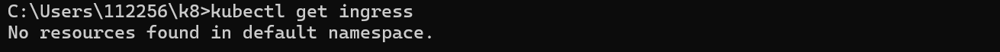

Ingress Annotation
- Annotation keys and values can only be strings. Advanced format should be encoded as below:
- boolean: 'true'
- integer: '42'
- stringList: s1,s2,s3
- stringMap: k1=v1,k2=v2
- json: 'jsonContent'
- Annotations applied to Service have higher priority over annotations applied to Ingress

Review App1 Deployment kube-manifest
01-Nginx-App1-Deployment-and-NodePortService.yml

Review Ingress kube-manifest with Default Backend Option
- 02-ALB-Ingress-Basic.yml

Deploy kube-manifests and Verify
# Deploy kube-manifests
kubectl apply -f 01-kube-manifests-default-backend/

# Verify k8s Deployment and Pods
kubectl get deploy
kubectl get pods
  

# Verify Ingress (Make a note of Address field)
kubectl get ingress
 

Goto AWS Mgmt Console -> Services -> EC2 -> Load Balancers
1. Verify Listeners and Rules inside a listener
2. Verify Target Groups
 

 

# Access App using Browser
kubectl get ingress
http://<ALB-DNS-URL>
http://<ALB-DNS-URL>/app1/index.html
or
http://<INGRESS-ADDRESS-FIELD>
http://<INGRESS-ADDRESS-FIELD>/app1/index.html

Clean Up
kubectl delete -f 01-kube-manifests-default-backend/
 

Review Ingress kube-manifest with Ingress Rules
Deploy kube-manifests and Verify
kubectl apply -f 02-kube-manifests-rules/

# Verify k8s Deployment and Pods
kubectl get deploy
kubectl get pods

# Verify Ingress (Make a note of Address field)
kubectl get ingress

Clean Up
# Delete Kubernetes Resources
kubectl delete -f 02-kube-manifests-rules/

# Verify if Ingress Deleted successfully 
kubectl get ingress

