Kubernates
- Kubernetes also known as K8s was built by Google based on their experience running 
-containers in production. It is now an open-source project and is arguably one of the 
-best and most popular container orchestration technologies out there

Containers
- Containers are completely isolated environments, as in they can have their own processes or services, their own network interfaces, their own 
- mounts, just like Virtual machines, except that they all share the same OS kernel.

Node 
-A node is a machine – physical or virtual – on which kubernetesis installed. 
- A node is aorker machine and this is were containers will be launched by Kubernetes

Cluster - 
- A cluster is a set of nodes grouped together. This way even if one node fails you have your application still accessible from the other nodes. 
- Moreover having multiple nodes helps in sharing load as well

Master -
- The master is another node with Kubernetes installed in it, and is configured as a Master.
- The master watches over the nodes in the cluster and is responsible for the actual orchestration of containers on the worker nodes.

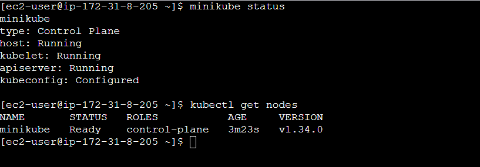

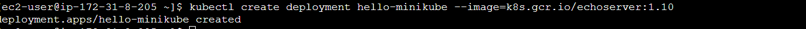

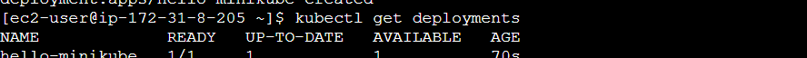

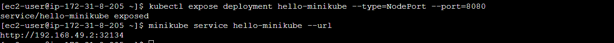

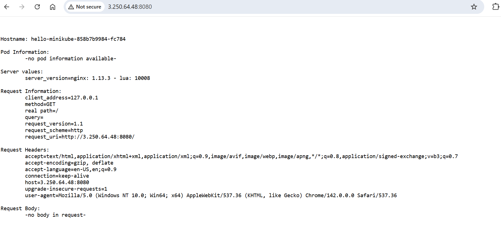

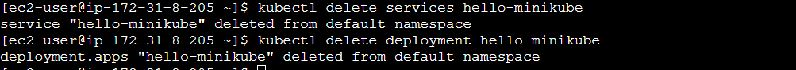

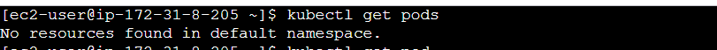

Pod-
- Pods are the smallest deployable units of computing that you can create and manage in Kubernetes
- kubernetes our ultimate aim is to deploy our application in the form of containers on a set of machines that are configured as worker nodesin a cluster. However, kubernetes does not deploy containers directly 
- on the worker nodes. The containers are encapsulated into a Kubernetes object known as PODs. A POD is a single instance of an application. 
- A POD is the smallest object, that you can create in kubernetes

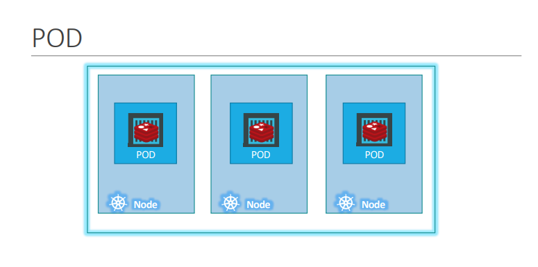

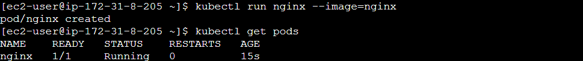

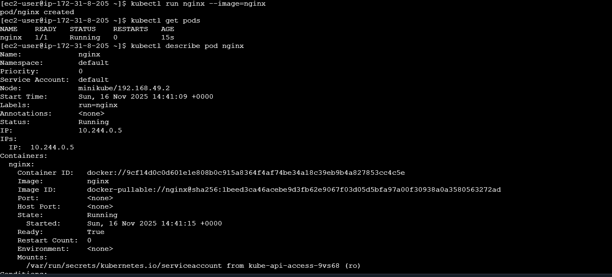

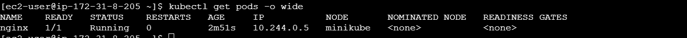

Pods with YAML-
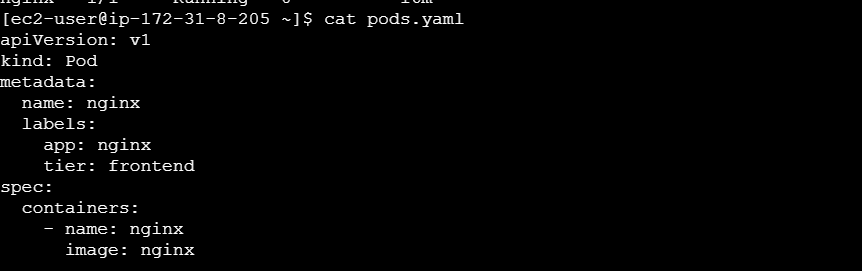

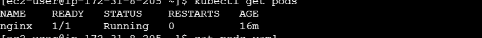

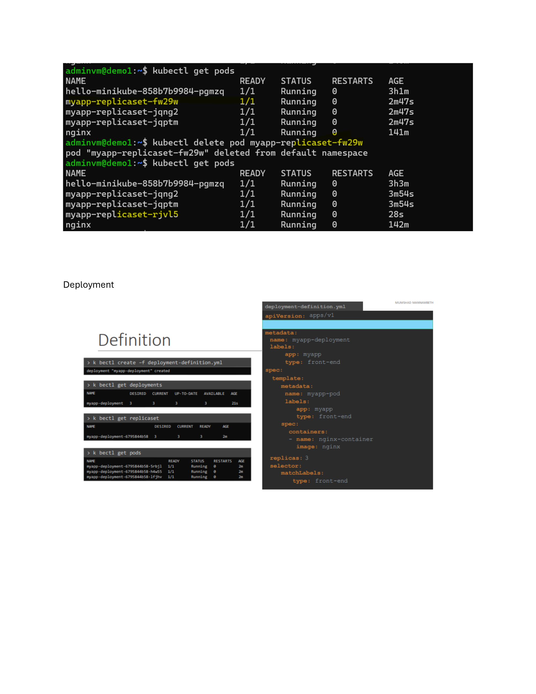

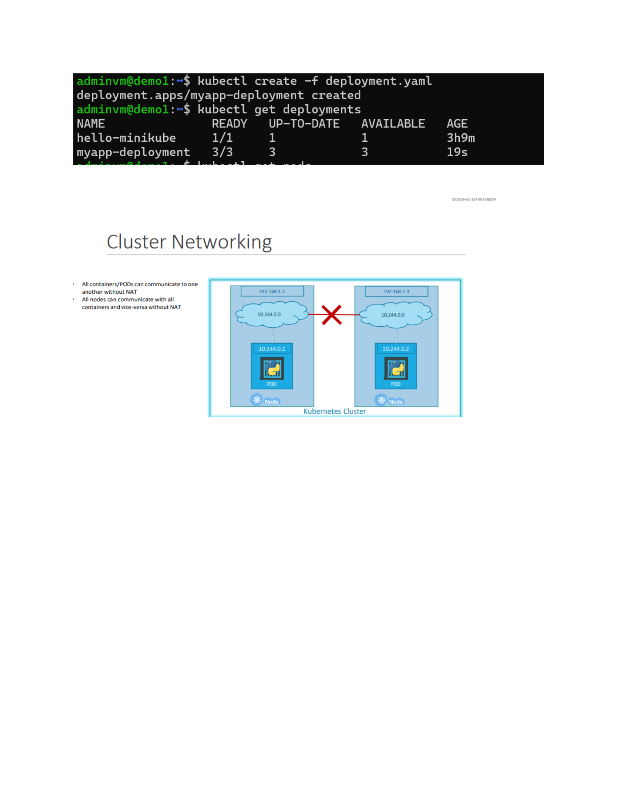

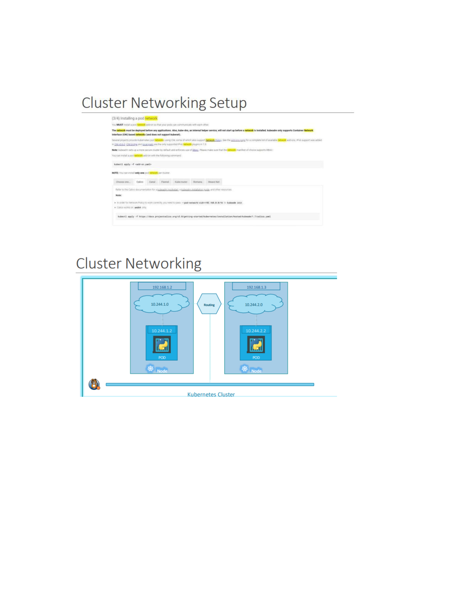

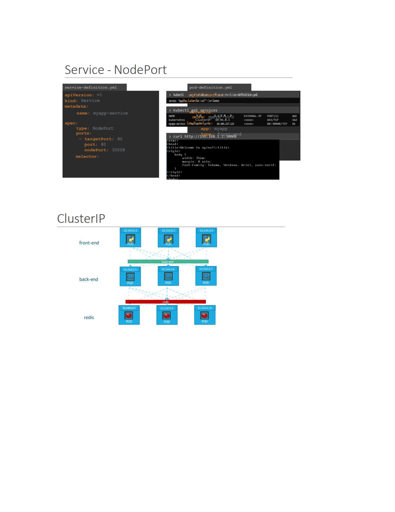

